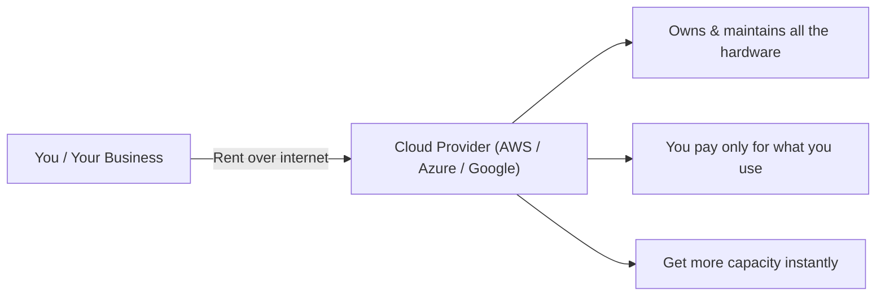

# 👋 Start Here — Cloud Computing in Plain English

> **Read this first.** No jargon, no assumptions. This page explains the *whole* of cloud computing using everyday analogies, then shows how each idea is used in real companies. Once this "clicks," the rest of the book will make sense easily.

⬅ [Back to Index](../README.md)

---

## 🧠 The One Big Idea (if you remember nothing else)

> **Cloud computing = renting computers over the internet instead of buying your own.**

That's it. Everything else is a detail on top of that sentence.

Think of it like this:

| You could... | Or you could... |
|--------------|-----------------|
| Buy a car (huge cost, you maintain it, it sits idle most of the day) | Use Uber (pay only per ride, no maintenance, always available) |
| Buy & run your own servers | Rent computing from Amazon/Microsoft/Google |

 You pay for what you use, someone else owns and maintains the hardware, and you can get more instantly when you need it.



**Explanation:** This one picture is the whole idea. You rent computing over the internet; the provider owns and looks after the machines; you pay for usage and can scale up the moment you need to.

---

## 🏠 The Master Analogy: Cloud = Housing

We'll reuse **one analogy** for the trickiest topic (service models). Keep it in your head:

| Housing Option | Cloud Equivalent | What it means |
|----------------|------------------|---------------|
| 🏗️ **Build your own house** | On-premises (no cloud) | You buy the land, bricks, everything. Total control, total responsibility. |
| 🏢 **Rent an empty apartment** | **IaaS** (e.g., AWS EC2) | Landlord owns the building; you bring furniture (your software). |
| 🛋️ **Rent a furnished apartment** | **PaaS** (e.g., Heroku) | Just move in with your clothes (your code). Furniture provided. |
| 🏨 **Stay in a hotel** | **SaaS** (e.g., Gmail) | Everything done for you. You just show up and use it. |

The more someone else manages, the less you control — but the less you have to worry about. **That trade-off is the heart of cloud computing.**

---

### 🔍 Quick Breakdown (Plain English)

| Option | You Manage | They Manage | Real Examples |
|--------|-----------|-------------|---------------|
| 🏗️ **On-Premises** | Everything (servers, software, power) | Nothing | Bank's own data center |
| 🏢 **IaaS** | Your software & setup | The physical machine | AWS EC2, Azure VMs |
| 🛋️ **PaaS** | Just your code | Servers + platform | Heroku, App Engine |
| 🏨 **SaaS** | Nothing — just use it | Everything | Gmail, Netflix, Zoom |

**One-liner for each:**
- 🏗️ **On-Premises** = *build your own house* → full control, all the work.
- 🏢 **IaaS** = *empty apartment* → you bring the furniture (software).
- 🛋️ **PaaS** = *furnished apartment* → just move in with your code.
- 🏨 **SaaS** = *hotel* → show up and use it, zero setup.

### 🎚️ The Sliding Scale

```
MORE control, MORE work  ◀──────────────────────▶  LESS control, LESS work
  On-Premises      IaaS        PaaS         SaaS
(build a house) (empty flat) (furnished)  (hotel)
```

👉 Want **control**? Go left. Want **convenience**? Go right. That trade-off is the **heart of cloud computing**. 🧠

---

## 🍕 The Pizza Version (another way to see it)

| Model | Pizza analogy |
|-------|---------------|
| On-premises | Make the pizza from scratch at home |
| **IaaS** | Buy the dough & ingredients, bake it yourself |
| **PaaS** | Order delivery, eat on your own plates at home |
| **SaaS** | Go to a restaurant — they cook, serve, and clean up |

### 🔍 Quick Breakdown (Plain English)

| Model | You Do | They Do | Real Examples |
|-------|--------|---------|---------------|
| 🏠 **On-Premises** | Everything (dough, oven, cooking, cleanup) | Nothing | Bank's own data center |
| 🛒 **IaaS** | Cook & assemble it yourself | Supply raw ingredients | AWS EC2, Azure VMs |
| 🛵 **PaaS** | Just serve & eat | Cook & deliver it | Heroku, App Engine |
| 🍽️ **SaaS** | Just eat | Cook, serve & clean up | Gmail, Netflix, Zoom |

**One-liner for each:**
- 🏠 **On-Premises** = *cook from scratch* → you handle every step.
- 🛒 **IaaS** = *buy ingredients, bake yourself* → they supply, you cook.
- 🛵 **PaaS** = *order delivery* → they cook, you just plate and eat.
- 🍽️ **SaaS** = *go to a restaurant* → they do it all, you just enjoy.

### 🎚️ The Sliding Scale

```
MORE effort, MORE control  ◀──────────────────────▶  LESS effort, LESS control
  On-Premises      IaaS         PaaS         SaaS
(cook scratch) (bake yourself) (delivery)  (restaurant)
```

👉 Feel like **cooking**? Go left. Just **hungry**? Go right. Same trade-off — effort vs. convenience. 🍕

### 🎓 Professional (IT-Standard) Reference

| Model | Layman View | Professional (IT-Standard) View + Example |
|-------|-------------|-------------------------------------------|
| On-Premises | Build & run everything yourself | On-premises means the organization owns and runs its own physical data center.<br>Your team manages the full stack: hardware, virtualization, Operating System (OS), and applications.<br>You also handle power, cooling, networking, and physical security.<br>It gives maximum control but the highest Capital Expenditure (CapEx) and operational effort.<br>Everything runs under your own Service Level Agreements (SLAs) and recovery plans.<br>*Example: a bank running a private VMware or OpenStack cluster in its own building.* |
| **IaaS** | Rent the raw machine | Infrastructure as a Service (IaaS) provides virtual compute, storage, and networking on demand.<br>The Cloud Service Provider (CSP) manages the physical hardware and the hypervisor.<br>You manage everything from the Operating System (OS) upward under the shared responsibility model.<br>Billing is Operating Expenditure (OpEx) on a pay-as-you-go basis.<br>It suits teams that want control without owning hardware.<br>*Example: Amazon Elastic Compute Cloud (EC2) or Microsoft Azure Virtual Machines (VMs).* |
| **PaaS** | Bring only your code | Platform as a Service (PaaS) gives you a managed platform where you deploy only your code.<br>The provider handles the Operating System (OS), patching, scaling, and load balancing.<br>Developers focus on application logic instead of infrastructure.<br>It integrates naturally with Continuous Integration/Continuous Delivery (CI/CD).<br>The trade-off is less control over the underlying environment.<br>*Example: Heroku, Microsoft Azure App Service, or Google App Engine.* |
| **SaaS** | Just use the finished app | Software as a Service (SaaS) is a fully managed application delivered over the internet.<br>Users access it via a browser or client over Hypertext Transfer Protocol Secure (HTTPS).<br>The vendor manages infrastructure, updates, security, and backups.<br>Billing is typically per-seat or subscription-based.<br>Login often uses Single Sign-On (SSO) via SAML or OpenID Connect (OIDC).<br>*Example: Microsoft 365, Salesforce, or Gmail.* |

---

## 🗺️ The Whole Cloud on One Page

Here's every major topic in this book, in plain English:

| Fancy Term | Plain English | Real-life analogy |
|------------|---------------|-------------------|
| **Server / Compute** | A computer that runs your app | A worker doing a job |
| **Virtual Machine (VM)** | A pretend computer running inside a real one | Dividing one big office into cubicles |
| **Container** | A lightweight box holding an app + everything it needs | A lunchbox — same meal wherever you take it |
| **Kubernetes** | A manager that runs hundreds of containers automatically | An air-traffic controller for lunchboxes |
| **Storage** | Where your files/data live | A warehouse or filing cabinet |
| **Database** | Organized storage you can search fast | A super-organized librarian |
| **Networking** | How computers talk to each other | Roads and phone lines between buildings |
| **Load Balancer** | Spreads visitors across many servers | A host seating diners across many tables |
| **Auto-scaling** | Automatically adds/removes servers with demand | Calling in extra staff on a busy day |
| **Serverless** | Run code without managing any servers | A vending machine — drops a snack only when asked |
| **CDN** | Copies of your content stored near users worldwide | Local warehouses so delivery is fast |
| **IAM (Identity & Access)** | Who's allowed to do what | Office keycards and permissions |
| **Encryption** | Scrambling data so only the right people can read it | A locked diary |
| **IaC (Infrastructure as Code)** | Building your setup with written instructions | IKEA instructions that build the furniture automatically |
| **CI/CD** | Automatically testing & shipping code | A factory conveyor belt with quality checks |
| **Monitoring** | Watching if everything is healthy | A hospital heart-rate monitor for your app |
| **Region / Availability Zone** | Where in the world your servers physically sit | Different city branches of a store |
| **High Availability** | Staying online even if something breaks | A backup generator during a power cut |
| **Disaster Recovery** | Getting back up after a big failure | Insurance + a rebuild plan after a fire |

💡 **If you understand this table, you already understand cloud computing at a conversational level.** The rest of the book just adds depth.

---

## 🏢 How This Actually Works in a Real Company (Industry Reality)

Let's follow a real example so the concepts stop being abstract.

### Meet "ShopEasy" — a growing online store

**Day 1 (tiny startup):** Two founders. They put their website on **one rented server** (IaaS) at AWS. Cheap, simple.

**Month 6 (getting popular):** Traffic grows. One server can't cope.
- They add a **load balancer** to spread visitors across **several servers**.
- They turn on **auto-scaling** so servers are added automatically on busy days (like holiday sales) and removed at night to save money.

**Year 1 (serious business):** They need reliability and speed.
- Product images are served from a **CDN** so customers worldwide load pages fast.
- Customer data moves to a **managed database** (so they don't babysit it).
- They deploy across **multiple availability zones** so a single data-center failure doesn't take them offline (**high availability**).

**Year 2 (a real engineering team):** Now they work like the industry does.
- Everything is defined in **Infrastructure as Code** (Terraform) — no more clicking buttons; the whole setup is written down and repeatable.
- Code changes go through a **CI/CD pipeline** — automatically tested and deployed many times a day.
- Apps run in **containers** managed by **Kubernetes**.
- **Monitoring** dashboards (Grafana) alert them the moment anything is slow.
- **Security** is enforced with **IAM** (least privilege) and **encryption** everywhere.
- A **FinOps** person watches the bill so costs don't spiral.

**That progression — from one rented server to a full cloud-native platform — is exactly how real companies grow.** This book teaches you every step of that journey.

---

## 👷 Who Does What? (Cloud Jobs in Plain English)

Understanding the roles helps you see *why* each concept matters and where you might fit.

| Job Title | What they actually do (plainly) | Key topics in this book |
|-----------|-------------------------------|-------------------------|
| **Cloud Engineer** | Sets up and runs the cloud infrastructure | Compute, storage, networking |
| **DevOps Engineer** | Automates building, testing & shipping software | CI/CD, IaC, containers |
| **Solutions Architect** | Designs the big-picture system | Well-Architected, HA, scaling |
| **Site Reliability Engineer (SRE)** | Keeps everything online & fast | Monitoring, disaster recovery |
| **Security Engineer** | Protects data and access | IAM, encryption, compliance |
| **Data Engineer** | Moves and organizes big data | Databases, big data, pipelines |
| **FinOps Analyst** | Keeps cloud costs under control | Cost optimization |

---

## 💰 Why Companies Love the Cloud (The Business Case)

Executives don't care about technology — they care about these:

| Benefit | In plain English | Why the business cares |
|---------|------------------|------------------------|
| **Pay-as-you-go** | Rent, don't buy | No huge upfront cost; better cash flow |
| **Elasticity** | Grow/shrink instantly | Handle a viral moment without crashing |
| **Speed** | Launch in minutes | Beat competitors to market |
| **Global reach** | Servers everywhere | Fast for customers on every continent |
| **Reliability** | Built-in backups | Less downtime = more revenue & trust |
| **Focus** | Someone else runs the hardware | The team builds the product, not plumbing |

---

## 📚 How to Read This Book (Layman-Friendly Path)

**If you're brand new, follow this order and don't rush:**

1. 🟢 **This page** — you're building the mental model. ✅
2. 🟢 [What is Cloud Computing?](../01-Introduction/what-is-cloud-computing.md) — the basics, expanded.
3. 🟢 [Service Models (IaaS/PaaS/SaaS)](../02-Service-Models/iaas.md) — the "housing" analogy in depth.
4. 🟢 [Deployment Models](../03-Deployment-Models/public-cloud.md) — public vs private vs hybrid.
5. 🟡 [Core Technologies](../04-Core-Technologies/virtualization.md) — how it works under the hood.
6. 🟡 [Cloud Providers](../05-Cloud-Providers/aws.md) — AWS/Azure/GCP.
7. 🟡 [Tools & Practices](../06-Tools-and-Practices/devops-cicd.md) — how pros build things.
8. 🔴 [Advanced Concepts](../10-Advanced-Concepts/microservices-architecture.md) — deeper design.
9. 🛠️ [Hands-on Projects](../08-Hands-on-Projects/projects.md) — **actually build things** (most important!).
10. 🎓 [Final Test](../14-Final-Test/interview-questions.md) — check your knowledge.

> 📌 **Reference anytime:** [Cheat Sheets](../12-Cheat-Sheets/docker-cheatsheet.md) for quick lookups and [Nooks & Corners](../13-Nooks-and-Corners/compute-deep.md) for deep details.

---

## 🎯 3 Rules for Learning the Cloud (from industry veterans)

1. **Learn by doing.** Reading isn't enough — create a free account (AWS/Azure/GCP) and click around. Break things. Fix them.
2. **Don't try to memorize everything.** Understand the *ideas*; look up the *details* when you need them (that's what the cheat sheets are for).
3. **Always ask "why?"** Why a database here? Why encryption there? The *reasoning* is what interviews and real jobs test.

---

## 🧩 A Tiny Glossary to Get You Started

| Word you'll hear | Simplest meaning |
|------------------|------------------|
| "Spin up a server" | Start a new computer in the cloud |
| "The cloud" | Someone else's computers you rent over the internet |
| "Scale" | Handle more (or fewer) users |
| "Deploy" | Put your app live so people can use it |
| "Provision" | Set up a resource (server, database, etc.) |
| "Instance" | One running virtual computer |
| "Workload" | The app or job running in the cloud |
| "Latency" | Delay / lag |
| "Uptime" | The % of time your service is online |
| "On-prem" | Your own data center (opposite of cloud) |

➡️ Full [Glossary here](../09-Resources/glossary.md) when you're ready.

---

## ✅ You're Ready

You now have the **mental map** of the entire cloud. Every chapter from here just zooms into one area of that map. Whenever a topic feels confusing, **come back to this page** and find its plain-English analogy — then dive back into the detail.

**Next stop:** [What is Cloud Computing? →](../01-Introduction/what-is-cloud-computing.md)

---

⬅ [Back to Index](../README.md)
