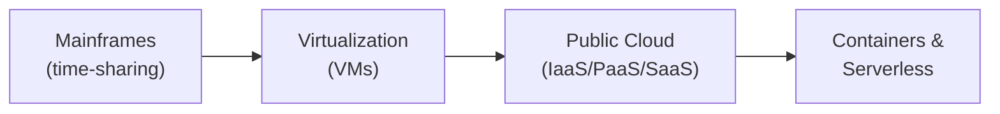

⬅ [Back to Index](../README.md)

# History & Evolution of Cloud Computing

Understanding *how* we got to the cloud helps you understand *why* it's designed the way it is.

### 🎓 Professional (IT-Standard) Reference

| Era / Concept | Layman View | Professional (IT-Standard) View + Example |
|---------------|-------------|-------------------------------------------|
| Mainframe & time-sharing | Sharing one big computer | Early computing centralized power in large mainframes.<br>Multiple users shared one machine through time-sharing.<br>Central Processing Unit (CPU) time was sliced between many jobs.<br>Terminals connected users to a single central system.<br>This introduced the idea of shared, rented compute.<br>*Example: an International Business Machines (IBM) System/360 running batch jobs.* |
| Virtualization | Splitting one machine into many | Virtualization uses a hypervisor to split one physical server into many Virtual Machines (VMs).<br>Each VM runs its own Operating System (OS) in isolation.<br>It dramatically improved hardware utilization.<br>It became the foundation for cloud computing.<br>Providers use it to serve many customers per host.<br>*Example: VMware Elastic Sky X integrated (ESXi) hosting dozens of VMs per server.* |
| Public cloud | Renting computers online | Public cloud delivers computing as a utility over the internet.<br>It is offered as Infrastructure, Platform, and Software as a Service (IaaS, PaaS, SaaS).<br>Resources are elastic and billed on usage.<br>It removed the need to buy servers.<br>It reshaped how businesses build systems.<br>*Example: the launch of Amazon Elastic Compute Cloud (EC2) in 2006.* |
| Containers & serverless | Lighter, faster app packaging | Containers use Operating System (OS)-level virtualization to package apps with dependencies.<br>They are lighter and faster to start than Virtual Machines (VMs).<br>Serverless / Function as a Service (FaaS) runs code without managing servers.<br>Both enable rapid, scalable deployment.<br>They are central to modern cloud-native design.<br>*Example: Docker containers orchestrated by Kubernetes; AWS Lambda functions.* |

---

## 🗺️ Visual Overview



**Explanation:** Cloud computing evolved step by step. We went from sharing one giant mainframe, to splitting servers into virtual machines, to renting computers online, and finally to lightweight containers and serverless code — each step made computing cheaper and faster to use.

---

## 🕰️ Timeline

| Era | Milestone |
|-----|-----------|
| **1960s** | John McCarthy envisions computing as a "public utility." Mainframe **time-sharing** lets multiple users share one machine. |
| **1970s** | IBM introduces **virtual machines** (VM/370) — one physical machine running multiple OSes. |
| **1990s** | **Virtualization** matures. Telecoms offer VPNs. The term "cloud" appears in network diagrams. |
| **1999** | **Salesforce** delivers enterprise apps over the web — early **SaaS**. |
| **2002** | **Amazon Web Services** launches internal infrastructure services. |
| **2006** | AWS launches **S3** (storage) and **EC2** (compute) — birth of modern **IaaS**. |
| **2008** | **Google App Engine** launches — early **PaaS**. Microsoft announces **Azure**. |
| **2010** | Microsoft **Azure** goes live. OpenStack (open-source cloud) founded. |
| **2013** | **Docker** popularizes containers. |
| **2014** | **AWS Lambda** launches **serverless / FaaS**. Google open-sources **Kubernetes**. |
| **2020s** | Multi-cloud, edge computing, AI/ML services, and serverless become mainstream. |

---

## 📈 Evolution of Compute Abstraction

```
Physical Servers → Virtual Machines → Containers → Serverless Functions
	(own metal)      (share machine)   (share OS)     (share runtime)
	 more control ◀───────────────────────────────▶ less management
```

Each step abstracts away more of the underlying infrastructure, letting developers focus on code instead of hardware.

---

## 🧠 Why It Matters

- **Time-sharing** → the idea of sharing resources (multi-tenancy).
- **Virtualization** → the technology that makes cloud economically viable ([read more](../04-Core-Technologies/virtualization.md)).
- **Containers & Kubernetes** → today's standard for deploying apps ([read more](../04-Core-Technologies/containers.md)).

---

**Navigation:** [← What is Cloud Computing](what-is-cloud-computing.md) | [Next → Characteristics](characteristics.md) | ⬅ [Back to Index](../README.md)
