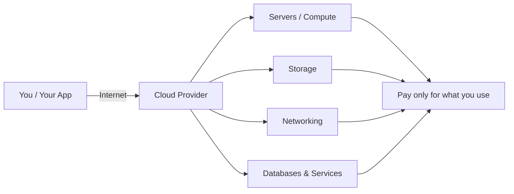

⬅ [Back to Index](../README.md)

# What is Cloud Computing?

**Cloud computing** is the on-demand delivery of computing resources — servers, storage, databases, networking, software, analytics, and intelligence — over the Internet ("the cloud") with **pay-as-you-go** pricing.

Instead of buying, owning, and maintaining physical data centers and servers, you rent access to anything from applications to storage from a cloud service provider.

### 🎓 Professional (IT-Standard) Reference

| Concept | Layman View | Professional (IT-Standard) View + Example |
|---------|-------------|-------------------------------------------|
| On-demand delivery | Get computing power whenever you need it | On-demand delivery means resources are provisioned instantly through self-service. No manual procurement or hardware setup is required. Provisioning happens via an Application Programming Interface (API) or web console. This aligns with the National Institute of Standards and Technology (NIST) definition in Special Publication (SP) 800-145. Capacity can be created and destroyed in seconds. *Example: launching an Amazon Elastic Compute Cloud (EC2) instance through the AWS API in seconds.* |
| Pay-as-you-go | Pay only for what you use | Pay-as-you-go is a consumption-based billing model. You are charged only for the resources you actually use. This shifts spending from Capital Expenditure (CapEx) to Operating Expenditure (OpEx). Usage is metered continuously and billed per unit. It removes large upfront hardware investments. *Example: AWS billing per second of compute and per gigabyte (GB) of Simple Storage Service (S3) storage.* |
| Rent vs own | Rent instead of buying machines | Renting shifts you from owning data centers to using provider-managed infrastructure. The Cloud Service Provider (CSP) owns and maintains the physical layer. You operate within the shared responsibility model. This reduces maintenance overhead and speeds up delivery. Migration is a common first cloud step. *Example: migrating an on-premises VMware cluster to Microsoft Azure Virtual Machines (VMs).* |
| Cloud provider | The company you rent from | A Cloud Service Provider (CSP) delivers computing services over the internet. Services are offered under a Service Level Agreement (SLA) defining uptime guarantees. Providers operate global regions and Availability Zones (AZs) for resilience. They handle physical security, power, and networking. You consume services through APIs, consoles, and Command Line Interfaces (CLIs). *Example: Amazon Web Services (AWS), Microsoft Azure, and Google Cloud Platform (GCP).* |

---

## 🗺️ Visual Overview

**Explanation:** You connect over the internet to a cloud provider that owns huge pools of servers, storage, and networking. Instead of buying any of it, you rent exactly what you need and pay only for what you use — the provider handles all the physical hardware behind the scenes.

---

## 🍕 Simple Analogy

Think of electricity.

| Traditional IT | Cloud Computing |
|----------------|-----------------|
| Buy your own generator | Plug into the power grid |
| High upfront cost (CapEx) | Pay-as-you-go (OpEx) |
| You maintain everything | Provider maintains hardware |
| Fixed capacity | Scale up/down instantly |

---

## 📖 Formal Definition (NIST)

The U.S. National Institute of Standards and Technology (NIST) defines cloud computing as:

> "A model for enabling ubiquitous, convenient, on-demand network access to a shared pool of configurable computing resources that can be rapidly provisioned and released with minimal management effort."

---

## 🧩 Real-World Examples

- **Netflix** runs entirely on AWS to stream video to 200M+ users.
- **Gmail / Google Docs** — you use email & documents without installing anything.
- **Spotify** stores and streams music from Google Cloud.
- **Zoom** scales meeting capacity up and down on the cloud during peak hours.
- **Dropbox** stores your files in the cloud, accessible from any device.

---

## 🔑 The Big Picture

Cloud computing is organized around two main axes:

1. **Service Models** — *what* you rent → [IaaS](../02-Service-Models/iaas.md), [PaaS](../02-Service-Models/paas.md), [SaaS](../02-Service-Models/saas.md)
2. **Deployment Models** — *where* it lives → [Public](../03-Deployment-Models/public-cloud.md), [Private](../03-Deployment-Models/private-cloud.md), [Hybrid](../03-Deployment-Models/hybrid-cloud.md)

---

## ✅ Key Takeaways

- Cloud = renting computing resources over the internet.
- You pay only for what you use.
- The provider handles the underlying hardware.
- It enables speed, scale, and global reach.

---

**Navigation:** [Next → History & Evolution](history-evolution.md) | ⬅ [Back to Index](../README.md)
