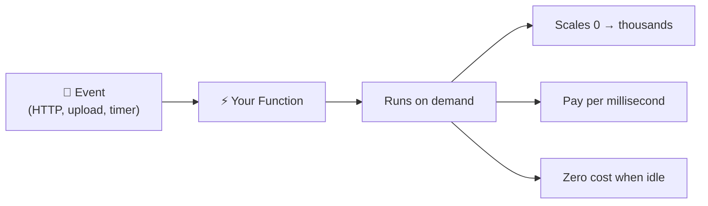

⬅ [Back to Index](../README.md)

# FaaS / Serverless Computing

**Serverless** lets you run code **without provisioning or managing servers**. **FaaS (Function as a Service)** is the core: you upload a function, and it runs on demand — you pay only while it executes.

> ⚡ "Serverless" doesn't mean no servers — it means *you* don't manage them.

### 🎓 Professional (IT-Standard) Reference

| Concept | Layman View | Professional (IT-Standard) View + Example |
|---------|-------------|-------------------------------------------|
| Functions (FaaS) | Run a snippet of code | Function as a Service (FaaS) runs small, stateless functions on demand.<br>You upload code and the provider runs it when triggered.<br>There are no servers for you to manage.<br>Billing is per invocation and per millisecond of runtime.<br>It scales automatically with demand.<br>*Example: an AWS Lambda function triggered by a Simple Storage Service (S3) upload.* |
| Event triggers | Runs when something happens | Serverless functions are event-driven.<br>Triggers come from queues, Hypertext Transfer Protocol (HTTP) requests, storage, or schedules.<br>Each event invokes the function independently.<br>This enables loosely coupled architectures.<br>Integration with other services is native.<br>*Example: Amazon API Gateway invoking Lambda; EventBridge running a scheduled job.* |
| Scaling | Handles any load | FaaS scales automatically and instantly.<br>It can scale to zero when idle, saving cost.<br>It bursts to many concurrent executions under load.<br>No capacity planning is required.<br>Concurrency limits can be configured.<br>*Example: Lambda scaling from zero to thousands of invocations during a spike.* |
| Cold start | First run is slower | A cold start is the delay when a new execution environment initializes.<br>It happens when no warm instance is available.<br>It adds latency to the first request.<br>It matters most for latency-sensitive apps.<br>It can be reduced with provisioned concurrency.<br>*Example: enabling provisioned concurrency to keep functions warm.* |

---

## 🗺️ Visual Overview



**Explanation:** Serverless / Function as a Service (FaaS) runs your code only when an event triggers it. The platform starts your function, scales it automatically, bills you per millisecond, and charges nothing while it sits idle.

---

## 🧩 Key Idea

- Write a small **function** (e.g., "resize an image").
- It runs **only when triggered** (an HTTP request, a file upload, a timer).
- Scales automatically from 0 → thousands of executions.
- **Pay per execution** (per millisecond), zero cost when idle.

---

## 🏭 Industry Examples / Tools

| Provider | FaaS Service |
|----------|--------------|
| AWS | **Lambda** |
| Azure | **Azure Functions** |
| GCP | **Cloud Functions**, **Cloud Run** |
| Open-source | **Knative**, **OpenFaaS**, Apache OpenWhisk |

Other serverless services: **AWS API Gateway**, **DynamoDB**, **S3**, **Aurora Serverless**, **Fargate**.

---

## 💡 Example Scenario

Automatically create a thumbnail whenever a user uploads a photo:
1. User uploads an image to **AWS S3**.
2. S3 event **triggers a Lambda function**.
3. Lambda resizes the image and saves the thumbnail.
4. You pay only for the milliseconds Lambda ran.

---

## 🖥️ Quick Example: AWS Lambda (Python)

```python
def lambda_handler(event, context):
	name = event.get("name", "World")
	return {
		"statusCode": 200,
		"body": f"Hello, {name}!"
	}
```

Deploy it, attach an API Gateway trigger, and you have a scalable API with no servers to manage.

---

## ✅ When to Use Serverless

- Event-driven workloads (file processing, webhooks, IoT).
- Unpredictable or spiky traffic.
- Microservices & APIs.
- You want minimal ops and pay-per-use.

## ⚖️ Pros & Cons

| Pros | Cons |
|------|------|
| No server management | **Cold starts** (initial latency) |
| Auto-scaling to zero | Execution time limits |
| Pay only when running | Harder to debug/monitor |
| Great for event-driven apps | Vendor lock-in risk |

---

**Related:** [PaaS](paas.md) · [Containers](../04-Core-Technologies/containers.md) · [Kubernetes](../06-Tools-and-Practices/kubernetes.md)

**Navigation:** [← SaaS](saas.md) | [Next → Public Cloud](../03-Deployment-Models/public-cloud.md) | ⬅ [Back to Index](../README.md)
