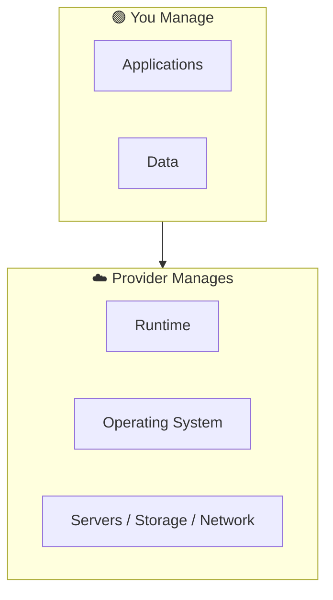

⬅ [Back to Index](../README.md)

# PaaS — Platform as a Service

**PaaS** provides a ready-to-use platform for developers to **build, run, and manage applications** without worrying about the underlying infrastructure (servers, OS, patching).

> 🏢 Think of PaaS as renting a **furnished apartment** — just move in your stuff (code) and start living.

### 🎓 Professional (IT-Standard) Reference

| Concept | Layman View | Professional (IT-Standard) View + Example |
|---------|-------------|-------------------------------------------|
| Managed runtime | Code just runs | Platform as a Service (PaaS) provides a managed application runtime.<br>The provider maintains the Operating System (OS), runtime, and middleware.<br>Patching and security updates are handled automatically.<br>Developers deploy code without touching servers.<br>It reduces operational overhead significantly.<br>*Example: Microsoft Azure App Service hosting a .NET application.* |
| Deployment | Upload and go | Deployment is streamlined and often automated.<br>Code is pushed via Git or a Continuous Integration/Continuous Delivery (CI/CD) pipeline.<br>Buildpacks or containers package the app automatically.<br>Rollouts and rollbacks are simplified.<br>Little to no infrastructure config is needed.<br>*Example: running `git push heroku main` to deploy instantly.* |
| Scaling | Grows automatically | PaaS platforms scale applications automatically.<br>They add or remove instances based on traffic.<br>Load balancing is built in and managed.<br>This maintains performance during spikes.<br>Scaling requires minimal developer effort.<br>*Example: Google App Engine auto-scaling instances as traffic rises.* |
| Backing services | Add-ons on tap | Managed backing services attach easily to apps.<br>These include databases, caches, and message queues.<br>They are provisioned as bindings or add-ons.<br>The provider manages their availability and backups.<br>This speeds up building full applications.<br>*Example: attaching a managed PostgreSQL add-on to your app.* |

---

## 🗺️ Visual Overview



**Explanation:** With Platform as a Service (PaaS) the provider manages the servers, operating system, and runtime for you. You only bring your application code and data — like moving into a furnished apartment and just unpacking your bags.

---

## 🎛️ What You Manage vs Provider

| Layer | PaaS: Who Manages? |
|-------|--------------------|
| Applications | **You** |
| Data | **You** |
| Runtime | Provider |
| OS | Provider |
| Virtualization / Servers / Storage / Network | Provider |

You focus **only on code and data**.

---

## 🏭 Industry Examples / Tools

| Provider | PaaS Service |
|----------|--------------|
| AWS | **Elastic Beanstalk**, **App Runner** |
| Azure | **App Service** |
| GCP | **App Engine**, **Cloud Run** |
| Others | **Heroku**, **Vercel**, **Netlify**, **Render**, Red Hat OpenShift |

---

## 💡 Example Scenario

A developer wants to deploy a Node.js app without managing servers:
1. Push code to **Heroku** or **Azure App Service**.
2. The platform automatically provisions servers, runtime, scaling, and load balancing.
3. Developer just runs `git push` — the app is live.

---

## 🚀 Quick Example: Deploy to Heroku

```bash
heroku create my-app
git push heroku main
# App is live at https://my-app.herokuapp.com
```

---

## ✅ When to Use PaaS

- You want to **focus on coding**, not infrastructure.
- Rapid development & deployment of web/mobile apps.
- Teams without dedicated ops/sysadmin resources.

## ⚖️ Pros & Cons

| Pros | Cons |
|------|------|
| Fast development & deployment | Less control over environment |
| No server management | Potential vendor lock-in |
| Built-in scaling & load balancing | Limited to supported runtimes |

---

**Related:** [IaaS](iaas.md) · [SaaS](saas.md) · [Serverless](faas-serverless.md)

**Navigation:** [← IaaS](iaas.md) | [Next → SaaS](saas.md) | ⬅ [Back to Index](../README.md)
