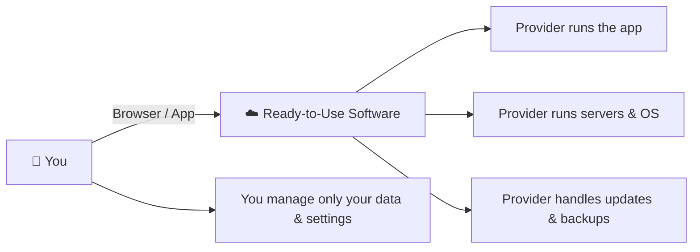

⬅ [Back to Index](../README.md)

# SaaS — Software as a Service

**SaaS** delivers **fully functional software applications** over the internet, on a subscription basis. The provider manages *everything* — you just use the app via a browser or client.

> 🏨 Think of SaaS as staying in a **hotel** — everything is managed for you; you just enjoy the service.

### 🎓 Professional (IT-Standard) Reference

| Concept | Layman View | Professional (IT-Standard) View + Example |
|---------|-------------|-------------------------------------------|
| Delivery | Use it in a browser | Software as a Service (SaaS) delivers ready-made applications online. Access is through a browser with no local installation. The app is multi-tenant, serving many customers at once. Traffic travels over Hypertext Transfer Protocol Secure (HTTPS). Updates roll out centrally to all users. *Example: Salesforce or Microsoft 365 used entirely in a browser.* |
| Billing | Pay a subscription | SaaS uses subscription or per-seat licensing. Customers pay monthly or annually per user. Costs scale with the number of users or usage. There is no hardware or maintenance cost. Plans are easy to upgrade or downgrade. *Example: a monthly per-user Slack plan billed by seat count.* |
| Identity | One login everywhere | Enterprise SaaS integrates centralized identity. Single Sign-On (SSO) lets users log in once for many apps. Federation uses standards like Security Assertion Markup Language (SAML) or OpenID Connect (OIDC). Multi-Factor Authentication (MFA) adds extra security. Access is centrally managed and revoked. *Example: Okta Single Sign-On (SSO) into Google Workspace.* |
| Data & compliance | They keep it safe | The vendor manages availability, backups, and security. They hold certifications proving compliance. Standards include System and Organization Controls (SOC) 2 and International Organization for Standardization (ISO) 27001. Uptime is guaranteed by a Service Level Agreement (SLA). Customers rely on the provider's controls. *Example: a vendor offering a 99.9% uptime SLA.* |

---

## 🗺️ Visual Overview

**Explanation:** With Software as a Service (SaaS) the provider runs the entire stack and you simply use the finished app through a browser. It is like staying in a hotel — everything is handled for you, and you only look after your own belongings (your data and settings).

---

## 🎛️ What You Manage vs Provider

| Layer | SaaS: Who Manages? |
|-------|--------------------|
| Applications | Provider |
| Data | Provider (you own your data) |
| Runtime / OS / Servers / Everything | Provider |

You manage **only your data and user settings**.

---

## 🏭 Industry Examples / Tools

| Category | SaaS Products |
|----------|---------------|
| Email & Productivity | **Google Workspace**, **Microsoft 365** |
| CRM | **Salesforce**, HubSpot |
| Communication | **Slack**, **Zoom**, Microsoft Teams |
| Storage | **Dropbox**, Google Drive |
| Dev Tools | **GitHub**, Jira, Notion |
| Streaming | **Netflix**, Spotify |

---

## 💡 Example Scenario

A company needs email for 500 employees:
- Instead of running mail servers, they subscribe to **Google Workspace**.
- Google handles servers, security, updates, spam filtering, storage.
- Employees just log in via browser.

---

## ✅ When to Use SaaS

- You need ready-to-use software with **zero maintenance**.
- Standard business needs (email, CRM, collaboration).
- Fast onboarding, predictable subscription cost.

## ⚖️ Pros & Cons

| Pros | Cons |
|------|------|
| Zero maintenance | Least control / customization |
| Accessible anywhere | Data lives with vendor |
| Predictable subscription pricing | Dependent on provider uptime |
| Automatic updates | Possible integration limits |

---

## 📊 Service Model Comparison (Pizza Analogy 🍕)

| Model | Analogy |
|-------|---------|
| **On-Premise** | Make pizza from scratch at home |
| **IaaS** | Buy dough, add your own toppings & bake |
| **PaaS** | Order takeout, eat at home |
| **SaaS** | Dine at a restaurant — everything served |

---

**Related:** [IaaS](iaas.md) · [PaaS](paas.md) · [Serverless](faas-serverless.md)

**Navigation:** [← PaaS](paas.md) | [Next → FaaS / Serverless](faas-serverless.md) | ⬅ [Back to Index](../README.md)
