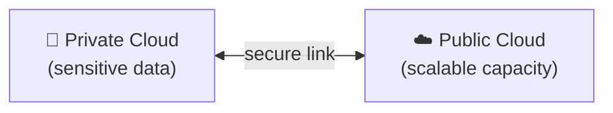

⬅ [Back to Index](../README.md)

# Hybrid Cloud

A **hybrid cloud** combines **public** and **private** clouds, allowing data and applications to move between them. You get the best of both worlds.

### 🎓 Professional (IT-Standard) Reference

| Concept | Layman View | Professional (IT-Standard) View + Example |
|---------|-------------|-------------------------------------------|
| Connectivity | Link private + public | Hybrid cloud securely connects private and public environments.<br>Connectivity uses a Virtual Private Network (VPN) or a dedicated link.<br>Dedicated links offer stable, low-latency bandwidth.<br>Traffic can stay private end to end.<br>This enables seamless integration.<br>*Example: AWS Direct Connect or Microsoft Azure ExpressRoute.* |
| Workload placement | Right app, right place | Workloads are placed based on cost, latency, and compliance.<br>Sensitive data can stay private while apps scale publicly.<br>Cloud-bursting sends peak load to the public cloud.<br>This balances control and flexibility.<br>Placement decisions are policy-driven.<br>*Example: cloud-bursting peak load to Amazon Web Services (AWS).* |
| Consistency | Same tools both sides | A unified control plane manages both environments.<br>Teams use the same tools across private and public.<br>This reduces complexity and training needs.<br>Governance and security stay consistent.<br>Operations become more efficient.<br>*Example: Microsoft Azure Arc or Google Anthos managing hybrid infrastructure.* |

---

## 🗺️ Visual Overview



**Explanation:** A hybrid cloud connects a private cloud with a public cloud so workloads can move between them. Sensitive data stays private while extra demand “bursts” into the public cloud — getting the best of both worlds.

---

## 💡 How It Works

```
   Private Cloud  ⇄  [ Secure Link ]  ⇄  Public Cloud
   (sensitive data)                     (scalable workloads)
```

- Keep sensitive data on a **private cloud**.
- Use the **public cloud** for scalability and burst capacity.
- Orchestrate workloads across both.

---

## 🏭 Examples / Tools

- **AWS Outposts / Azure Arc / Google Anthos** — manage hybrid environments.
- **VMware Cloud on AWS**.
- **Red Hat OpenShift** across on-prem + cloud.

---

## 💡 Example Scenario — "Cloud Bursting"

An e-commerce company:
- Runs normal traffic on its **private cloud**.
- During Black Friday, **bursts** extra load to the **public cloud** to handle spikes.
- Scales back down afterward — paying only for the extra capacity when needed.

---

## ✅ Advantages

| Advantage | Explanation |
|-----------|-------------|
| Flexibility | Right workload in the right place |
| Cost optimization | Burst to public only when needed |
| Security + scalability | Sensitive data stays private |
| Gradual migration | Move to cloud at your own pace |

## ⚠️ Disadvantages

- Complex to set up and manage.
- Networking & integration challenges.
- Requires strong governance.

---

## 🎯 Best For

- Enterprises modernizing gradually.
- Variable workloads with sensitive data.
- Disaster recovery setups.

---

**Related:** [Public Cloud](public-cloud.md) · [Private Cloud](private-cloud.md) · [Multi-Cloud](multi-cloud.md)

**Navigation:** [← Private Cloud](private-cloud.md) | [Next → Multi-Cloud](multi-cloud.md) | ⬅ [Back to Index](../README.md)
