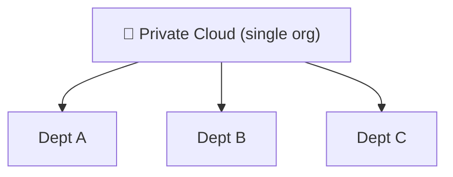

⬅ [Back to Index](../README.md)

# Private Cloud

A **private cloud** is cloud infrastructure dedicated to a **single organization**. It can be hosted on-premises or by a third party, but resources are **not shared** with others.

### 🎓 Professional (IT-Standard) Reference

| Concept | Layman View | Professional (IT-Standard) View + Example |
|---------|-------------|-------------------------------------------|
| Dedicated infra | Your own private cloud | Private cloud is single-tenant infrastructure for one organization. Resources are not shared with other customers. It can be on-premises or hosted by a third party. It offers strong control and isolation. It is common where compliance is strict. *Example: a VMware vSphere or OpenStack private cloud.* |
| Control | You run everything | You retain full governance over the environment. This includes data residency, security, and configuration. It suits regulated industries with strict rules. Customization is nearly unlimited. The trade-off is higher operational effort. *Example: meeting strict data-sovereignty requirements in-country.* |
| Cost model | Buy and maintain it | Private cloud is typically Capital Expenditure (CapEx)-heavy. You buy and maintain the hardware yourself. In-house teams handle operations. Utilization must stay high to justify cost. Refresh cycles add ongoing spend. *Example: periodic on-premises hardware refresh cycles.* |

---

## 🗺️ Visual Overview

**Explanation:** A private cloud is dedicated to one organization only — no sharing with outsiders. It gives maximum control and security (often for banks or governments), like owning your own private house instead of renting a shared building.

---

## 🏭 Examples / Tools

- **VMware vSphere / vCloud**
- **OpenStack** (open-source private cloud)
- **Microsoft Azure Stack**
- **Red Hat OpenShift** (on-prem)
- **AWS Outposts** (AWS hardware in your data center)

---

## 💡 How It Works

- Infrastructure is dedicated to one organization.
- Full control over security, hardware, and configuration.
- Often used by banks, governments, healthcare — where data privacy and compliance are critical.

---

## ✅ Advantages

| Advantage | Explanation |
|-----------|-------------|
| Maximum control | You own/manage everything |
| Enhanced security | Dedicated, isolated resources |
| Compliance-friendly | Meet strict regulations |
| Customizable | Tailor to specific needs |

## ⚠️ Disadvantages

- High upfront cost (hardware, maintenance).
- Limited scalability vs public cloud.
- Requires in-house expertise.

---

## 🎯 Best For

- Highly regulated industries (finance, healthcare, government).
- Sensitive data with strict compliance ([see compliance](../07-Security/compliance.md)).
- Predictable, steady workloads.

---

**Related:** [Public Cloud](public-cloud.md) · [Hybrid Cloud](hybrid-cloud.md)

**Navigation:** [← Public Cloud](public-cloud.md) | [Next → Hybrid Cloud](hybrid-cloud.md) | ⬅ [Back to Index](../README.md)
