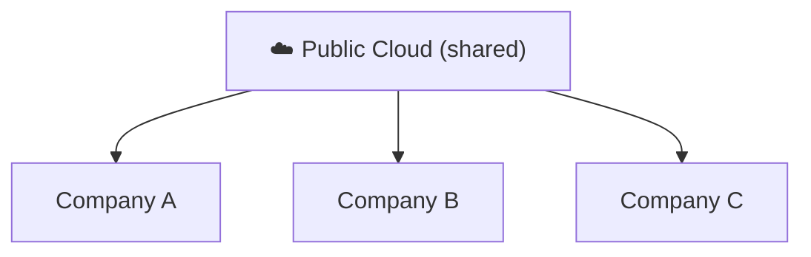

⬅ [Back to Index](../README.md)

# Public Cloud

A **public cloud** is owned and operated by a **third-party provider** that delivers computing resources over the internet. Resources are **shared** among many customers (multi-tenant).

### 🎓 Professional (IT-Standard) Reference

| Concept | Layman View | Professional (IT-Standard) View + Example |
|---------|-------------|-------------------------------------------|
| Multi-tenancy | Everyone shares the cloud | Public cloud serves many customers on shared infrastructure. Each tenant is logically isolated from the others. Isolation uses accounts, Identity and Access Management (IAM), and networking. Customers cannot see each other's data. This maximizes efficiency and lowers cost. *Example: Amazon Web Services (AWS) accounts isolated via IAM and Virtual Private Cloud (VPC).* |
| Elasticity | Scales on demand | Capacity expands and contracts automatically with demand. Global regions and Availability Zones (AZs) provide reach and resilience. You pay only for what you use. Scaling avoids over-provisioning. It supports unpredictable workloads. *Example: scaling an application across multiple Availability Zones (AZs).* |
| Economics | No upfront hardware | Public cloud uses an Operating Expenditure (OpEx) model. There is no Capital Expenditure (CapEx) on hardware. Billing is metered per usage. This lowers the barrier to entry. Costs must be governed to avoid waste. *Example: hourly Elastic Compute Cloud (EC2) billing with no upfront purchase.* |

---

## 🗺️ Visual Overview

**Explanation:** A public cloud is owned by a provider like AWS, Azure, or Google and shared by many customers at once. Each customer is isolated but rents from the same giant pool of hardware — like tenants in one big apartment building.

---

## 🏭 Examples / Providers

- **Amazon Web Services (AWS)** → [details](../05-Cloud-Providers/aws.md)
- **Microsoft Azure** → [details](../05-Cloud-Providers/azure.md)
- **Google Cloud Platform (GCP)** → [details](../05-Cloud-Providers/gcp.md)
- Oracle Cloud, IBM Cloud, Alibaba Cloud

---

## 💡 How It Works

- The provider owns the data centers, hardware, and networking.
- You rent resources on demand and share physical infrastructure with other tenants (securely isolated).
- Access everything via the internet.

---

## ✅ Advantages

| Advantage | Explanation |
|-----------|-------------|
| No hardware cost | Provider owns everything |
| Massive scalability | Near-unlimited resources |
| Pay-as-you-go | Only pay for usage |
| Global reach | Deploy in regions worldwide |
| High reliability | Redundant, managed infrastructure |

## ⚠️ Disadvantages

- Less control over infrastructure.
- Shared environment (though isolated).
- Compliance concerns for sensitive data.

---

## 🎯 Best For

- Startups & scale-ups.
- Web/mobile apps, dev/test environments.
- Variable or unpredictable workloads.

---

**Related:** [Private Cloud](private-cloud.md) · [Hybrid Cloud](hybrid-cloud.md)

**Navigation:** [Next → Private Cloud](private-cloud.md) | ⬅ [Back to Index](../README.md)
