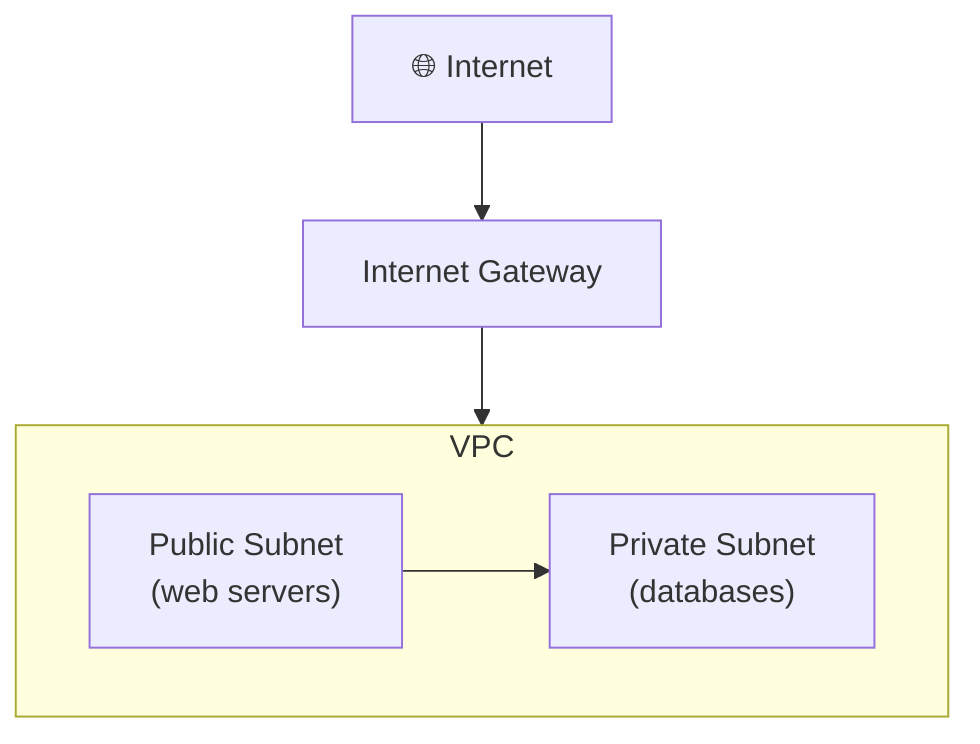

⬅ [Back to Index](../README.md)

# Cloud Networking

Cloud networking connects your resources securely, controls traffic, and connects your cloud to the internet and on-premises networks.

### 🎓 Professional (IT-Standard) Reference

| Concept | Layman View | Professional (IT-Standard) View + Example |
|---------|-------------|-------------------------------------------|
| VPC / VNet | Your private network in the cloud | A Virtual Private Cloud (VPC), called a Virtual Network (VNet) in Azure, is an isolated cloud network.<br>It is software-defined and fully configurable.<br>It uses private address ranges defined by Request for Comments (RFC) 1918.<br>It contains your compute and storage resources.<br>It controls how traffic flows.<br>*Example: an AWS VPC using the range 10.0.0.0/16.* |
| Subnets | Sections of your network | Subnets divide a network into smaller segments.<br>Public subnets allow internet access; private ones do not.<br>They are often mapped to Availability Zones (AZs).<br>Tiered apps place tiers in separate subnets.<br>This improves security and organization.<br>*Example: a web tier in a public subnet and a database tier in a private subnet.* |
| Security groups / NACLs | Firewalls for resources | Traffic is filtered by Security Groups (SGs) and Network Access Control Lists (NACLs).<br>Security Groups are stateful and attach to instances.<br>Network Access Control Lists are stateless and attach to subnets.<br>Rules allow or deny specific ports and sources.<br>They form layered network defense.<br>*Example: allowing only port 443 inbound to web servers.* |
| Load balancing | Spread traffic evenly | Load balancers distribute traffic across many targets.<br>Layer 4 balances at the transport level; Layer 7 at the application level.<br>They improve availability and scalability.<br>Health checks route around failures.<br>They enable zero-downtime scaling.<br>*Example: an AWS Application Load Balancer (ALB) routing Hypertext Transfer Protocol (HTTP) traffic across targets.* |

---

## 🗺️ Visual Overview



**Explanation:** Cloud networking gives you a private, walled-off network (a Virtual Private Cloud, or VPC) inside the provider. Public subnets face the internet for web servers, while private subnets hide sensitive resources like databases behind them.

---

## 🧩 Core Concepts

| Concept | Description | AWS | Azure | GCP |
|---------|-------------|-----|-------|-----|
| **Virtual Network** | Isolated private network | VPC | VNet | VPC |
| **Subnet** | Segment of a network | Subnet | Subnet | Subnet |
| **Load Balancer** | Distributes traffic | ELB/ALB/NLB | Load Balancer | Cloud LB |
| **DNS** | Domain name resolution | Route 53 | Azure DNS | Cloud DNS |
| **CDN** | Content delivery at edge | CloudFront | Azure CDN | Cloud CDN |
| **Firewall** | Traffic filtering | Security Groups / NACL | NSG | Firewall Rules |
| **VPN / Direct Link** | Connect on-prem | Direct Connect | ExpressRoute | Interconnect |

---

## 🌐 Key Components Explained

### VPC (Virtual Private Cloud)
Your own isolated section of the cloud where you define IP ranges, subnets, and routing.

### Subnets
- **Public subnet** — has internet access (e.g., web servers).
- **Private subnet** — no direct internet (e.g., databases).

### Load Balancing
Spreads incoming traffic across multiple servers for reliability and performance.
```
		┌──▶ Server 1
Traffic ─┼──▶ Server 2   (Load Balancer distributes)
		└──▶ Server 3
```

### CDN (Content Delivery Network)
Caches content at **edge locations** near users to reduce latency.
- Example: **Netflix** uses CDNs to stream video from the nearest server.

---

## 🔒 Security in Networking

- **Security Groups** — virtual firewalls for instances.
- **Network ACLs** — subnet-level rules.
- **Private endpoints** — access services without public internet.

➡️ More on security: [Cloud Security](../07-Security/cloud-security.md)

---

## 💡 Example Architecture

```
Internet → CDN → Load Balancer → [Public Subnet: Web Servers]
									   │
								 [Private Subnet: Database]
```

---

**Navigation:** [← Containers](containers.md) | [Next → Cloud Storage](storage.md) | ⬅ [Back to Index](../README.md)
