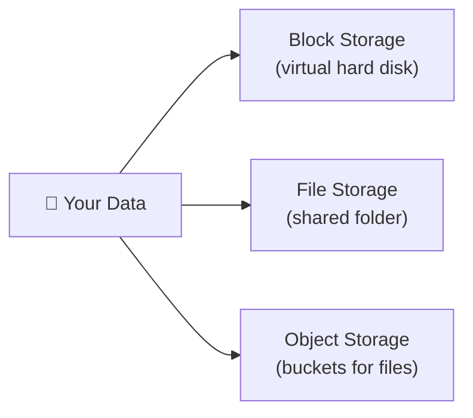

⬅ [Back to Index](../README.md)

# Cloud Storage

Cloud storage lets you store and retrieve data over the internet. There are **three main types**, each for different use cases.

### 🎓 Professional (IT-Standard) Reference

| Concept | Layman View | Professional (IT-Standard) View + Example |
|---------|-------------|-------------------------------------------|
| Object storage | Store files in buckets | Object storage keeps data as objects with metadata in buckets.<br>It is accessed over Hypertext Transfer Protocol (HTTP) using an Application Programming Interface (API).<br>It scales almost infinitely.<br>It offers very high durability (often eleven nines).<br>It suits backups, media, and static assets.<br>*Example: Amazon Simple Storage Service (S3) or Azure Blob Storage.* |
| Block storage | A virtual hard drive | Block storage provides low-latency volumes attached to a server.<br>It behaves like a physical hard disk.<br>It is ideal for databases and operating systems.<br>Volumes can be resized and snapshotted.<br>Each volume attaches to one instance at a time.<br>*Example: Amazon Elastic Block Store (EBS) mounted to an Elastic Compute Cloud (EC2) instance.* |
| File storage | A shared network folder | File storage offers a shared file system over the network.<br>It uses protocols like Network File System (NFS) or Server Message Block (SMB).<br>Many servers can mount it at once.<br>It suits shared application data.<br>It is fully managed by the provider.<br>*Example: Amazon Elastic File System (EFS) or Azure Files.* |
| Tiering & lifecycle | Cheaper storage for old data | Lifecycle policies move data between storage tiers automatically.<br>Data flows from hot to cold to archive over time.<br>This optimizes cost for infrequently used data.<br>Rules trigger based on age or access.<br>It reduces storage bills significantly.<br>*Example: a Simple Storage Service (S3) lifecycle rule moving data to Glacier after 90 days.* |

---

## 🗺️ Visual Overview



**Explanation:** Cloud storage comes in three flavors. Block storage acts like a hard disk for a server, file storage is a shared network folder, and object storage holds huge numbers of files (photos, backups) in buckets accessed over the web.

---

## 🗂️ Three Types of Storage

### 1️⃣ Object Storage
- Stores data as **objects** (file + metadata + unique ID) in a flat structure ("buckets").
- Best for: images, videos, backups, static websites, big data.
- **Highly scalable & cheap.**

| Provider | Service |
|----------|---------|
| AWS | **S3** |
| Azure | **Blob Storage** |
| GCP | **Cloud Storage** |

### 2️⃣ Block Storage
- Stores data in fixed-size **blocks**, like a virtual hard drive attached to a VM.
- Best for: databases, OS disks, high-performance apps.

| Provider | Service |
|----------|---------|
| AWS | **EBS** (Elastic Block Store) |
| Azure | **Managed Disks** |
| GCP | **Persistent Disk** |

### 3️⃣ File Storage
- Shared file system accessed over a network (NFS/SMB).
- Best for: shared files, legacy apps, content management.

| Provider | Service |
|----------|---------|
| AWS | **EFS** (Elastic File System) |
| Azure | **Azure Files** |
| GCP | **Filestore** |

---

## 📊 Comparison

| Feature | Object | Block | File |
|---------|--------|-------|------|
| Structure | Flat (buckets) | Blocks | Hierarchy (folders) |
| Access | HTTP API | Attached to VM | Network mount |
| Scalability | Virtually unlimited | Limited | Moderate |
| Use case | Media, backups | Databases, VMs | Shared drives |

---

## 🧊 Storage Tiers (Cost Optimization)

Cloud providers offer tiers based on access frequency:
- **Hot** — frequent access (higher cost). e.g., S3 Standard.
- **Cool / Infrequent** — occasional access. e.g., S3 Standard-IA.
- **Archive / Cold** — rare access, cheapest. e.g., **AWS S3 Glacier**, Azure Archive.

💡 **Example:** Store active user photos in Hot tier, move 5-year-old backups to Glacier to save 80%+ on cost.

---

## 💡 Example: Upload to AWS S3

```bash
aws s3 cp myfile.jpg s3://my-bucket/photos/
aws s3 ls s3://my-bucket/photos/
```

---

**Navigation:** [← Cloud Networking](networking.md) | [Next → AWS](../05-Cloud-Providers/aws.md) | ⬅ [Back to Index](../README.md)
