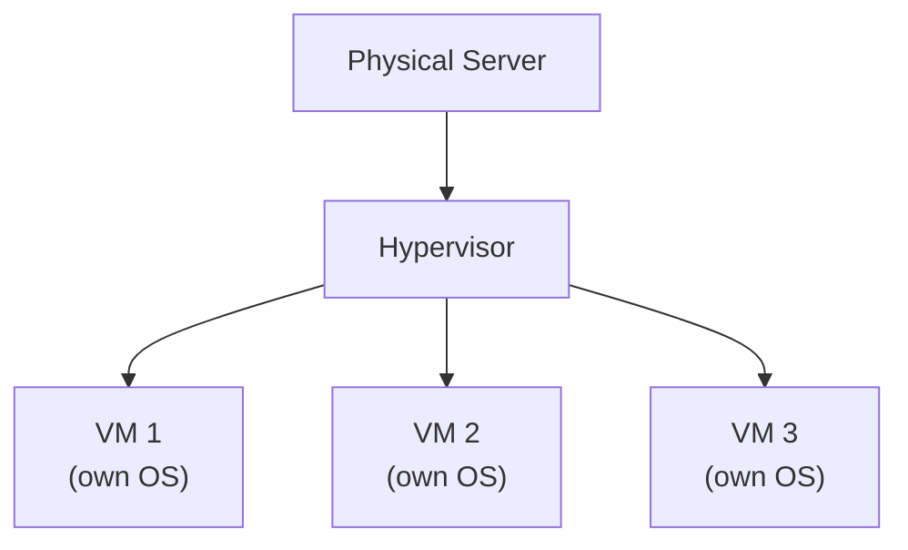

⬅ [Back to Index](../README.md)

# Virtualization

**Virtualization** is the foundational technology of cloud computing. It uses software (a **hypervisor**) to create multiple **virtual machines (VMs)** on a single physical server — each with its own OS.

### 🎓 Professional (IT-Standard) Reference

| Concept | Layman View | Professional (IT-Standard) View + Example |
|---------|-------------|-------------------------------------------|
| Hypervisor | Software that splits a server | A hypervisor, also called a Virtual Machine Monitor (VMM), creates and runs Virtual Machines (VMs).<br>Type-1 runs directly on hardware (bare-metal).<br>Type-2 runs on top of a host Operating System (OS).<br>It allocates Central Processing Unit (CPU), memory, and disk to guests.<br>It underpins cloud infrastructure.<br>*Example: VMware Elastic Sky X integrated (ESXi), Kernel-based Virtual Machine (KVM), or Microsoft Hyper-V.* |
| Virtual machine | A computer inside a computer | A Virtual Machine (VM) is an isolated guest with its own Operating System (OS).<br>It has virtualized Central Processing Unit (CPU), Random Access Memory (RAM), and storage.<br>Multiple VMs run on one physical host.<br>Each VM is independent and secure.<br>VMs can be cloned and moved.<br>*Example: an Ubuntu VM running on a VMware ESXi host.* |
| Resource allocation | Sharing the hardware fairly | The hypervisor schedules shared physical resources across guests.<br>Virtual Central Processing Units (vCPUs) and memory can be overcommitted.<br>Scheduling ensures fair access under contention.<br>This maximizes hardware utilization.<br>Limits prevent one VM starving others.<br>*Example: twenty VMs sharing eight physical CPU cores.* |
| Live migration | Moving a VM without downtime | Live migration moves a running Virtual Machine (VM) between hosts.<br>It happens with little or no downtime.<br>Memory state is copied while the VM keeps running.<br>It enables maintenance without outages.<br>It supports load balancing across hosts.<br>*Example: VMware vMotion moving a running VM during host maintenance.* |

---

## 🗺️ Visual Overview



**Explanation:** Virtualization uses a layer called a hypervisor to split one physical server into several independent virtual machines, each with its own operating system. This is the foundation of the cloud — it lets providers run many customers safely on one machine.

---

## 🧩 How It Works

```
┌─────────────────────────────────────┐
│  VM1     VM2     VM3   (each has OS) │
├─────────────────────────────────────┤
│           Hypervisor                 │
├─────────────────────────────────────┤
│        Physical Hardware             │
└─────────────────────────────────────┘
```

The **hypervisor** sits between hardware and VMs, allocating CPU, memory, and storage to each VM.

---

## 🔧 Types of Hypervisors

| Type | Description | Examples |
|------|-------------|----------|
| **Type 1 (Bare-metal)** | Runs directly on hardware; fast & secure | VMware ESXi, Microsoft Hyper-V, KVM, Xen |
| **Type 2 (Hosted)** | Runs on top of a host OS | VirtualBox, VMware Workstation |

---

## 🎭 Types of Virtualization

- **Server virtualization** — multiple VMs per physical server.
- **Storage virtualization** — pool multiple storage devices.
- **Network virtualization** — virtual networks (VLANs, SDN).
- **Desktop virtualization (VDI)** — virtual desktops (e.g., Citrix, AWS WorkSpaces).

---

## 💡 Why It Matters for Cloud

- **Resource pooling** — one server serves many customers ([multi-tenancy](../01-Introduction/characteristics.md)).
- **Efficiency** — maximize hardware utilization.
- **Isolation** — VMs are separated for security.
- **Elasticity** — spin VMs up/down quickly.

---

## 🆚 Virtualization vs Containers

| Aspect | Virtual Machines | Containers |
|--------|------------------|------------|
| Isolation | Full OS per VM | Share host OS kernel |
| Size | GBs | MBs |
| Startup | Minutes | Seconds |
| Overhead | Higher | Lower |

➡️ Learn about the lightweight alternative: [Containers](containers.md)

---

**Navigation:** [Next → Containers](containers.md) | ⬅ [Back to Index](../README.md)
