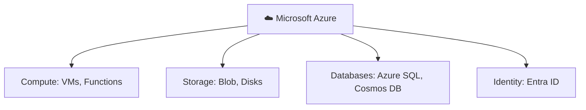

⬅ [Back to Index](../README.md)

# Microsoft Azure

**Azure** is Microsoft's cloud platform (launched 2010), strong in **enterprise**, **hybrid cloud**, and **Microsoft ecosystem** integration (Windows, Office 365, Active Directory).

### 🎓 Professional (IT-Standard) Reference

| Service Area | Layman View | Professional (IT-Standard) View + Example |
|--------------|-------------|-------------------------------------------|
| Compute | Rent servers | Microsoft Azure offers several compute options.<br>Virtual Machines (VMs) provide full server control.<br>Functions provide serverless execution.<br>Azure Kubernetes Service (AKS) runs containers.<br>Scale Sets provide elastic capacity.<br>*Example: Virtual Machine Scale Sets for elastic capacity.* |
| Storage | Store files/data | Azure provides multiple storage services.<br>Blob Storage holds object data.<br>Managed Disks provide block storage for VMs.<br>Azure Files offers shared file storage.<br>Tiers optimize cost by access frequency.<br>*Example: using Blob Storage for application backups.* |
| Identity | Corporate logins | Azure centralizes identity with Microsoft Entra ID (formerly Azure Active Directory).<br>It provides Single Sign-On (SSO) and Multi-Factor Authentication (MFA).<br>Conditional access enforces security policies.<br>It integrates deeply with Microsoft 365.<br>Access is centrally governed.<br>*Example: enforcing conditional access policies for sign-in.* |
| Hybrid | Bridge on-prem & cloud | Azure is strong in hybrid scenarios.<br>Azure Arc manages on-premises and multi-cloud resources.<br>ExpressRoute provides a private, dedicated connection.<br>This unifies management across environments.<br>It suits enterprises with existing data centers.<br>*Example: managing on-premises servers through Azure Arc.* |

---

## 🗺️ Visual Overview



**Explanation:** Microsoft Azure is the second-largest cloud and is especially strong for enterprises already using Microsoft tools. It offers the same core families — compute, storage, databases — plus deep identity integration with Entra ID (formerly Active Directory).

---

## 🧱 Core Services by Category

| Category | Service | What It Does |
|----------|---------|--------------|
| **Compute** | Virtual Machines | IaaS servers |
| | Azure Functions | Serverless |
| | AKS | Managed Kubernetes |
| | App Service | PaaS web apps |
| **Storage** | Blob Storage | Object storage |
| | Managed Disks | Block storage |
| | Azure Files | File storage |
| **Database** | Azure SQL Database | Managed SQL |
| | Cosmos DB | Globally distributed NoSQL |
| | Azure Database for PostgreSQL/MySQL | Managed open-source DBs |
| **Networking** | Virtual Network (VNet) | Private network |
| | Azure DNS | DNS |
| | Azure CDN | Content delivery |
| | Load Balancer / App Gateway | Traffic distribution |
| **Identity** | Azure Active Directory (Entra ID) | Identity management |
| **AI/ML** | Azure Machine Learning | ML platform |
| | Azure OpenAI Service | GPT models |
| | Cognitive Services | Vision, speech, language |
| **Hybrid** | Azure Arc | Manage on-prem + cloud |
| | Azure Stack | On-prem Azure |

---

## 🌟 Azure's Strengths

- **Enterprise & hybrid** — best-in-class hybrid tools (Azure Arc, Stack).
- **Microsoft integration** — seamless with Windows Server, AD, Office 365.
- **Compliance** — extensive certifications for regulated industries.

---

## 💡 Example: Enterprise Hybrid Setup

```
On-Premises (Windows Server + AD)
	 ⇅ (Azure Arc / ExpressRoute)
Azure Cloud (VMs + Azure SQL + Entra ID)
```

Companies already using Microsoft products often choose Azure for smooth integration.

---

## 🎓 Certifications
- Azure Fundamentals (AZ-900)
- Azure Administrator (AZ-104)
- Azure Solutions Architect (AZ-305)
- Azure Developer (AZ-204)

➡️ See [Certifications Guide](../09-Resources/certifications.md)

---

**Navigation:** [← AWS](aws.md) | [Next → GCP](gcp.md) | ⬅ [Back to Index](../README.md)
