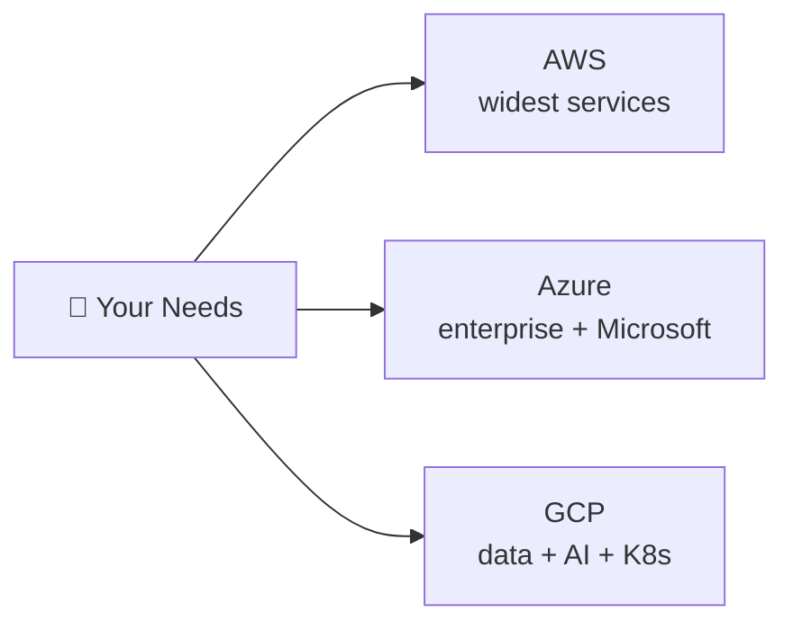

⬅ [Back to Index](../README.md)

# Cloud Provider Comparison (AWS vs Azure vs GCP)

A side-by-side comparison to help you understand each provider's strengths.

### 🎓 Professional (IT-Standard) Reference

| Dimension | Layman View | Professional (IT-Standard) View + Example |
|-----------|-------------|-------------------------------------------|
| Market position | Who's biggest | Amazon Web Services (AWS) leads overall market share. Microsoft Azure is strong in enterprise and hybrid. Google Cloud Platform (GCP) excels in data and machine learning. Each has distinct strengths. Choice often follows existing technology stacks. *Example: choosing Azure for a Microsoft-centric organization.* |
| Service naming | Same thing, different names | Providers offer similar services with different names. Virtual Machines are EC2, Azure VM, and Compute Engine. Serverless is Lambda, Azure Functions, and Cloud Functions. Mapping names helps in multi-cloud work. Concepts remain consistent across clouds. *Example: Amazon Elastic Compute Cloud (EC2) equals Azure Virtual Machines.* |
| Selection criteria | Which one to pick | Provider choice depends on several factors. Consider existing stack, compliance, and region coverage. Pricing and specific service strengths matter. Team skills influence the decision. A workload's needs guide the choice. *Example: choosing Google Cloud Platform (GCP) for BigQuery analytics.* |
| Multi-cloud | Use more than one | Many organizations use multiple providers. This avoids lock-in and improves resilience. Abstraction tools keep deployments portable. Terraform and Kubernetes are common choices. It adds complexity that must be managed. *Example: abstracting workloads with Terraform and Kubernetes across clouds.* |

---

## 🗺️ Visual Overview

**Explanation:** The big three clouds offer very similar building blocks under different names. This section compares them so you can pick based on your needs — AWS for breadth, Azure for Microsoft shops, and GCP for data and AI.

---

## 🏆 Market Position (approximate)

| Provider | Market Share | Launched | Strength |
|----------|-------------|----------|----------|
| **AWS** | ~31% | 2006 | Breadth of services, maturity, market leader |
| **Azure** | ~25% | 2010 | Enterprise & hybrid, Microsoft ecosystem |
| **GCP** | ~11% | 2008 | Data analytics, ML, Kubernetes |

---

## 🔄 Service Name Equivalents

| Service | AWS | Azure | GCP |
|---------|-----|-------|-----|
| Virtual Machines | EC2 | Virtual Machines | Compute Engine |
| Serverless | Lambda | Azure Functions | Cloud Functions |
| Kubernetes | EKS | AKS | GKE |
| Object Storage | S3 | Blob Storage | Cloud Storage |
| Block Storage | EBS | Managed Disks | Persistent Disk |
| Managed SQL | RDS | Azure SQL DB | Cloud SQL |
| NoSQL | DynamoDB | Cosmos DB | Firestore/Bigtable |
| Data Warehouse | Redshift | Synapse | BigQuery |
| PaaS | Elastic Beanstalk | App Service | App Engine |
| CDN | CloudFront | Azure CDN | Cloud CDN |
| DNS | Route 53 | Azure DNS | Cloud DNS |
| Identity | IAM | Entra ID (AD) | Cloud IAM |
| Virtual Network | VPC | VNet | VPC |

---

## 🎯 Which to Choose?

| If you need... | Choose |
|----------------|--------|
| Widest range of services & maturity | **AWS** |
| Strong enterprise/hybrid + Microsoft stack | **Azure** |
| Best data analytics, ML, Kubernetes | **GCP** |
| Avoid lock-in | **[Multi-cloud](../03-Deployment-Models/multi-cloud.md)** |

---

## 💡 Reality Check

- All three are excellent and constantly catching up to each other.
- Choice often depends on: existing tech stack, team skills, pricing, specific service needs.
- Many large companies use **[multi-cloud](../03-Deployment-Models/multi-cloud.md)**.

---

**Navigation:** [← GCP](gcp.md) | [Next → DevOps & CI/CD](../06-Tools-and-Practices/devops-cicd.md) | ⬅ [Back to Index](../README.md)
