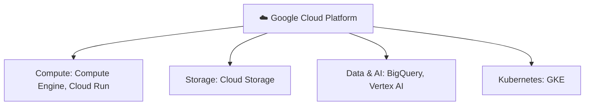

⬅ [Back to Index](../README.md)

# Google Cloud Platform (GCP)

**GCP** is Google's cloud (launched 2008), known for **data analytics, machine learning, Kubernetes**, and networking (built on Google's global backbone).

### 🎓 Professional (IT-Standard) Reference

| Service Area | Layman View | Professional (IT-Standard) View + Example |
|--------------|-------------|-------------------------------------------|
| Compute | Rent servers | Google Cloud Platform (GCP) offers several compute models.<br>Compute Engine provides Virtual Machines (VMs).<br>Cloud Run runs containers serverlessly.<br>Google Kubernetes Engine (GKE) manages Kubernetes.<br>Autopilot mode manages nodes for you.<br>*Example: a GKE Autopilot managed Kubernetes cluster.* |
| Data & analytics | Crunch big data | GCP is known for large-scale data analytics.<br>BigQuery is a serverless data warehouse.<br>Dataflow processes streaming and batch data.<br>These handle petabyte-scale workloads.<br>They integrate with machine learning tools.<br>*Example: running petabyte-scale queries in BigQuery.* |
| ML/AI | Smart models | GCP provides strong Machine Learning (ML) and Artificial Intelligence (AI) services.<br>Vertex AI covers training and serving models.<br>TensorFlow tooling is deeply supported.<br>Managed infrastructure simplifies ML workflows.<br>Graphics Processing Units (GPUs) accelerate training.<br>*Example: training and serving models on Vertex AI.* |
| Networking | Fast global network | GCP runs on Google's global fiber backbone.<br>A global Virtual Private Cloud (VPC) spans regions.<br>Cloud Load Balancing distributes traffic worldwide.<br>Anycast routing sends users to the nearest edge.<br>This delivers low latency globally.<br>*Example: an anycast global Hypertext Transfer Protocol Secure (HTTPS) load balancer.* |

---

## 🗺️ Visual Overview



**Explanation:** Google Cloud Platform (GCP) is known for strengths in data analytics, machine learning, and Kubernetes (which Google created). It offers the usual compute and storage families plus standout tools like BigQuery for analytics.

---

## 🧱 Core Services by Category

| Category | Service | What It Does |
|----------|---------|--------------|
| **Compute** | Compute Engine | Virtual machines |
| | Cloud Functions | Serverless |
| | GKE | Managed Kubernetes (industry-leading) |
| | Cloud Run | Serverless containers |
| | App Engine | PaaS |
| **Storage** | Cloud Storage | Object storage |
| | Persistent Disk | Block storage |
| | Filestore | File storage |
| **Database** | Cloud SQL | Managed SQL |
| | Firestore | NoSQL document DB |
| | Bigtable | Wide-column NoSQL |
| | **BigQuery** | Serverless data warehouse (flagship) |
| | Spanner | Global relational DB |
| **Networking** | VPC | Virtual network |
| | Cloud DNS / Cloud CDN | DNS & CDN |
| **AI/ML** | Vertex AI | Unified ML platform |
| | Vision / Speech / Translation AI | Pre-trained APIs |
| | TensorFlow (open-source) | ML framework |

---

## 🌟 GCP's Strengths

- **Data & Analytics** — **BigQuery** is world-class for big data.
- **Machine Learning / AI** — Vertex AI, TensorFlow, TPUs.
- **Kubernetes** — Google created Kubernetes; **GKE** is best-in-class.
- **Networking** — runs on Google's private global fiber network.

---

## 💡 Example: Data Analytics Pipeline

```
Data sources → Pub/Sub (streaming) → Dataflow (processing)
   → BigQuery (analysis) → Looker / Data Studio (visualization)
```

Companies with heavy data/ML needs often choose GCP.

---

## 🎓 Certifications
- Cloud Digital Leader (beginner)
- Associate Cloud Engineer
- Professional Cloud Architect
- Professional Data Engineer / ML Engineer

➡️ See [Certifications Guide](../09-Resources/certifications.md)

---

**Navigation:** [← Azure](azure.md) | [Next → Provider Comparison](comparison.md) | ⬅ [Back to Index](../README.md)
