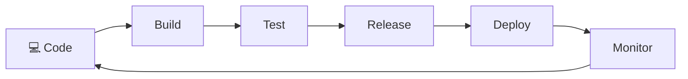

⬅ [Back to Index](../README.md)

# DevOps & CI/CD

**DevOps** is a culture and set of practices that unite **development (Dev)** and **operations (Ops)** to deliver software faster and more reliably. **CI/CD** automates building, testing, and deploying code.

### 🎓 Professional (IT-Standard) Reference

| Concept | Layman View | Professional (IT-Standard) View + Example |
|---------|-------------|-------------------------------------------|
| CI (Continuous Integration) | Merge & test often | Continuous Integration (CI) means merging code frequently into a shared branch.<br>Each commit triggers an automated build and tests.<br>This catches integration issues early.<br>It keeps the main branch always releasable.<br>Fast feedback improves quality.<br>*Example: GitHub Actions running unit tests on every Pull Request (PR).* |
| CD (Continuous Delivery/Deployment) | Ship automatically | Continuous Delivery keeps code ready to release at any time.<br>Continuous Deployment goes further and releases automatically.<br>Deployments pass through approval and quality gates.<br>This shortens release cycles safely.<br>Rollbacks are automated when needed.<br>*Example: ArgoCD performing a GitOps deploy to a Kubernetes cluster.* |
| Pipeline | The assembly line | A pipeline defines automated stages from code to production.<br>Typical stages are build, test, and deploy.<br>It is defined as code and version-controlled.<br>Stages can run in sequence or parallel.<br>It ensures repeatable, auditable releases.<br>*Example: a Jenkinsfile or GitLab Continuous Integration (CI) YAML pipeline.* |
| DORA metrics | Measuring success | DevOps Research and Assessment (DORA) defines four key delivery metrics.<br>They are deployment frequency and lead time for changes.<br>They also include Mean Time To Recovery (MTTR) and change-failure rate.<br>These measure delivery performance objectively.<br>Teams use them to improve.<br>*Example: tracking Mean Time To Recovery (MTTR) after incidents.* |

---

## 🗺️ Visual Overview



**Explanation:** DevOps with Continuous Integration/Continuous Delivery (CI/CD) turns software delivery into an automated loop. Every code change is automatically built, tested, and deployed, then monitored — feeding lessons back into the next change.

---

## 🔄 CI/CD Explained

| Term | Meaning |
|------|---------|
| **CI — Continuous Integration** | Developers merge code frequently; automated builds & tests run on each commit |
| **CD — Continuous Delivery** | Code is always in a deployable state; deployment is one click |
| **CD — Continuous Deployment** | Every passing change auto-deploys to production |

### Pipeline Flow
```
Code Commit → Build → Test → Package → Deploy to Staging → Deploy to Production
	(git)     (compile) (unit/  (Docker)   (auto)             (auto/manual)
						integration)
```

---

## 🏭 Industry CI/CD Tools

| Tool | Notes |
|------|-------|
| **Jenkins** | Open-source, highly extensible (plugins) |
| **GitHub Actions** | Native to GitHub, YAML workflows |
| **GitLab CI/CD** | Built into GitLab |
| **CircleCI** | Cloud-based, fast |
| **Azure DevOps** | Microsoft's full ALM suite |
| **AWS CodePipeline** | AWS-native CI/CD |
| **ArgoCD** | GitOps for Kubernetes |
| **Travis CI** | Simple, popular for open source |

---

## 💡 Example: GitHub Actions Workflow

```yaml
name: CI/CD Pipeline
on:
  push:
	branches: [ main ]
jobs:
  build-and-deploy:
	runs-on: ubuntu-latest
	steps:
	  - uses: actions/checkout@v4
	  - name: Install dependencies
		run: npm install
	  - name: Run tests
		run: npm test
	  - name: Build Docker image
		run: docker build -t my-app .
	  - name: Deploy
		run: ./deploy.sh
```

---

## 🧩 The DevOps Toolchain

| Stage | Tools |
|-------|-------|
| Plan | Jira, Trello |
| Code | Git, GitHub, GitLab |
| Build | Maven, Gradle, npm, Docker |
| Test | JUnit, Selenium, Jest |
| Release | Jenkins, GitHub Actions, ArgoCD |
| Deploy | [Kubernetes](kubernetes.md), [Terraform](iac.md) |
| Operate | [Prometheus, Grafana](monitoring.md) |
| Monitor | Datadog, ELK, CloudWatch |

---

## 🌟 DevOps Principles

- **Automate everything** — builds, tests, deployments, infrastructure.
- **Continuous feedback** — monitoring & alerts.
- **Infrastructure as Code** — see [IaC](iac.md).
- **Collaboration** — break down Dev/Ops silos.

---

**Navigation:** [Next → Infrastructure as Code](iac.md) | ⬅ [Back to Index](../README.md)
