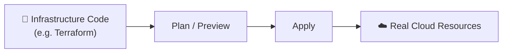

⬅ [Back to Index](../README.md)

# Infrastructure as Code (IaC)

**IaC** means managing and provisioning infrastructure (servers, networks, databases) through **code and configuration files** instead of manual clicking in a console.

> 📜 Your entire cloud setup becomes version-controlled, repeatable, and automated.

### 🎓 Professional (IT-Standard) Reference

| Concept | Layman View | Professional (IT-Standard) View + Example |
|---------|-------------|-------------------------------------------|
| Declarative IaC | Describe the end state | Declarative Infrastructure as Code (IaC) defines the desired end state.<br>The tool figures out how to reach that state.<br>You describe what you want, not the steps.<br>It reconciles real infrastructure to match.<br>This makes deployments predictable.<br>*Example: Terraform HashiCorp Configuration Language (HCL) defining a Virtual Private Cloud (VPC) and Elastic Compute Cloud (EC2) instance.* |
| State management | Remember what exists | IaC tools track real resources in a state file.<br>State maps configuration to actual infrastructure.<br>It should be stored remotely and locked for teams.<br>This prevents conflicts and drift.<br>State is critical to safe operations.<br>*Example: Terraform state stored in Simple Storage Service (S3) with DynamoDB locking.* |
| Idempotency | Run it safely many times | Idempotency means repeated runs yield the same result.<br>Applying config twice does not cause duplicate changes.<br>The tool only changes what differs from desired state.<br>This makes automation safe to re-run.<br>It reduces the risk of errors.<br>*Example: running `ansible-playbook` repeatedly to converge configuration.* |
| Modules/reuse | Reusable building blocks | Modules package reusable infrastructure components.<br>They are parameterized and versioned.<br>Teams share them to enforce standards.<br>This reduces duplication and errors.<br>It speeds up new deployments.<br>*Example: a shared Terraform network module reused across projects.* |

---

## 🗺️ Visual Overview



**Explanation:** Infrastructure as Code (IaC) means describing your servers and networks in text files instead of clicking buttons. You preview the changes, apply them, and the tool builds the real resources — making setups repeatable, reviewable, and version-controlled.

---

## 🌟 Why IaC?

| Benefit | Explanation |
|---------|-------------|
| **Consistency** | Same setup every time — no manual errors |
| **Version control** | Track changes in Git, roll back easily |
| **Speed** | Provision entire environments in minutes |
| **Repeatability** | Recreate dev/test/prod identically |
| **Documentation** | The code *is* the documentation |

---

## 🏭 Industry IaC Tools

| Tool | Type | Notes |
|------|------|-------|
| **Terraform** | Declarative, multi-cloud | Most popular; HCL language |
| **AWS CloudFormation** | Declarative, AWS-only | JSON/YAML templates |
| **Azure ARM / Bicep** | Declarative, Azure-only | Bicep is friendlier syntax |
| **Pulumi** | Uses real languages (Python, TS, Go) | Programmer-friendly |
| **Ansible** | Config management + provisioning | Agentless, YAML |
| **Chef / Puppet** | Config management | Mature, enterprise |

---

## 📜 Declarative vs Imperative

- **Declarative** ("what") — you describe the *desired end state*; the tool figures out how. (Terraform, CloudFormation)
- **Imperative** ("how") — you specify the exact steps. (scripts, some Ansible)

---

## 💡 Example: Terraform (create an AWS EC2 instance)

```hcl
provider "aws" {
  region = "us-east-1"
}

resource "aws_instance" "web_server" {
  ami           = "ami-0abcdef1234567890"
  instance_type = "t3.micro"

  tags = {
	Name = "MyWebServer"
  }
}
```

Run it:
```bash
terraform init      # initialize
terraform plan      # preview changes
terraform apply     # create infrastructure
terraform destroy   # tear it all down
```

---

## 🔧 Related Practice: Configuration Management

Once servers exist, tools like **Ansible** configure them:
```yaml
- hosts: webservers
  tasks:
	- name: Install nginx
	  apt:
		name: nginx
		state: present
```

---

## 🧩 IaC + CI/CD = GitOps

Store infrastructure code in Git → changes are reviewed, tested, and auto-applied. Tools: **ArgoCD**, **Flux**, **Atlantis**.

➡️ Related: [DevOps & CI/CD](devops-cicd.md) · [Kubernetes](kubernetes.md)

---

**Navigation:** [← DevOps & CI/CD](devops-cicd.md) | [Next → Kubernetes](kubernetes.md) | ⬅ [Back to Index](../README.md)
