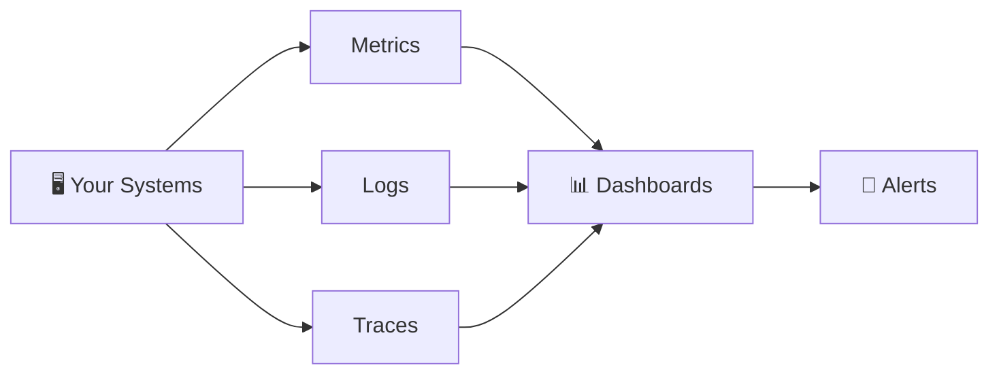

⬅ [Back to Index](../README.md)

# Monitoring & Observability

You can't manage what you can't measure. **Monitoring** tracks system health; **observability** helps you understand *why* something is happening.

### 🎓 Professional (IT-Standard) Reference

| Concept | Layman View | Professional (IT-Standard) View + Example |
|---------|-------------|-------------------------------------------|
| Metrics | Numbers over time | Metrics are numeric measurements collected over time.<br>They are stored as time-series data.<br>They track things like latency and resource usage.<br>They power dashboards and alerts.<br>They are lightweight and efficient.<br>*Example: Prometheus scraping Central Processing Unit (CPU) and latency metrics.* |
| Logs | Event records | Logs are timestamped records of discrete events.<br>They are centralized and made searchable.<br>Structured logs are easier to query.<br>They help diagnose specific failures.<br>They complement metrics and traces.<br>*Example: the Elasticsearch, Logstash, and Kibana (ELK) stack aggregating application logs.* |
| Traces | Request's journey | Distributed tracing follows a request across services.<br>Each step is recorded as a span.<br>It reveals where time is spent.<br>It uses the OpenTelemetry standard.<br>It is vital in microservices.<br>*Example: Jaeger tracing a slow request across services.* |
| Alerting & SLOs | Warn when it breaks | Alerts notify teams when systems misbehave.<br>They are based on Service Level Indicators (SLIs) and Objectives (SLOs).<br>Objectives relate to Service Level Agreements (SLAs).<br>Error budgets guide when to act.<br>Good alerts reduce noise.<br>*Example: Alertmanager paging on a 99.9% Service Level Objective (SLO) breach.* |

---

## 🗺️ Visual Overview



**Explanation:** Monitoring and observability collect three signals from your systems — metrics (numbers), logs (events), and traces (request paths). These feed dashboards and alerts so you can see health at a glance and get paged when something breaks.

---

## 🔭 The Three Pillars of Observability

| Pillar | What It Tracks | Example |
|--------|----------------|---------|
| **Metrics** | Numeric measurements over time | CPU %, request rate, latency |
| **Logs** | Timestamped event records | Error messages, access logs |
| **Traces** | Request flow across services | A request through microservices |

---

## 🏭 Industry Tools

| Category | Tools |
|----------|-------|
| **Metrics** | **Prometheus**, CloudWatch, Datadog |
| **Visualization** | **Grafana**, Kibana |
| **Logging** | **ELK Stack** (Elasticsearch, Logstash, Kibana), Loki, Splunk |
| **Tracing** | Jaeger, Zipkin, AWS X-Ray |
| **All-in-one (SaaS)** | **Datadog**, New Relic, Dynatrace |
| **Cloud-native** | AWS CloudWatch, Azure Monitor, Google Cloud Operations |
| **Alerting** | PagerDuty, Opsgenie, Alertmanager |

---

## 📊 Prometheus + Grafana (Popular Combo)

- **Prometheus** — collects & stores metrics (pull-based, time-series DB).
- **Grafana** — beautiful dashboards to visualize those metrics.

```
App exposes /metrics → Prometheus scrapes → Grafana dashboards → Alerts
```

### Example Prometheus Query (PromQL)
```promql
# Average CPU usage over 5 minutes
rate(container_cpu_usage_seconds_total[5m])
```

---

## 🚨 Key Metrics to Monitor (The "Four Golden Signals")

1. **Latency** — how long requests take.
2. **Traffic** — how much demand (requests/sec).
3. **Errors** — rate of failed requests.
4. **Saturation** — how "full" your system is (CPU, memory, disk).

---

## 💡 Why It Matters

- **Detect issues** before users do.
- **Debug faster** with logs & traces.
- **Optimize costs** by spotting waste.
- **Meet SLAs** (uptime guarantees).

➡️ Related: [Kubernetes](kubernetes.md) · [DevOps & CI/CD](devops-cicd.md)

---

**Navigation:** [← Kubernetes](kubernetes.md) | [Next → Cloud Security](../07-Security/cloud-security.md) | ⬅ [Back to Index](../README.md)
