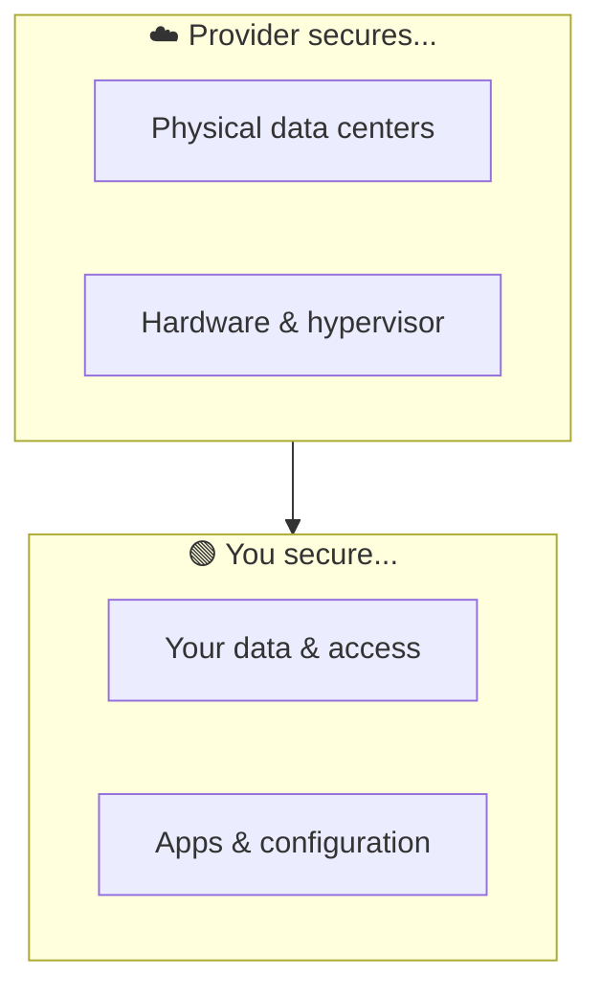

⬅ [Back to Index](../README.md)

# Cloud Security Fundamentals

Cloud security protects data, applications, and infrastructure in the cloud from threats.

### 🎓 Professional (IT-Standard) Reference

| Concept | Layman View | Professional (IT-Standard) View + Example |
|---------|-------------|-------------------------------------------|
| Shared responsibility | Who guards what | The shared responsibility model splits security duties.<br>The provider secures the cloud infrastructure itself.<br>You secure what you put in the cloud.<br>This includes data, access, and configuration.<br>Clear boundaries prevent gaps.<br>*Example: Amazon Web Services (AWS) secures hardware while you secure Identity and Access Management (IAM) and data.* |
| Defense in depth | Many locked doors | Defense in depth uses multiple layered controls.<br>No single control is trusted alone.<br>Layers span network, host, application, and data.<br>If one fails, others still protect.<br>It reduces overall risk.<br>*Example: a Web Application Firewall (WAF), Security Groups (SGs), encryption, and Identity and Access Management (IAM) combined.* |
| Encryption | Scramble the data | Encryption protects data from unauthorized access.<br>Data at rest is encrypted using a Key Management Service (KMS).<br>Data in transit uses Transport Layer Security (TLS) 1.2 or higher.<br>Keys are managed and rotated securely.<br>It is essential for compliance.<br>*Example: Simple Storage Service (S3) server-side encryption with KMS plus Hypertext Transfer Protocol Secure (HTTPS).* |
| Zero Trust | Never trust by default | Zero Trust assumes no implicit trust anywhere.<br>Every request is verified regardless of origin.<br>Least privilege is enforced everywhere.<br>It follows National Institute of Standards and Technology (NIST) Special Publication (SP) 800-207.<br>Identity is the new perimeter.<br>*Example: verifying identity on every request, even inside the network.* |

---

## 🗺️ Visual Overview



**Explanation:** Cloud security follows a shared responsibility model. The provider secures the physical infrastructure “of the cloud,” while you secure what you put “in the cloud” — your data, access, and configuration. Most breaches come from the customer side.

---

## 🤝 The Shared Responsibility Model

Security is **shared** between the provider and you.

```
┌──────────────────────────────────────────┐
│  YOU: Security IN the cloud               │
│  - Data, access, apps, OS config,         │
│    network config, encryption             │
├──────────────────────────────────────────┤
│  PROVIDER: Security OF the cloud          │
│  - Physical data centers, hardware,       │
│    networking, hypervisor                 │
└──────────────────────────────────────────┘
```

⚠️ The split shifts by service model:
- **IaaS** → you handle more (OS, apps, data).
- **SaaS** → provider handles most; you handle data & access.

---

## 🛡️ Core Security Areas

| Area | Description | Tools |
|------|-------------|-------|
| **Identity & Access** | Who can do what | [IAM](iam.md), MFA |
| **Data Protection** | Encryption at rest & in transit | KMS, TLS/SSL |
| **Network Security** | Firewalls, segmentation | Security Groups, WAF |
| **Threat Detection** | Detect anomalies | GuardDuty, Defender |
| **Compliance** | Meet regulations | [Governance](compliance.md) |
| **Secrets Management** | Store keys/passwords safely | HashiCorp Vault, AWS Secrets Manager |

---

## 🔐 Key Best Practices

1. **Least Privilege** — grant only necessary permissions.
2. **Enable MFA** — multi-factor authentication everywhere.
3. **Encrypt everything** — at rest and in transit.
4. **Never hardcode secrets** — use secret managers.
5. **Regular audits & logging** — track all access.
6. **Patch & update** — keep systems current.
7. **Backup & disaster recovery** — plan for failure.
8. **Network segmentation** — isolate sensitive resources.

---

## 🏭 Security Tools by Category

| Category | Tools |
|----------|-------|
| Secrets | **HashiCorp Vault**, AWS Secrets Manager, Azure Key Vault |
| Vulnerability scanning | **Trivy**, Snyk, Qualys |
| Runtime security | **Falco**, Aqua Security |
| SIEM | Splunk, Microsoft Sentinel |
| DDoS/WAF | AWS Shield/WAF, Cloudflare |
| Threat detection | AWS GuardDuty, Microsoft Defender |

---

## 💡 Common Threats

- **Misconfiguration** (e.g., public S3 buckets) — #1 cause of breaches.
- **Weak access controls** — stolen credentials.
- **Insecure APIs**.
- **Data breaches** — unencrypted data.

➡️ Deep dive: [IAM](iam.md) · [Compliance](compliance.md)

---

**Navigation:** [Next → IAM](iam.md) | ⬅ [Back to Index](../README.md)
