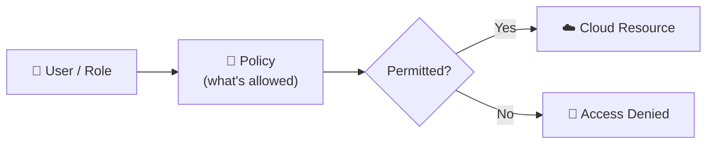

⬅ [Back to Index](../README.md)

# Identity & Access Management (IAM)

**IAM** controls **who** (identity) can access **what** (resources) and **what they can do** (permissions). It's the foundation of cloud security.

### 🎓 Professional (IT-Standard) Reference

| Concept | Layman View | Professional (IT-Standard) View + Example |
|---------|-------------|-------------------------------------------|
| Identities | Users & apps | Identity and Access Management (IAM) covers all identities.<br>These include users, groups, and roles.<br>Applications use service principals or roles.<br>Each identity is authenticated before access.<br>Roles are preferred over long-lived keys.<br>*Example: an IAM role assumed by an Elastic Compute Cloud (EC2) instance.* |
| Policies | The rulebook | Policies define what an identity can do.<br>They are written as JavaScript Object Notation (JSON) documents.<br>They explicitly allow or deny actions.<br>They attach to users, groups, or roles.<br>They are the core of authorization.<br>*Example: a least-privilege read-only Simple Storage Service (S3) policy.* |
| Least privilege | Only what's needed | Least privilege grants the minimum access required.<br>Nothing more than needed is allowed.<br>It limits the blast radius of a breach.<br>Permissions are scoped tightly.<br>It is a core security principle.<br>*Example: scoping access to a single bucket instead of all buckets.* |
| MFA & federation | Extra-strong login | Multi-Factor Authentication (MFA) adds a second verification step.<br>Federation enables Single Sign-On (SSO) across systems.<br>It uses Security Assertion Markup Language (SAML) or OpenID Connect (OIDC).<br>This strengthens and centralizes login.<br>Compromised passwords alone are not enough.<br>*Example: Okta federated login with enforced Multi-Factor Authentication (MFA).* |

---

## 🗺️ Visual Overview



**Explanation:** Identity and Access Management (IAM) decides who can do what in the cloud. A user or role carries policies that list allowed actions; when they try to reach a resource, IAM checks those policies and either permits or denies the request.

---

## 🧩 Core IAM Concepts

| Concept | Description |
|---------|-------------|
| **User** | An individual identity (person or app) |
| **Group** | A collection of users with shared permissions |
| **Role** | A set of permissions assumed temporarily |
| **Policy** | A document defining permissions (allow/deny) |
| **Permission** | A specific action allowed on a resource |
| **MFA** | Multi-factor authentication for extra security |

---

## 🔑 Key Principles

### 1. Least Privilege
Grant **only** the permissions needed — nothing more.

### 2. Authentication vs Authorization
- **Authentication** — proving *who you are* (login, MFA).
- **Authorization** — what *you're allowed to do* (permissions).

### 3. Roles over long-lived credentials
Use temporary **roles** instead of permanent access keys where possible.

---

## 💡 Example: AWS IAM Policy (JSON)

```json
{
  "Version": "2012-10-17",
  "Statement": [
	{
	  "Effect": "Allow",
	  "Action": ["s3:GetObject"],
	  "Resource": "arn:aws:s3:::my-bucket/*"
	}
  ]
}
```
This policy allows **read-only** access to objects in `my-bucket` — nothing else.

---

## 🏭 IAM Across Providers

| Provider | Service |
|----------|---------|
| AWS | **IAM**, IAM Identity Center |
| Azure | **Entra ID** (formerly Azure AD) |
| GCP | **Cloud IAM** |

Related: **SSO** (Single Sign-On), **OAuth 2.0**, **SAML**, **OpenID Connect**.

---

## ✅ IAM Best Practices

1. Enable **MFA** for all users, especially admins.
2. Use **groups** to assign permissions, not individual users.
3. Apply **least privilege** — start with zero, add as needed.
4. Rotate credentials regularly.
5. Never use the **root/admin** account for daily tasks.
6. Audit permissions regularly (remove unused access).
7. Use **roles** for applications & services.

---

**Navigation:** [← Cloud Security](cloud-security.md) | [Next → Compliance](compliance.md) | ⬅ [Back to Index](../README.md)
