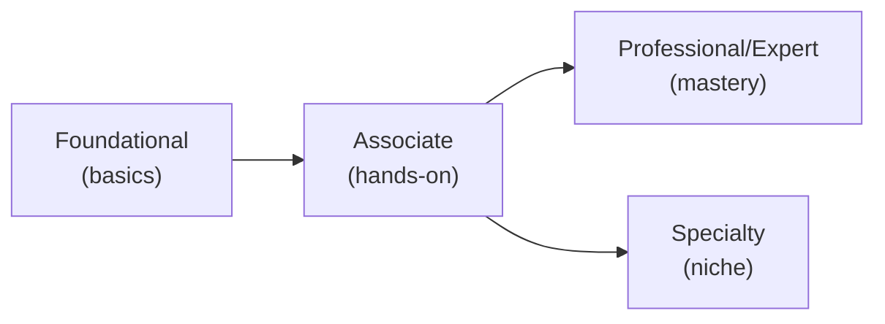

⬅ [Back to Index](../README.md)

# Cloud Certifications Guide

Certifications validate your skills and boost your career. Here's a roadmap by provider and level.

### 🎓 Professional (IT-Standard) Reference

| Level | Layman View | Professional (IT-Standard) View + Example |
|-------|-------------|-------------------------------------------|
| Foundational | Prove the basics | Foundational certifications validate core cloud literacy.<br>They cover basic concepts and terminology.<br>They suit beginners and non-technical roles.<br>They require little hands-on experience.<br>They are a common starting point.<br>*Example: Amazon Web Services (AWS) Cloud Practitioner or Azure Fundamentals (AZ-900).* |
| Associate | Prove hands-on skill | Associate certifications validate practical, role-based skills.<br>They cover designing and deploying real solutions.<br>They expect hands-on experience.<br>They are widely recognized by employers.<br>They map to specific job roles.<br>*Example: the AWS Certified Solutions Architect – Associate.* |
| Professional/Expert | Prove deep mastery | Professional and Expert certifications validate advanced mastery.<br>They cover complex architecture at scale.<br>They require significant real-world experience.<br>They are the highest standard credentials.<br>They signal senior expertise.<br>*Example: AWS Solutions Architect – Professional or Azure Solutions Architect Expert.* |
| Specialty | Prove a niche | Specialty certifications validate deep domain knowledge.<br>They focus on areas like security, networking, or machine learning.<br>They target specialized roles.<br>They complement role-based certifications.<br>They prove focused expertise.<br>*Example: the AWS Advanced Networking Specialty certification.* |

> 🔗 **Looking for actual links + free/paid options + non-certified courses?** See the companion page:
> **[Free & Paid Certifications & Courses (with Links)](free-paid-certifications-and-courses.md)**

---

## 🗺️ Visual Overview



**Explanation:** Cloud certifications form a ladder. You start at the foundational level to prove the basics, move to associate for hands-on skills, then branch into professional/expert (deep mastery) or specialty (focused niche) credentials.

---

## ☁️ AWS Certifications

| Level | Certification | Focus |
|-------|--------------|-------|
| Foundational | **Cloud Practitioner (CLF-C02)** | Cloud basics |
| Associate | **Solutions Architect Associate (SAA)** | Designing systems |
| Associate | **Developer Associate** | Building apps |
| Associate | **SysOps Administrator** | Operations |
| Professional | **Solutions Architect Professional** | Advanced design |
| Professional | **DevOps Engineer Professional** | CI/CD, automation |
| Specialty | Security, Networking, ML, Data Analytics | Deep expertise |

---

## 🔷 Microsoft Azure Certifications

| Level | Certification | Focus |
|-------|--------------|-------|
| Fundamentals | **AZ-900 (Azure Fundamentals)** | Cloud basics |
| Associate | **AZ-104 (Administrator)** | Managing Azure |
| Associate | **AZ-204 (Developer)** | Building apps |
| Expert | **AZ-305 (Solutions Architect)** | Architecture |
| Expert | **AZ-400 (DevOps Engineer)** | DevOps |
| Specialty | Security (AZ-500), AI, Data | Specialized |

---

## 🔴 Google Cloud Certifications

| Level | Certification | Focus |
|-------|--------------|-------|
| Foundational | **Cloud Digital Leader** | Business & basics |
| Associate | **Associate Cloud Engineer** | Deploying & managing |
| Professional | **Cloud Architect** | Designing solutions |
| Professional | **Data Engineer** | Data pipelines |
| Professional | **DevOps Engineer** | SRE & automation |
| Professional | **ML Engineer** | Machine learning |

---

## 🛠️ Vendor-Neutral Certifications

| Certification | Focus |
|--------------|-------|
| **CKA (Certified Kubernetes Administrator)** | Kubernetes ops |
| **CKAD (Certified Kubernetes App Developer)** | K8s development |
| **HashiCorp Terraform Associate** | Infrastructure as Code |
| **CompTIA Cloud+** | Vendor-neutral cloud |
| **CCSP (Certified Cloud Security Professional)** | Cloud security |

---

## 🗺️ Suggested Path

```
1. Start: AWS Cloud Practitioner OR AZ-900 (foundational)
2. Then:  Associate-level (Solutions Architect Associate)
3. Add:   Terraform Associate + CKA (hands-on tools)
4. Grow:  Professional-level + a Specialty
```

---

## 📚 Study Resources

- Official provider training (AWS Skill Builder, Microsoft Learn, Google Cloud Skills Boost).
- Hands-on labs (do the [projects](../08-Hands-on-Projects/projects.md)!).
- Practice exams before the real thing.
- Free tiers to experiment.

---

**Navigation:** [Next → Glossary](glossary.md) | ⬅ [Back to Index](../README.md)
