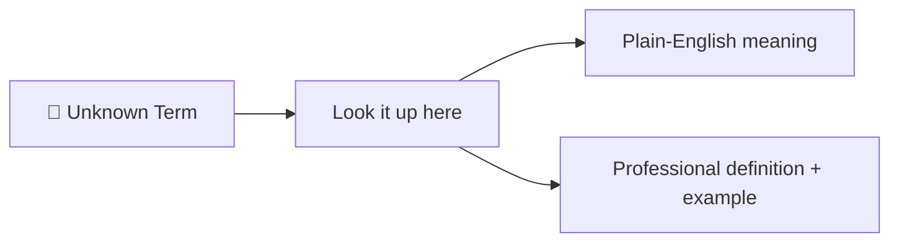

⬅ [Back to Index](../README.md)

# Glossary of Cloud Computing Terms

Quick reference for common terms. Bookmark this page!

### 🎓 Professional (IT-Standard) Reference

| Term | Layman View | Professional (IT-Standard) View + Example |
|------|-------------|-------------------------------------------|
| SLA | A uptime promise | A Service Level Agreement (SLA) is a contractual availability commitment. It defines guaranteed uptime targets. It often includes penalties for breaches. It sets expectations between provider and customer. Higher targets mean less allowed downtime. *Example: a 99.99% SLA allows about 52 minutes of downtime per year.* |
| Region / AZ | Where servers live | A region is a geographic cloud location. Each region contains multiple Availability Zones (AZs). Availability Zones are physically isolated data centers. Spreading across AZs improves resilience. Region choice affects latency and compliance. *Example: the us-east-1 region containing six Availability Zones (AZs).* |
| Latency | Delay/lag | Latency is the delay before a response returns. It is measured in milliseconds (ms). It reflects the round-trip response time. Lower latency means faster user experience. It is reduced with edge and regional placement. *Example: targeting under 100 milliseconds (ms) for web Application Programming Interfaces (APIs).* |
| Throughput | How much it handles | Throughput measures how much work a system handles per unit time. It is expressed as Requests Per Second (RPS) or Input/Output Operations Per Second (IOPS). Higher throughput means more capacity. It is a key scalability metric. It is tuned via scaling and caching. *Example: a system handling 10,000 requests per second (RPS).* |

## 🗺️ Visual Overview

**Explanation:** This glossary is your quick-reference dictionary for cloud jargon. Whenever you hit an unfamiliar term, look it up to get both a plain-English meaning and a professional definition with a real example.

---

| Term | Definition |
|------|------------|
| **API** | Application Programming Interface — how software components talk to each other |
| **Auto-scaling** | Automatically adjusting resources based on demand |
| **Availability Zone (AZ)** | An isolated data center within a region |
| **Bare Metal** | A physical server without virtualization |
| **CapEx / OpEx** | Capital vs Operational Expenditure (upfront vs pay-as-you-go) |
| **CDN** | Content Delivery Network — caches content near users |
| **CI/CD** | Continuous Integration / Continuous Delivery — automated pipelines |
| **Cloud Bursting** | Overflowing from private to public cloud during spikes |
| **Cluster** | A group of machines working together |
| **Cold Start** | Delay when a serverless function starts from idle |
| **Container** | A lightweight, portable package of an app + dependencies |
| **DevOps** | Practices uniting development and operations |
| **Elasticity** | Ability to scale resources up/down quickly |
| **FaaS** | Function as a Service (serverless functions) |
| **FinOps** | Financial operations — managing cloud costs |
| **Hybrid Cloud** | Mix of public and private cloud |
| **Hypervisor** | Software that creates and runs virtual machines |
| **IaaS** | Infrastructure as a Service |
| **IaC** | Infrastructure as Code |
| **IAM** | Identity and Access Management |
| **Kubernetes (K8s)** | Container orchestration platform |
| **Latency** | Delay before data transfer begins |
| **Load Balancer** | Distributes traffic across servers |
| **Microservices** | Architecture of small, independent services |
| **MFA** | Multi-Factor Authentication |
| **Multi-Cloud** | Using multiple cloud providers |
| **Multi-Tenancy** | Multiple customers sharing infrastructure |
| **Object Storage** | Storing data as objects (e.g., S3) |
| **On-Premises** | Infrastructure hosted in your own data center |
| **Orchestration** | Automated coordination of systems/containers |
| **PaaS** | Platform as a Service |
| **Pod** | Smallest deployable unit in Kubernetes |
| **Provisioning** | Setting up computing resources |
| **Region** | A geographic area with multiple AZs |
| **Replica** | A copy of data/service for redundancy |
| **SaaS** | Software as a Service |
| **Scalability** | Ability to handle growth |
| **Serverless** | Running code without managing servers |
| **Shared Responsibility Model** | Split of security duties between provider & customer |
| **SLA** | Service Level Agreement — uptime/performance guarantee |
| **Snapshot** | Point-in-time backup of storage |
| **Throughput** | Amount of data processed in a time period |
| **VM (Virtual Machine)** | Software emulation of a physical computer |
| **VPC** | Virtual Private Cloud — isolated cloud network |
| **VPN** | Virtual Private Network — secure connection |
| **Vendor Lock-in** | Difficulty moving between providers |
| **Virtualization** | Creating virtual versions of hardware |
| **Workload** | An application or task running on the cloud |

---

## 📖 Related Reading

- [What is Cloud Computing?](../01-Introduction/what-is-cloud-computing.md)
- [Service Models](../02-Service-Models/iaas.md)
- [Provider Comparison](../05-Cloud-Providers/comparison.md)

---

**Navigation:** [← Certifications](certifications.md) | ⬅ [Back to Index](../README.md)
