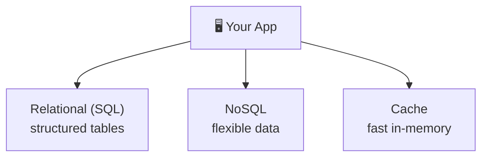

⬅ [Back to Index](../README.md)

# Databases in the Cloud

Choosing the right database is critical. The cloud offers many **managed database** options so you don't run the servers yourself.

### 🎓 Professional (IT-Standard) Reference

| Concept | Layman View | Professional (IT-Standard) View + Example |
|---------|-------------|-------------------------------------------|
| Relational (SQL) | Tables with rules | Relational databases store data in structured tables.<br>They use Structured Query Language (SQL) to query data.<br>They guarantee Atomicity, Consistency, Isolation, Durability (ACID) transactions.<br>They support joins and strict schemas.<br>They suit transactional applications.<br>*Example: Amazon Relational Database Service (RDS) or Aurora running PostgreSQL or MySQL.* |
| NoSQL | Flexible data | NoSQL databases offer flexible, schema-light data models.<br>Types include key-value, document, and wide-column.<br>They scale horizontally to huge sizes.<br>They favor availability and speed.<br>They suit high-scale, flexible workloads.<br>*Example: Amazon DynamoDB or MongoDB Atlas.* |
| Caching | Fast temporary store | Caching stores frequently used data in memory.<br>It returns results with very low latency.<br>It reduces load on the primary database.<br>It improves application performance.<br>Data is temporary and can be rebuilt.<br>*Example: Redis or Amazon ElastiCache.* |
| Replication & HA | Copies for safety | Replication keeps copies of data for safety and scale.<br>Multiple Availability Zones (AZs) protect against failures.<br>Automatic failover maintains High Availability (HA).<br>Read replicas offload query traffic.<br>It reduces downtime risk.<br>*Example: an Aurora Multi-Availability Zone (AZ) setup with read replicas.* |

---

## 🗺️ Visual Overview



**Explanation:** Cloud apps usually mix database types. Relational (SQL) databases store structured, related data; NoSQL databases handle flexible, huge-scale data; and caches keep hot data in memory for speed. You pick each based on the job.

---

## 🗄️ Database Types

### 1️⃣ Relational (SQL)
- Structured data, tables, relationships, ACID transactions.
- **Use for:** financial data, orders, anything needing strong consistency.
- **Examples:** MySQL, PostgreSQL, SQL Server, Oracle.
- **Managed services:** AWS RDS, Aurora · Azure SQL Database · GCP Cloud SQL.

### 2️⃣ NoSQL
| Sub-type | Description | Examples | Managed |
|----------|-------------|----------|---------|
| **Document** | JSON-like documents | MongoDB, Firestore | DocumentDB, Cosmos DB |
| **Key-Value** | Simple key→value | Redis, DynamoDB | ElastiCache, DynamoDB |
| **Column** | Wide columns, big data | Cassandra, Bigtable | Keyspaces, Bigtable |
| **Graph** | Nodes & relationships | Neo4j | Neptune |

### 3️⃣ Specialized
- **Data Warehouse** (analytics): Redshift, BigQuery, Snowflake.
- **Time-Series**: InfluxDB, Timestream.
- **Search**: Elasticsearch, OpenSearch.

---

## 🤔 SQL vs NoSQL — When to Use

| Use SQL when... | Use NoSQL when... |
|-----------------|-------------------|
| Data is structured & related | Data is unstructured/flexible |
| Need ACID transactions | Need massive scale |
| Complex queries & joins | Simple, fast lookups |
| Consistency is critical | Availability & speed matter more |

---

## 🧠 Key Concepts

- **ACID** — Atomicity, Consistency, Isolation, Durability (SQL guarantees).
- **BASE** — Basically Available, Soft state, Eventual consistency (NoSQL).
- **CAP Theorem** — In a distributed system, pick 2 of 3: **C**onsistency, **A**vailability, **P**artition tolerance.
- **Sharding** — splitting data across servers horizontally.
- **Replication** — copies for redundancy & read scaling.
- **Read Replicas** — copies to handle read traffic.
- **Caching** — Redis/Memcached in front of DB for speed.

---

## 💡 Example: Choosing Databases for an App

```
User profiles       → PostgreSQL (RDS)       [relational, consistent]
Product catalog     → MongoDB (DocumentDB)   [flexible schema]
Shopping cart       → Redis (ElastiCache)    [fast, temporary]
Analytics/reporting → BigQuery/Redshift      [data warehouse]
Full-text search    → Elasticsearch          [search]
```

---

## 🛠️ Managed DB Benefits

- Automated backups, patching, scaling.
- High availability (multi-AZ), failover.
- Read replicas with one click.
- Encryption & monitoring built in.

---

**Navigation:** [← Microservices](microservices-architecture.md) | [Next → Messaging & Event-Driven](messaging-event-driven.md) | ⬅ [Back to Index](../README.md)
