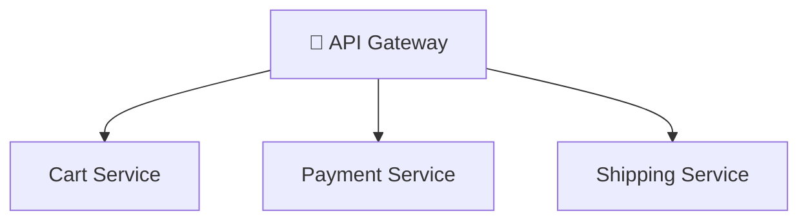

⬅ [Back to Index](../README.md)

# Microservices Architecture

**Microservices** break a large application into small, independent services that each do one thing well, communicate over APIs, and can be deployed separately.

> 🧩 Opposite of a **monolith** (one big codebase). Netflix, Amazon, Uber all run on microservices.

### 🎓 Professional (IT-Standard) Reference

| Concept | Layman View | Professional (IT-Standard) View + Example |
|---------|-------------|-------------------------------------------|
| Service boundary | One job per service | A service boundary defines what one service owns.<br>It follows bounded contexts from Domain-Driven Design (DDD).<br>Each service maps to one business capability.<br>It keeps services independent.<br>It reduces coupling between teams.<br>*Example: separate `orders` and `payments` services.* |
| API contract | How they talk | An Application Programming Interface (API) contract defines how services talk.<br>It uses versioned interfaces.<br>Common styles are Representational State Transfer (REST) and gRPC Remote Procedure Call (gRPC).<br>It keeps integrations stable.<br>It allows safe evolution.<br>*Example: gRPC calls between internal services.* |
| Resilience | Survive failures | Resilience helps services survive partial failures.<br>It uses circuit breakers, retries, and timeouts.<br>It prevents cascading outages.<br>It degrades gracefully under load.<br>It improves overall stability.<br>*Example: Istio combined with Resilience4j patterns.* |
| Service mesh | Traffic manager | A service mesh manages service-to-service communication.<br>It handles routing, retries, and security.<br>It adds observability without code changes.<br>It enforces mutual Transport Layer Security (mTLS).<br>It runs as sidecar proxies.<br>*Example: Istio or Linkerd on Kubernetes.* |

---

## 🗺️ Visual Overview



**Explanation:** Microservices split one big application into small, independent services that each do one job. An API gateway routes requests to the right service, and each can be built, scaled, and deployed on its own — improving agility and resilience.

---

## 🏛️ Monolith vs Microservices

```
   MONOLITH                    MICROSERVICES
┌──────────────┐        ┌────────┐ ┌────────┐ ┌────────┐
│ UI           │        │ Users  │ │ Orders │ │ Payment│
│ Business     │        │ Service│ │ Service│ │ Service│
│ Data Access  │        └────┬───┘ └───┬────┘ └───┬────┘
│ (one deploy) │             └─────API Gateway────┘
└──────────────┘
```

| Aspect | Monolith | Microservices |
|--------|----------|---------------|
| Deployment | All at once | Independent |
| Scaling | Whole app | Per-service |
| Tech stack | One | Polyglot (mix) |
| Failure impact | Whole app down | Isolated |
| Complexity | Simple start | Complex ops |

---

## 🧩 Key Patterns & Concepts

| Concept | Description | Tools |
|---------|-------------|-------|
| **API Gateway** | Single entry point routing to services | Kong, AWS API Gateway, NGINX |
| **Service Discovery** | Services find each other dynamically | Consul, Eureka, K8s DNS |
| **Load Balancing** | Distribute requests | Envoy, NGINX |
| **Service Mesh** | Manage service-to-service traffic | **Istio**, Linkerd |
| **Circuit Breaker** | Stop cascading failures | Resilience4j, Hystrix |
| **Saga Pattern** | Manage distributed transactions | Custom, Temporal |
| **Event-Driven** | Services communicate via events | Kafka, RabbitMQ ([details](messaging-event-driven.md)) |

---

## 💡 Example: E-commerce Broken into Services

```
API Gateway
   ├── User Service        (auth, profiles)      → PostgreSQL
   ├── Product Service     (catalog)             → MongoDB
   ├── Cart Service        (shopping cart)       → Redis
   ├── Order Service       (orders)              → PostgreSQL
   ├── Payment Service     (billing)             → Stripe API
   └── Notification Service (emails/SMS)         → SES/Twilio
```

Each can be built by a different team, in a different language, scaled independently.

---

## ✅ Benefits & ⚠️ Challenges

| Benefits | Challenges |
|----------|------------|
| Independent scaling & deployment | Distributed system complexity |
| Team autonomy | Network latency between services |
| Fault isolation | Harder debugging (need tracing) |
| Technology flexibility | Data consistency challenges |

---

## 🛠️ How to Run Microservices

1. **Containerize** each service with [Docker](../04-Core-Technologies/containers.md).
2. **Orchestrate** with [Kubernetes](../06-Tools-and-Practices/kubernetes.md).
3. **Connect** with a service mesh (Istio).
4. **Observe** with [distributed tracing](../06-Tools-and-Practices/monitoring.md) (Jaeger).

---

**Navigation:** [Next → Databases in the Cloud](databases-in-cloud.md) | ⬅ [Back to Index](../README.md)
