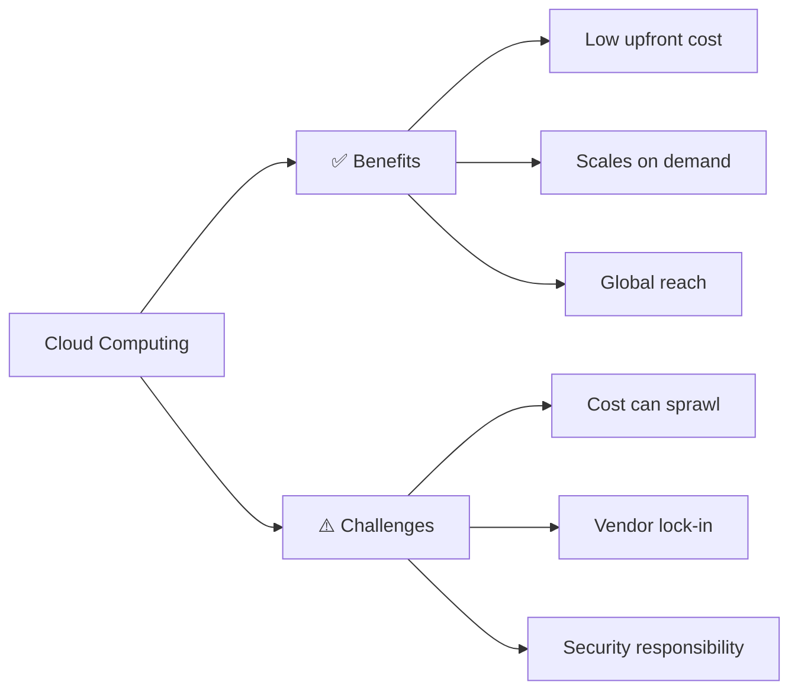
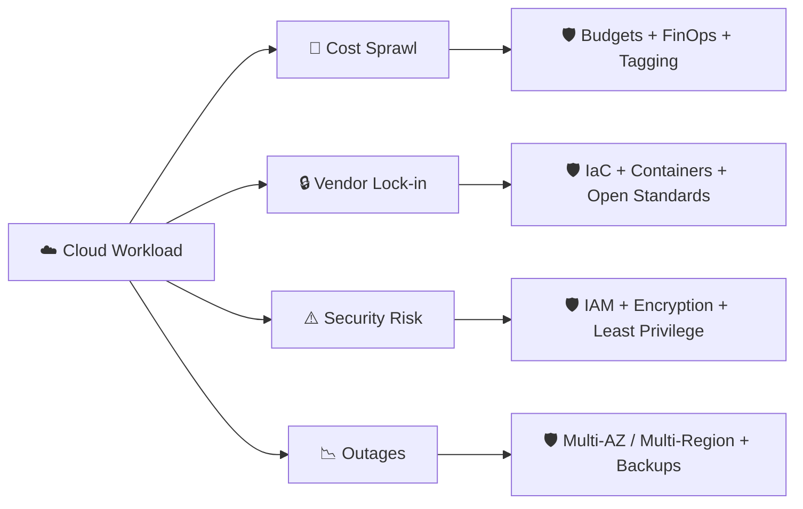

⬅ [Back to Index](../README.md)

# Benefits & Challenges of Cloud Computing

A balanced view — the cloud is powerful, but not a silver bullet.

### 🎓 Professional (IT-Standard) Reference

| Topic | Layman View | Professional (IT-Standard) View + Example |
|-------|-------------|-------------------------------------------|
| Cost model | Rent instead of buy | The cloud shifts spending from Capital Expenditure (CapEx) to Operating Expenditure (OpEx).<br>You pay for usage instead of buying hardware upfront.<br>Costs can grow unexpectedly without governance.<br>Financial Operations (FinOps) practices optimize spend.<br>Commitments reduce steady-state cost.<br>*Example: Reserved Instances or Savings Plans cutting the cost of always-on workloads.* |
| Scalability | Grows with your needs | Elastic capacity expands and contracts with demand.<br>You avoid over-provisioning idle hardware.<br>Scaling can be automated based on metrics.<br>It handles spikes without manual effort.<br>It improves both performance and cost efficiency.<br>*Example: scaling a Black Friday workload with Kubernetes Horizontal Pod Autoscaler (HPA).* |
| Vendor lock-in | Hard to switch providers | Heavy use of proprietary services makes migration difficult.<br>Switching providers can be costly and complex.<br>It is mitigated with open standards and portability.<br>Infrastructure as Code (IaC) and containers improve flexibility.<br>Multi-cloud strategies reduce dependence.<br>*Example: using Terraform and containers to keep workloads portable.* |
| Security & compliance | Keeping data safe & legal | Security follows the shared responsibility model.<br>The provider secures the infrastructure; you secure your data and access.<br>Compliance is proven through audits and certifications.<br>Standards include International Organization for Standardization (ISO) 27001, System and Organization Controls (SOC) 2, and General Data Protection Regulation (GDPR).<br>Encryption and access control are essential.<br>*Example: encrypting data at rest with a Key Management Service (KMS) and enforcing Identity and Access Management (IAM) policies.* |

---

## 🗺️ Visual Overview



**Explanation:** The cloud is powerful but not free of trade-offs. On the left are the wins (cheap to start, elastic, worldwide); on the right are the risks you must manage (runaway bills, hard-to-leave providers, and shared security duties).

---

## ✅ Benefits

| Benefit | Explanation | Example |
|---------|-------------|---------|
| **Cost Efficiency** | No upfront hardware; pay-as-you-go (CapEx → OpEx) | Startup avoids $100K server purchase |
| **Scalability** | Handle growth without re-architecting | Scale to millions of users |
| **Elasticity** | Auto scale with demand | Traffic spikes on sale days |
| **Speed / Agility** | Deploy in minutes, not months | Launch a feature globally overnight |
| **Global Reach** | Deploy near your users | Low latency in every continent |
| **Reliability** | Built-in backups, redundancy, DR | 99.99% uptime SLAs |
| **Focus on Business** | Provider manages hardware | Team focuses on product, not servers |
| **Security** | Enterprise-grade tools & compliance | Encryption, IAM, certifications |

---

## ⚠️ Challenges

| Challenge | Explanation | Mitigation |
|-----------|-------------|------------|
| **Security & Privacy** | Data lives off-premises | Encryption, [IAM](../07-Security/iam.md), compliance |
| **Vendor Lock-in** | Hard to migrate between providers | Use open standards, containers, [multi-cloud](../03-Deployment-Models/multi-cloud.md) |
| **Cost Management** | Bills can spiral unexpectedly | FinOps, budgets, monitoring |
| **Downtime / Outages** | You depend on the provider | Multi-region, redundancy |
| **Compliance** | Data residency & regulations (GDPR, HIPAA) | [Governance](../07-Security/compliance.md) |
| **Limited Control** | Provider owns the infrastructure | Choose the right [service model](../02-Service-Models/iaas.md) |
| **Skills Gap** | Requires new expertise | Training & certifications |

---

## 💰 CapEx vs OpEx

```
Traditional:  Big upfront cost  ████████████  then flat
Cloud:        Small ongoing cost ▁▂▃▂▃▄▃▂  scales with usage
```

- **CapEx (Capital Expenditure):** Buy servers upfront.
- **OpEx (Operational Expenditure):** Pay monthly for what you use.

---

## 🖼️ Tools That Tame the Challenges


> 🏷️ *Portability tools (Terraform, Docker, Kubernetes) fight **vendor lock-in**; observability tools (Prometheus, Grafana) fight **cost sprawl & downtime**; secrets tools (Vault) fight **security risk**.*

---

## 🏗️ Architecture: Turning Challenges into Guardrails



**Explanation:** Every cloud challenge has a well-known guardrail. Mature teams don't avoid the risks — they *engineer controls* (budgets, IaC, IAM, redundancy) so the benefits outweigh them.

---

## 🖥️ Cost Alert — What Runaway Spend Looks Like (Mockup)

```text
┌────────────────────────────────────────────────────────┐
│  🔔  Budget Alert — "monthly-prod-budget"              │
├────────────────────────────────────────────────────────┤
│  Budget:        $ 5,000.00                              │
│  Forecast:      $ 8,240.00   ⚠️ 165% of budget         │
│  ▁▂▃▅▇█  spend accelerating                             │
│                                                        │
│  Top driver:  NAT Gateway data transfer  +$2,100       │
│  Action:      Review → enable VPC endpoints            │
└────────────────────────────────────────────────────────┘
```

*This is why **FinOps** exists — cloud makes it as easy to waste money as to save it.*

---

## 🔍 Deep Dive — Concepts Often Missed

### 💸 The Hidden Cost Traps
- **Data egress:** moving data *out* of the cloud/between regions is often the biggest surprise line item.
- **Idle/zombie resources:** forgotten VMs, unattached disks, old snapshots keep billing.
- **NAT gateways & load balancers:** small hourly + per-GB fees that add up silently.

### 🔒 Types of Lock-in
- **Data lock-in** (hard to export), **API lock-in** (proprietary services), **skills lock-in** (team trained on one vendor). Mitigate with open formats, IaC, and containers.

### 📈 FinOps in One Sentence
- A culture where **engineering + finance + business** share real-time cost accountability — *tag everything, right-size, commit (Reserved/Savings Plans), and kill waste*.

### 🛡️ Reliability Vocabulary
- **RTO (Recovery Time Objective):** how fast you must recover.
- **RPO (Recovery Point Objective):** how much data loss is acceptable.
- **Blast radius:** how much fails when one component fails — minimized with multi-AZ design.

---

## 🧭 When NOT to Use Cloud

- Extremely predictable, steady workloads (owning may be cheaper long-term).
- Strict data-residency laws requiring on-prem.
- Ultra-low-latency needs better served by [edge/private cloud](../03-Deployment-Models/private-cloud.md).

---

**Navigation:** [← Characteristics](characteristics.md) | [Next → IaaS](../02-Service-Models/iaas.md) | ⬅ [Back to Index](../README.md)
