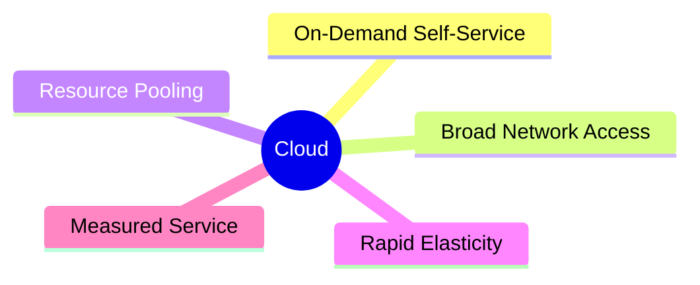
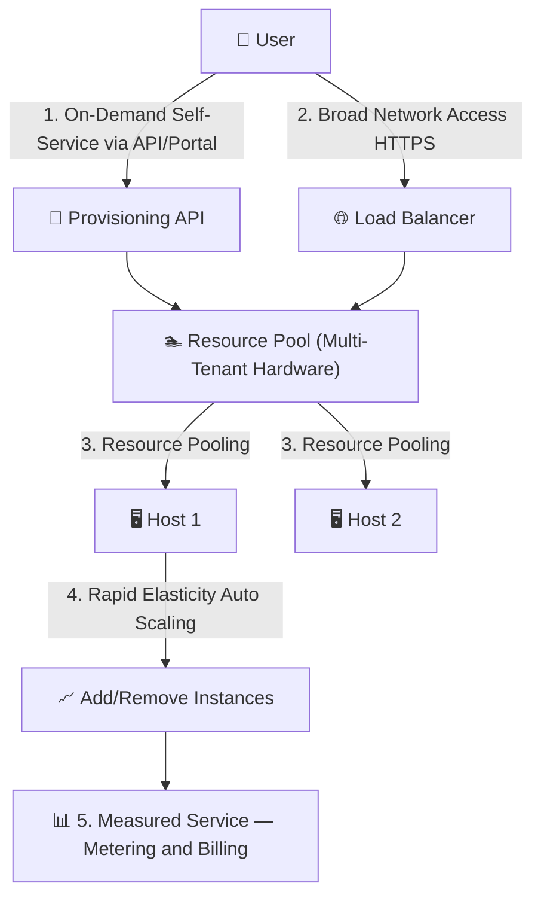

⬅ [Back to Index](../README.md)

# Key Characteristics of Cloud Computing

NIST defines **five essential characteristics** that make something truly "cloud."

### 🎓 Professional (IT-Standard) Reference

| Characteristic (NIST SP 800-145) | Layman View | Professional (IT-Standard) View + Example |
|----------------------------------|-------------|-------------------------------------------|
| On-Demand Self-Service | Get resources yourself, instantly | Users provision resources themselves without human intervention.<br>No support ticket or manual approval is needed.<br>Provisioning is automated via an Application Programming Interface (API) or portal.<br>This enables speed and repeatability.<br>It is a core National Institute of Standards and Technology (NIST) characteristic.<br>*Example: running `terraform apply` to spin up infrastructure automatically.* |
| Broad Network Access | Use it from anywhere | Services are available over the network from many device types.<br>Access uses standard protocols like Hypertext Transfer Protocol Secure (HTTPS).<br>Clients include browsers, mobile apps, and Command Line Interfaces (CLIs).<br>This supports remote and distributed teams.<br>Connectivity is location-independent.<br>*Example: accessing the same application via browser, mobile, and CLI.* |
| Resource Pooling | Many customers share the hardware | Providers pool physical resources to serve many customers (multi-tenancy).<br>Each tenant is logically isolated from the others.<br>Resources are dynamically assigned based on demand.<br>This maximizes efficiency and lowers cost.<br>Customers are unaware of exact physical location.<br>*Example: Amazon Web Services (AWS) running many tenants' Virtual Machines (VMs) on one host.* |
| Rapid Elasticity | Scale up/down quickly | Capacity scales automatically to match demand.<br>Scaling can be horizontal (more instances) or vertical (bigger instances).<br>It appears virtually unlimited to the user.<br>It prevents both over-provisioning and shortages.<br>Scaling is fast and often automated.<br>*Example: Auto Scaling Groups adding Elastic Compute Cloud (EC2) instances at peak load.* |
| Measured Service | Pay for what you use | Usage is measured, monitored, and reported transparently.<br>Billing is based on actual consumption.<br>Metrics drive both invoices and optimization.<br>This provides cost visibility and accountability.<br>It supports Financial Operations (FinOps) practices.<br>*Example: Amazon CloudWatch metrics driving per-usage invoices.* |

---

## 🗺️ Visual Overview



**Explanation:** The National Institute of Standards and Technology (NIST) says something is truly “cloud” only if it has these five traits. Together they mean: you get resources instantly, from anywhere, on shared hardware, that scales up or down fast, and you pay based on measured usage.

---

## 1️⃣ On-Demand Self-Service
Provision resources (servers, storage) automatically **without human interaction** with the provider.

```
You (click / API call)  →  Cloud provisions server  →  Ready in seconds
        (no phone call, no ticket, no waiting for staff)
```

**Explanation:** You request what you need yourself and the platform delivers it automatically, with no human in the loop — like getting cash from an ATM instead of visiting a bank teller.
- **Example:** Spin up an AWS EC2 server in 60 seconds via a web console or API call.

## 2️⃣ Broad Network Access
Resources are available over the network and accessed through standard devices (laptops, phones, tablets).
- **Example:** Access Google Docs from any browser, anywhere.

## 3️⃣ Resource Pooling (Multi-Tenancy)
The provider's resources are pooled to serve multiple customers, dynamically assigned on demand.
- **Example:** Thousands of customers share the same physical AWS data center, isolated from each other.

## 4️⃣ Rapid Elasticity
Resources can **scale out and in** quickly, sometimes automatically, to match demand.
- **Example:** An e-commerce site auto-scales from 10 to 500 servers during Black Friday, then scales back down.

## 5️⃣ Measured Service (Pay-per-Use)
Resource usage is monitored, controlled, and reported — you pay only for what you consume.
- **Example:** AWS Lambda charges per **millisecond** of execution time.

---

## 📊 Summary Table

| Characteristic | What It Means | Real Example |
|----------------|---------------|--------------|
| On-Demand Self-Service | Get resources instantly | Launch a VM via API |
| Broad Network Access | Access from anywhere | Gmail on phone |
| Resource Pooling | Shared infrastructure | Multi-tenant SaaS |
| Rapid Elasticity | Scale up/down fast | Auto-scaling groups |
| Measured Service | Pay for usage | Per-second billing |

---

## 🎁 Bonus Characteristics (often added)

- **Resilience / High Availability** — data replicated across zones.
- **Global Reach** — deploy in regions worldwide in minutes.
- **Automation** — infrastructure managed as code.

---

## 🏗️ Architecture: The Five Characteristics in One System



**Explanation:** A single cloud request touches all five NIST traits: you self-serve over the network, land on shared pooled hardware, the system elastically scales instances, and a meter records usage for billing.

---

## 🖥️ "Measured Service" — What a Usage Bill Looks Like (Mockup)

```text
┌──────────────────────────────────────────────────────────┐
│  📊  Billing › Cost Explorer            October 2025      │
├──────────────────────────────────────────────────────────┤
│  Service            Usage            Cost                 │
│  ─────────────────  ───────────────  ─────────            │
│  EC2 (compute)      412.5 hrs        $  8.66              │
│  S3 (storage)       84.2 GB-month    $  1.94              │
│  Lambda             2.1M requests    $  0.42              │
│  Data transfer      63 GB out        $  5.67              │
│  ─────────────────  ───────────────  ─────────            │
│  TOTAL                               $ 16.69              │
│  ▁▂▃▂▃▄▃▂  usage tracked per second / per GB              │
└──────────────────────────────────────────────────────────┘
```

---

## 🔍 Deep Dive — Concepts Often Missed

### ⚖️ Elasticity vs Scalability (not the same!)
- **Scalability** = the *ability* to grow to handle more load (can be manual, long-term).
- **Elasticity** = *automatic, fast* expansion **and** contraction to match real-time demand.
- **Horizontal scaling (scale out)** = add more instances. **Vertical scaling (scale up)** = bigger instance.

### 🏢 Multi-Tenancy & Isolation
- Many customers ("tenants") share physical hardware but are **logically isolated** via virtualization, VPCs, and IAM.
- **Noisy neighbor problem:** one tenant's heavy load can affect others — mitigated by resource limits and dedicated/instance options.

### 🧾 Metering Granularity
- Billing dimensions differ per service: **per-second** (compute), **per-GB-month** (storage), **per-request/per-ms** (serverless), **per-GB** (data transfer — often the surprise cost!).

### 🔁 Self-Service = Automation-First
- True self-service implies **APIs**, not humans — enabling Infrastructure as Code (IaC), CI/CD, and repeatable environments.

---

**Navigation:** [← History & Evolution](history-evolution.md) | [Next → Benefits & Challenges](benefits-challenges.md) | ⬅ [Back to Index](../README.md)

---

**Navigation:** [← History & Evolution](history-evolution.md) | [Next → Benefits & Challenges](benefits-challenges.md) | ⬅ [Back to Index](../README.md)
