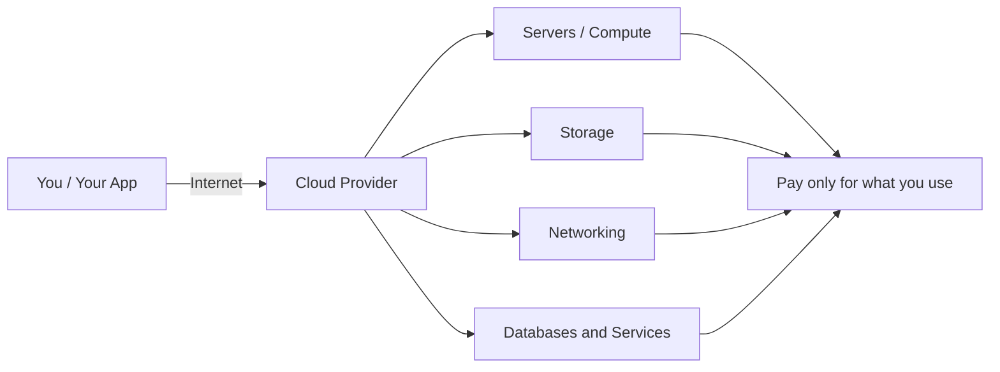
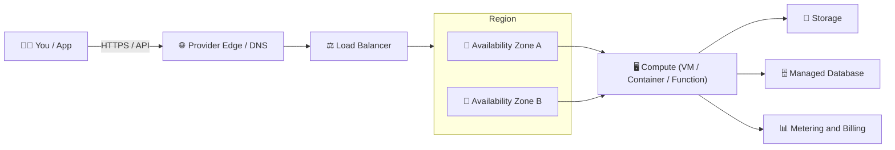

⬅ [Back to Index](../README.md)

# What is Cloud Computing?

**Cloud computing** is the on-demand delivery of computing resources — servers, storage, databases, networking, software, analytics, and intelligence — over the Internet ("the cloud") with **pay-as-you-go** pricing.

Instead of buying, owning, and maintaining physical data centers and servers, you rent access to anything from applications to storage from a cloud service provider.

### 🎓 Professional (IT-Standard) Reference

| Concept | Layman View | Professional (IT-Standard) View + Example |
|---------|-------------|-------------------------------------------|
| On-demand delivery | Get computing power whenever you need it | On-demand delivery means resources are provisioned instantly through self-service.<br>No manual procurement or hardware setup is required.<br>Provisioning happens via an Application Programming Interface (API) or web console.<br>This aligns with the National Institute of Standards and Technology (NIST) definition in Special Publication (SP) 800-145.<br>Capacity can be created and destroyed in seconds.<br>*Example: launching an Amazon Elastic Compute Cloud (EC2) instance through the AWS API in seconds.* |
| Pay-as-you-go | Pay only for what you use | Pay-as-you-go is a consumption-based billing model.<br>You are charged only for the resources you actually use.<br>This shifts spending from Capital Expenditure (CapEx) to Operating Expenditure (OpEx).<br>Usage is metered continuously and billed per unit.<br>It removes large upfront hardware investments.<br>*Example: AWS billing per second of compute and per gigabyte (GB) of Simple Storage Service (S3) storage.* |
| Rent vs own | Rent instead of buying machines | Renting shifts you from owning data centers to using provider-managed infrastructure.<br>The Cloud Service Provider (CSP) owns and maintains the physical layer.<br>You operate within the shared responsibility model.<br>This reduces maintenance overhead and speeds up delivery.<br>Migration is a common first cloud step.<br>*Example: migrating an on-premises VMware cluster to Microsoft Azure Virtual Machines (VMs).* |
| Cloud provider | The company you rent from | A Cloud Service Provider (CSP) delivers computing services over the internet.<br>Services are offered under a Service Level Agreement (SLA) defining uptime guarantees.<br>Providers operate global regions and Availability Zones (AZs) for resilience.<br>They handle physical security, power, and networking.<br>You consume services through APIs, consoles, and Command Line Interfaces (CLIs).<br>*Example: Amazon Web Services (AWS), Microsoft Azure, and Google Cloud Platform (GCP).* |

---

## 🗺️ Visual Overview



**Explanation:** You connect over the internet to a cloud provider that owns huge pools of servers, storage, and networking. Instead of buying any of it, you rent exactly what you need and pay only for what you use — the provider handles all the physical hardware behind the scenes.

---

## 🍕 Simple Analogy

Think of electricity.

| Traditional IT | Cloud Computing |
|----------------|-----------------|
| Buy your own generator | Plug into the power grid |
| High upfront cost (CapEx) | Pay-as-you-go (OpEx) |
| You maintain everything | Provider maintains hardware |
| Fixed capacity | Scale up/down instantly |

---

## 📖 Formal Definition (NIST)

The U.S. National Institute of Standards and Technology (NIST) defines cloud computing as:

> "A model for enabling ubiquitous, convenient, on-demand network access to a shared pool of configurable computing resources that can be rapidly provisioned and released with minimal management effort."

---

## 🧩 Real-World Examples

- **Netflix** runs entirely on AWS to stream video to 200M+ users.
- **Gmail / Google Docs** — you use email & documents without installing anything.
- **Spotify** stores and streams music from Google Cloud.
- **Zoom** scales meeting capacity up and down on the cloud during peak hours.
- **Dropbox** stores your files in the cloud, accessible from any device.

---

## 🔑 The Big Picture

Cloud computing is organized around two main axes:

1. **Service Models** — *what* you rent → [IaaS](../02-Service-Models/iaas.md), [PaaS](../02-Service-Models/paas.md), [SaaS](../02-Service-Models/saas.md)
2. **Deployment Models** — *where* it lives → [Public](../03-Deployment-Models/public-cloud.md), [Private](../03-Deployment-Models/private-cloud.md), [Hybrid](../03-Deployment-Models/hybrid-cloud.md)

---

## 🖼️ The Cloud Landscape (Providers & Tools)


> 🏷️ *The badges above are the official brand marks of the major Cloud Service Providers (CSPs) — the "storefronts" where you rent computing over the internet.*

---

## 🏗️ Architecture: How a Cloud Request Flows



**Explanation:** Your request enters through the provider's global edge, gets routed to a **Region** (a geographic cluster of data centers), and is served by redundant **Availability Zones (AZs)**. Behind the scenes a metering system records every second and gigabyte so you are billed only for what you used.

---

## 🖥️ What It Looks Like — Console "Screenshot" (Mockup)

```text
┌──────────────────────────────────────────────────────────────┐
│  ☁️  AWS Management Console            🔍 Search   🔔  user ▾ │
├──────────────────────────────────────────────────────────────┤
│  EC2 › Instances › Launch an instance                        │
│                                                              │
│   Name        [ my-first-server                           ]  │
│   AMI         [ Ubuntu Server 22.04 LTS            ▾ ]        │
│   Instance    ( ) t3.micro  (•) t3.small  ( ) m5.large       │
│   Key pair    [ my-key                             ▾ ]        │
│   Network     [ vpc-0a1b2c  •  subnet-public       ▾ ]        │
│                                                              │
│   Est. cost:  ~$0.021 / hour   ( pay only while running )     │
│                                                              │
│                         [  Cancel  ]   [ ▶ Launch instance ] │
└──────────────────────────────────────────────────────────────┘
```

*This is the self-service portal in action — you fill a short form and a server boots in ~60 seconds, no procurement, no wiring.*

---

## 🔍 Deep Dive — Concepts Often Missed

### 🌍 Regions, Availability Zones & Edge Locations
- **Region** = a physical geographic area (e.g. `us-east-1`, `westeurope`) containing multiple data centers.
- **Availability Zone (AZ)** = one or more isolated data centers within a Region, with independent power/cooling/network. Spreading across AZs = high availability.
- **Edge / PoP (Point of Presence)** = smaller sites near users for caching (CDN) and low latency.

### 🤝 The Shared Responsibility Model
| Layer | On-Prem | IaaS | PaaS | SaaS |
|-------|:------:|:----:|:----:|:----:|
| Data & Access | You | You | You | You |
| Application | You | You | You | Provider |
| OS / Runtime | You | You | Provider | Provider |
| Hardware / Network | You | Provider | Provider | Provider |

> **Rule of thumb:** *The provider secures the cloud; you secure what you put in the cloud.*

### 📶 SLA & the "Nines" of Uptime
| SLA | Allowed Downtime / Year | Typical Use |
|-----|-------------------------|-------------|
| 99% ("two nines") | ~3.65 days | Dev/test |
| 99.9% ("three nines") | ~8.76 hours | Standard web apps |
| 99.99% ("four nines") | ~52.6 minutes | Business-critical |
| 99.999% ("five nines") | ~5.26 minutes | Banking, telecom |

### 💸 CapEx → OpEx & Total Cost of Ownership (TCO)
- **CapEx:** buy hardware upfront (depreciates, idle capacity wasted).
- **OpEx:** pay monthly per usage (elastic, no waste).
- **TCO** also includes people, power, cooling, licensing — cloud shifts most of these to the provider.

### 🧠 Control Plane vs Data Plane
- **Control plane** = the management APIs/console you use to *create* resources.
- **Data plane** = the actual traffic your app serves *through* those resources.

---

## ✅ Key Takeaways

- Cloud = renting computing resources over the internet.
- You pay only for what you use.
- The provider handles the underlying hardware.
- It enables speed, scale, and global reach.

---

**Navigation:** [Next → History & Evolution](history-evolution.md) | ⬅ [Back to Index](../README.md)
