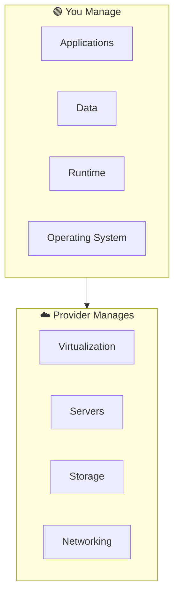
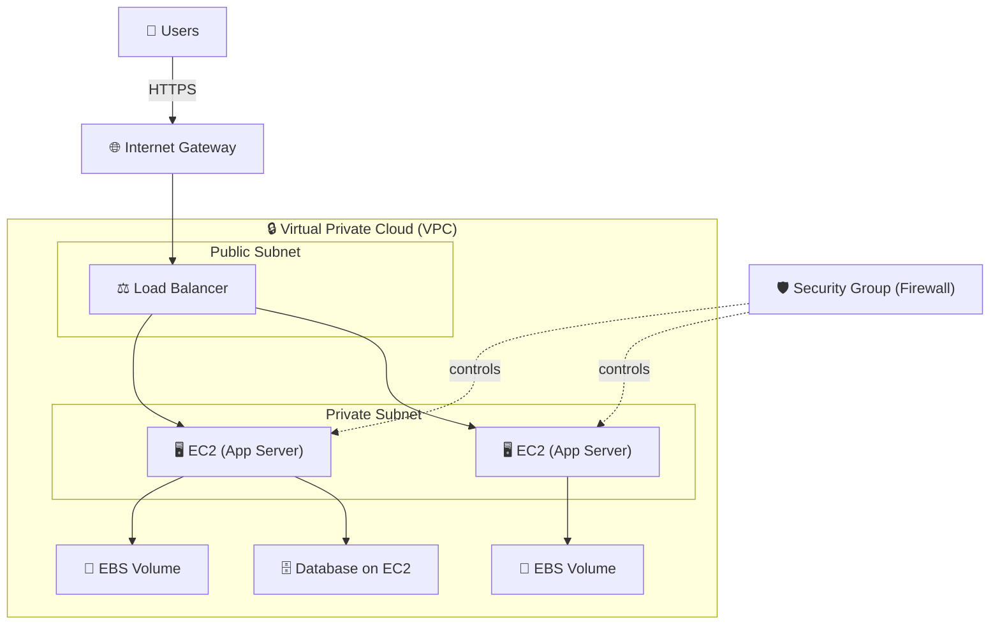

⬅ [Back to Index](../README.md)

# IaaS — Infrastructure as a Service

**IaaS** provides virtualized computing resources over the internet: **servers, storage, and networking**. You manage the OS and everything above it; the provider manages the physical hardware.

> 🧱 Think of IaaS as renting an **empty apartment** — you bring your own furniture (OS, apps, data).

### 🎓 Professional (IT-Standard) Reference

| Concept | Layman View | Professional (IT-Standard) View + Example |
|---------|-------------|-------------------------------------------|
| Compute | Rent a bare server | Compute in Infrastructure as a Service (IaaS) provides virtual servers on demand.<br>Each server runs a full Operating System (OS) you control.<br>You install, patch, and secure the OS and applications.<br>Instances can be resized or terminated at any time.<br>Billing is pay-as-you-go per second or hour.<br>*Example: Amazon Elastic Compute Cloud (EC2), Azure Virtual Machines (VMs), or Google Compute Engine.* |
| Storage & networking | Rent disk and connections | IaaS offers block, object, and file storage plus virtual networking.<br>Block storage acts like a virtual hard disk attached to a server.<br>Networking is software-defined using a Virtual Private Cloud (VPC).<br>Subnets, routing, and firewalls are fully configurable.<br>Resources scale independently of compute.<br>*Example: Elastic Block Store (EBS) volumes attached to EC2 inside a VPC.* |
| Responsibility | You clean your own place | IaaS follows the shared responsibility model.<br>The Cloud Service Provider (CSP) secures hardware and the hypervisor.<br>You secure the Operating System (OS), runtime, applications, and data.<br>Patching and configuration are your duty.<br>Misconfiguration is a common risk.<br>*Example: you patch the guest OS while AWS maintains the physical host.* |
| Provisioning | Set it up yourself | Provisioning should be automated and repeatable.<br>Infrastructure as Code (IaC) defines resources in version-controlled files.<br>This ensures consistent, auditable environments.<br>It reduces manual errors and drift.<br>Changes are reviewed like application code.<br>*Example: running `terraform apply` to provision VMs and networks.* |

> 🗣️ **In Plain English:** IaaS is when you rent a bare computer in the cloud. The landlord (AWS/Azure/Google) keeps the building running — power, walls, internet — but the *inside* is yours to set up however you like. You install the operating system, your programs, and your files. Maximum freedom, but you also do the cleaning. *New to this? See the [Plain-English Primer](../00-Start-Here/read-me-first.md).*

---

## 🗺️ Visual Overview



**Explanation:** With Infrastructure as a Service (IaaS) the provider hands you a bare virtual machine and manages everything physical below it. Everything from the operating system upward — patching, apps, and data — is your job, giving you maximum control.

---

## 🎛️ What You Manage vs Provider

| Layer | IaaS: Who Manages? |
|-------|--------------------|
| Applications | **You** |
| Data | **You** |
| Runtime | **You** |
| Operating System | **You** |
| Virtualization | Provider |
| Servers | Provider |
| Storage | Provider |
| Networking | Provider |

---

## 🏭 Industry Examples / Tools

| Provider | IaaS Service |
|----------|--------------|
| AWS | **EC2** (compute), **EBS** (storage), **VPC** (network) |
| Azure | **Virtual Machines**, **Managed Disks** |
| GCP | **Compute Engine** |
| Others | DigitalOcean Droplets, Linode, Oracle Cloud Compute |

---

## 💡 Example Scenario

A company needs to host a custom Java web app:
1. Launch an **AWS EC2** instance (Ubuntu Linux).
2. Install Java, Tomcat, and the app themselves.
3. Configure firewall rules via **Security Groups**.
4. Attach **EBS** storage for the database.

They control everything from the OS up — full flexibility.

---

## 🖥️ Quick Example: Launch a VM via AWS CLI

```bash
aws ec2 run-instances \
  --image-id ami-0abcdef1234567890 \
  --instance-type t3.micro \
  --key-name my-key \
  --security-group-ids sg-0123456789
```

---

## 🖼️ IaaS Tools & Platforms


---

## 🏗️ Architecture: A Typical IaaS Deployment



**Explanation:** In IaaS you assemble the building blocks yourself: a **VPC** for networking, **subnets** (public/private), a **load balancer**, **EC2** servers, **EBS** disks, and **Security Groups** as firewalls. The provider only guarantees the raw infrastructure — the design is yours.

---

## 🖥️ What It Looks Like — SSH into Your VM (Mockup)

```text
$ ssh -i my-key.pem ubuntu@54.221.12.34
Welcome to Ubuntu 22.04.3 LTS (GNU/Linux 6.2.0-aws x86_64)

  System load: 0.08   Processes: 112
  Memory used: 21%    IP address: 10.0.1.15

ubuntu@ip-10-0-1-15:~$ sudo apt update && sudo apt install -y openjdk-17-jre
ubuntu@ip-10-0-1-15:~$ java -jar myapp.jar
Started MyApp on port 8080  ✅
```

*You get a bare Linux box — everything above the OS (patching, Java, the app) is your responsibility.*

---

## 🔍 Deep Dive — Concepts Often Missed

### 💽 Storage Types in IaaS
| Type | Analogy | Example | Use For |
|------|---------|---------|---------|
| **Block** | A raw hard disk | EBS, Azure Managed Disk | Boot volumes, databases |
| **Object** | A key-value bucket | S3, Azure Blob | Files, backups, media |
| **File** | A shared network drive | EFS, Azure Files | Shared app data |

### 🖥️ Instance Families
- **General purpose** (t/m): balanced. **Compute optimized** (c): CPU-heavy. **Memory optimized** (r/x): databases/caches. **GPU** (p/g): ML/graphics.

### 💰 Purchasing Options (big cost lever)
- **On-Demand:** flexible, most expensive. **Reserved / Savings Plans:** 1–3 yr commit, up to ~72% off. **Spot:** spare capacity, up to ~90% off but can be reclaimed — great for fault-tolerant batch jobs.

### 🛡️ Security Groups vs NACLs
- **Security Group** = stateful firewall at the instance level.
- **Network ACL** = stateless firewall at the subnet level.

### ⚠️ Common Gotchas
- **Public IPs & open ports:** never expose SSH (22) to `0.0.0.0/0` in prod.
- **Right-sizing:** most IaaS bills are inflated by oversized/idle instances.

---

## ✅ When to Use IaaS

- You need **full control** over the OS and environment.
- Migrating existing on-prem apps ("lift and shift").
- Highly customized or legacy workloads.

## ⚖️ Pros & Cons

| Pros | Cons |
|------|------|
| Maximum flexibility & control | You manage OS, patching, scaling |
| Easy lift-and-shift migration | More operational overhead |
| Pay-as-you-go infrastructure | Requires sysadmin skills |

---

**Related:** [Virtualization](../04-Core-Technologies/virtualization.md) · [PaaS](paas.md) · [SaaS](saas.md)

**Navigation:** [Next → PaaS](paas.md) | ⬅ [Back to Index](../README.md)
