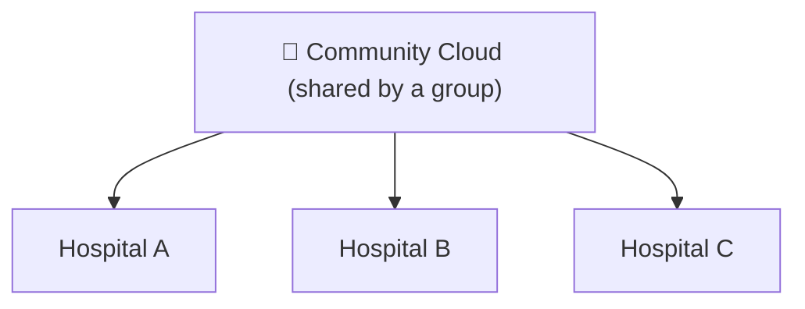
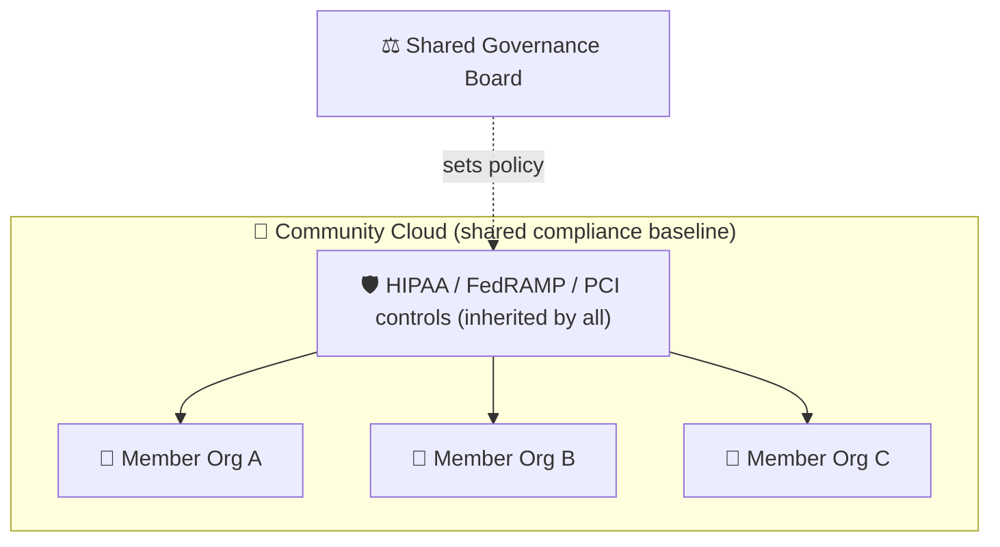

⬅ [Back to Index](../README.md)

# Community Cloud

A **community cloud** is shared by **several organizations with common concerns** (e.g., same industry, compliance requirements, or mission). It's a middle ground between private and public.

### 🎓 Professional (IT-Standard) Reference

| Concept | Layman View | Professional (IT-Standard) View + Example |
|---------|-------------|-------------------------------------------|
| Shared purpose | A cloud for one industry | Community cloud serves several organizations with shared concerns.<br>Members typically share an industry or mission.<br>Governance and compliance rules are common to all.<br>It sits between private and public cloud.<br>It balances isolation with shared cost.<br>*Example: a government community cloud such as AWS GovCloud.* |
| Cost sharing | Split the bill | Costs are pooled across member organizations.<br>This lowers the expense for each participant.<br>Shared infrastructure improves utilization.<br>Members jointly fund the platform.<br>It is efficient for aligned groups.<br>*Example: a healthcare consortium sharing a Health Insurance Portability and Accountability Act (HIPAA)-compliant platform.* |
| Compliance | Built to the same rules | The platform meets a common regulatory baseline.<br>All members inherit the same controls.<br>Standards include HIPAA and the Federal Risk and Authorization Management Program (FedRAMP).<br>This simplifies audits for members.<br>Compliance is designed in from the start.<br>*Example: AWS GovCloud meeting FedRAMP High requirements.* |

---

## 🗺️ Visual Overview



**Explanation:** A community cloud is shared by several organizations with common needs — for example, hospitals that must meet the same regulations. They split the cost and enforce shared rules, like neighbors sharing a private community pool.

---

## 💡 How It Works

- Infrastructure is shared among a **specific community** of organizations.
- Managed internally or by a third party.
- Costs and governance are shared among members.

---

## 🏭 Examples

- **Government cloud** — e.g., **AWS GovCloud**, **Azure Government** for public-sector agencies.
- **Healthcare community cloud** — hospitals sharing HIPAA-compliant infrastructure.
- **Financial services cloud** — banks sharing a compliant platform.
- **Research/education clouds** — universities pooling resources.

---

## ✅ Advantages

| Advantage | Explanation |
|-----------|-------------|
| Shared cost | Members split expenses |
| Compliance-focused | Built for the community's regulations |
| Collaboration | Easier data sharing among members |
| More secure than public | Restricted to trusted members |

## ⚠️ Disadvantages

- Limited to community members.
- Shared governance can be complex.
- Less scalable than public cloud.

---

## 🎯 Best For

- Organizations in the same regulated industry.
- Joint ventures & consortiums.
- Government & public-sector collaboration.

---

## 🖼️ Community Cloud Platforms


---

## 🏗️ Architecture: Shared Compliance Baseline



**Explanation:** Members inherit one certified control baseline (e.g., HIPAA), so each org doesn't re-certify from scratch. A shared governance body sets rules; costs and audits are pooled across the community.

---

## 🌐 Real-World Usage Example

The **U.S. Intelligence Community (IC)** uses **AWS GovCloud (C2S)** as a community cloud shared across 17 agencies (CIA, NSA, etc.) under one FedRAMP/IL-certified environment. Agencies collaborate on shared data while inheriting the same strict, government-grade security controls — something none could economically build alone.

**Other real examples:** the UK NHS regional health clouds, university research consortiums (e.g., Internet2), and financial-sector shared compliance platforms.

---

## 🖥️ What It Looks Like — Compliance Dashboard (Mockup)

```text
┌────────────────────────────────────────────────────┐
│  🛡️  Community Compliance Dashboard                 │
├────────────────────────────────────────────────────┤
│  Baseline: FedRAMP High     Status: ✓ Authorized   │
│  Members: 17 agencies                               │
│  Controls inherited: 421 / 421  ▇▇▇▇▇▇▇ 100%        │
│  Last shared audit: 2025-09-12   Result: PASS       │
└────────────────────────────────────────────────────┘
```

---

## 📊 Deployment Models Summary

| Model | Users | Control | Cost | Best For |
|-------|-------|---------|------|----------|
| [Public](public-cloud.md) | Anyone | Low | Low | Startups, web apps |
| [Private](private-cloud.md) | One org | High | High | Regulated industries |
| [Hybrid](hybrid-cloud.md) | Mixed | Medium | Medium | Gradual migration |
| [Multi-Cloud](multi-cloud.md) | One org, many providers | Medium | Variable | Avoiding lock-in |
| **Community** | Group of orgs | Medium | Shared | Industry consortiums |

---

**Navigation:** [← Multi-Cloud](multi-cloud.md) | [Next → Virtualization](../04-Core-Technologies/virtualization.md) | ⬅ [Back to Index](../README.md)
