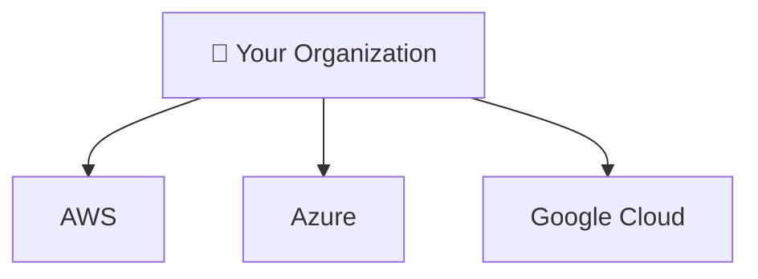
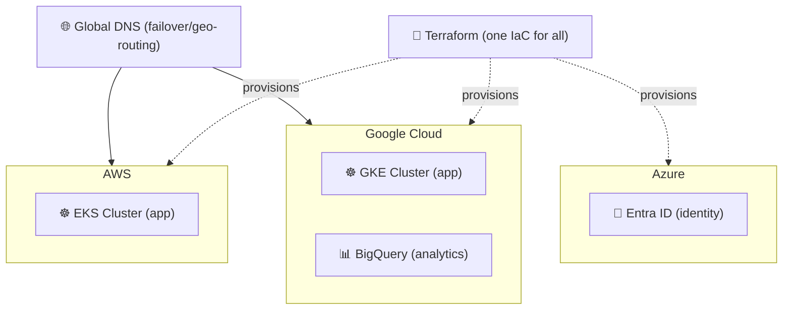

⬅ [Back to Index](../README.md)

# Multi-Cloud

**Multi-cloud** means using **multiple public cloud providers** (e.g., AWS + Azure + GCP) together — to avoid vendor lock-in, optimize cost, and increase resilience.

> 🔀 Hybrid = public + private. Multi-cloud = multiple public providers.

### 🎓 Professional (IT-Standard) Reference

| Concept | Layman View | Professional (IT-Standard) View + Example |
|---------|-------------|-------------------------------------------|
| Avoid lock-in | Not tied to one vendor | Multi-cloud reduces dependence on a single provider.<br>Portability is achieved with open standards and containers.<br>Infrastructure as Code (IaC) keeps deployments provider-neutral.<br>This preserves negotiating power and flexibility.<br>Migration risk is lowered.<br>*Example: Kubernetes and Terraform running across Amazon Web Services (AWS) and Google Cloud Platform (GCP).* |
| Best-of-breed | Pick the best service | Teams choose the strongest service from each provider.<br>This lets you optimize for capability and cost.<br>Workloads are placed where they perform best.<br>It requires cross-cloud expertise.<br>Integration complexity increases.<br>*Example: Google BigQuery for analytics plus AWS Lambda for compute.* |
| Resilience | Survive one provider failing | Spreading workloads across clouds improves resilience.<br>If one provider fails, another keeps services running.<br>It supports Disaster Recovery (DR) strategies.<br>Failover can be automated at the Domain Name System (DNS) layer.<br>Redundancy reduces outage risk.<br>*Example: failover Domain Name System (DNS) routing between two clouds.* |

---

## 🗺️ Visual Overview



**Explanation:** Multi-cloud means using more than one public cloud provider at the same time. It avoids depending on a single vendor and lets you pick the best service from each — though it adds complexity to manage.

---

## 💡 Why Multi-Cloud?

| Reason | Explanation |
|--------|-------------|
| **Avoid vendor lock-in** | Not dependent on a single provider |
| **Best-of-breed** | Use each provider's strengths (e.g., GCP for ML, AWS for breadth) |
| **Resilience** | If one provider has an outage, fail over |
| **Cost optimization** | Choose cheapest provider per workload |
| **Compliance** | Meet regional data laws |

---

## 🏭 Tools for Multi-Cloud

- **Terraform** — provision across AWS, Azure, GCP with one language ([IaC](../06-Tools-and-Practices/iac.md)).
- **Kubernetes** — run containers on any cloud ([details](../06-Tools-and-Practices/kubernetes.md)).
- **Google Anthos / Azure Arc** — unified management.
- **HashiCorp Consul** — service networking across clouds.

---

## 💡 Example Scenario

A company:
- Runs its main app on **AWS**.
- Uses **Google Cloud's BigQuery** for analytics.
- Uses **Azure Active Directory** for identity.
- Deploys via **Kubernetes** so workloads are portable.

---

## ⚠️ Challenges

- Increased complexity & management overhead.
- Skills across multiple platforms required.
- Networking and data transfer costs between clouds.
- Consistent security/governance is harder.

---

## 🖼️ Multi-Cloud Toolchain


---

## 🏗️ Architecture: Portable Multi-Cloud App



**Explanation:** One Terraform codebase provisions across all three clouds; Kubernetes makes the app portable; DNS routes users and fails over between clouds. You cherry-pick the best service from each (BigQuery for analytics, Entra ID for identity).

---

## 🖥️ What It Looks Like — Terraform Multi-Provider Plan (Mockup)

```text
$ terraform plan
Providers:
  + aws       ~> 5.0   (us-east-1)
  + google    ~> 5.0   (us-central1)
  + azuread   ~> 2.0

Plan: 3 to add, 0 to change, 0 to destroy.
  + aws_eks_cluster.app
  + google_bigquery_dataset.analytics
  + azuread_application.sso
```

---

## 🌐 Real-World Usage Example

**Snapchat (Snap Inc.)** famously runs **multi-cloud** on both **Google Cloud and AWS** simultaneously — a public commitment worth billions to each. This gives Snap resilience (an outage at one provider doesn't take Snapchat down), pricing leverage, and access to each provider's best services for its 400M+ daily users.

**Other real examples:** Twitter/X (AWS + GCP), HSBC (AWS + GCP + Azure), Spotify migrating analytics to GCP while keeping other services elsewhere.

---

## 🔍 Deep Dive — Concepts Often Missed

- **Multi-cloud ≠ automatic resilience:** true failover requires replicated data and tested runbooks, not just accounts on two clouds.
- **Inter-cloud egress fees** can be brutal — keep chatty services within one cloud.
- **Lowest-common-denominator risk:** forcing portability can stop you using a cloud's best managed services.
- **Abstraction tools:** Crossplane/Terraform/Kubernetes standardize deployment, but identity and networking remain the hardest cross-cloud problems.

---

**Related:** [Hybrid Cloud](hybrid-cloud.md) · [Provider Comparison](../05-Cloud-Providers/comparison.md)

**Navigation:** [← Hybrid Cloud](hybrid-cloud.md) | [Next → Community Cloud](community-cloud.md) | ⬅ [Back to Index](../README.md)
