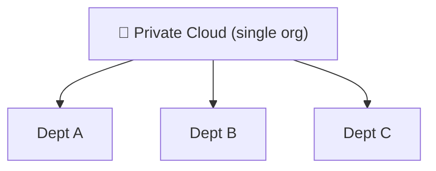
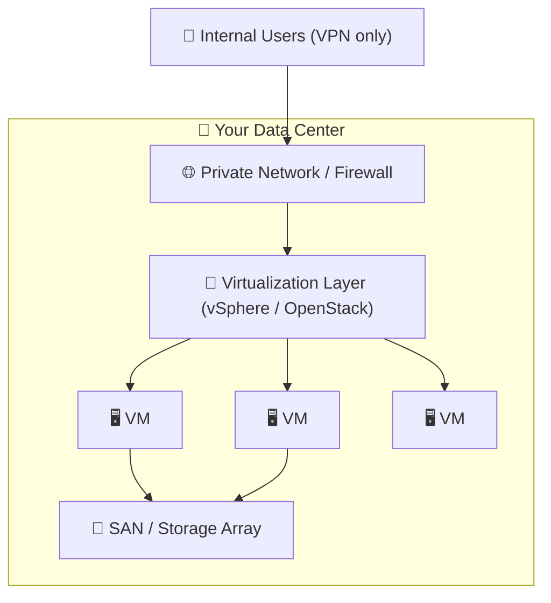

⬅ [Back to Index](../README.md)

# Private Cloud

A **private cloud** is cloud infrastructure dedicated to a **single organization**. It can be hosted on-premises or by a third party, but resources are **not shared** with others.

### 🎓 Professional (IT-Standard) Reference

| Concept | Layman View | Professional (IT-Standard) View + Example |
|---------|-------------|-------------------------------------------|
| Dedicated infra | Your own private cloud | Private cloud is single-tenant infrastructure for one organization.<br>Resources are not shared with other customers.<br>It can be on-premises or hosted by a third party.<br>It offers strong control and isolation.<br>It is common where compliance is strict.<br>*Example: a VMware vSphere or OpenStack private cloud.* |
| Control | You run everything | You retain full governance over the environment.<br>This includes data residency, security, and configuration.<br>It suits regulated industries with strict rules.<br>Customization is nearly unlimited.<br>The trade-off is higher operational effort.<br>*Example: meeting strict data-sovereignty requirements in-country.* |
| Cost model | Buy and maintain it | Private cloud is typically Capital Expenditure (CapEx)-heavy.<br>You buy and maintain the hardware yourself.<br>In-house teams handle operations.<br>Utilization must stay high to justify cost.<br>Refresh cycles add ongoing spend.<br>*Example: periodic on-premises hardware refresh cycles.* |

---

## 🗺️ Visual Overview



**Explanation:** A private cloud is dedicated to one organization only — no sharing with outsiders. It gives maximum control and security (often for banks or governments), like owning your own private house instead of renting a shared building.

---

## 🏭 Examples / Tools

- **VMware vSphere / vCloud**
- **OpenStack** (open-source private cloud)
- **Microsoft Azure Stack**
- **Red Hat OpenShift** (on-prem)
- **AWS Outposts** (AWS hardware in your data center)

---

## 💡 How It Works

- Infrastructure is dedicated to one organization.
- Full control over security, hardware, and configuration.
- Often used by banks, governments, healthcare — where data privacy and compliance are critical.

---

## ✅ Advantages

| Advantage | Explanation |
|-----------|-------------|
| Maximum control | You own/manage everything |
| Enhanced security | Dedicated, isolated resources |
| Compliance-friendly | Meet strict regulations |
| Customizable | Tailor to specific needs |

## ⚠️ Disadvantages

- High upfront cost (hardware, maintenance).
- Limited scalability vs public cloud.
- Requires in-house expertise.

---

## 🎯 Best For

- Highly regulated industries (finance, healthcare, government).
- Sensitive data with strict compliance ([see compliance](../07-Security/compliance.md)).
- Predictable, steady workloads.

---

## 🖼️ Private Cloud Platforms


---

## 🏗️ Architecture: On-Prem Private Cloud



**Explanation:** You own the whole stack — servers, storage (SAN), network — and layer virtualization on top to deliver "cloud-like" self-service internally. Full control, but you buy, patch, and refresh everything.

---

## 🖥️ What It Looks Like — vSphere Console (Mockup)

```text
┌──────────────────────────────────────────────────────┐
│  vSphere Client     Datacenter › Cluster-Prod         │
├──────────────────────────────────────────────────────┤
│  Hosts: 8      CPU: 384 GHz  ▇▇▇▇▇▁▁ 61% used         │
│  VMs:  142     RAM: 3.0 TB   ▇▇▇▇▇▇▁ 74% used         │
│  Datastore: SAN-01  128 TB   ▇▇▇▇▁▁▁ 52% used         │
│                                                      │
│   ▸ vm-db-01     ● Running   8 vCPU / 64 GB          │
│   ▸ vm-app-07    ● Running   4 vCPU / 16 GB          │
│   ▸ vm-test-22   ◌ Powered off                       │
└──────────────────────────────────────────────────────┘
```

---

## 🌐 Real-World Usage Example

**Bank of America** runs one of the world's largest **private clouds** to keep sensitive financial data fully in-house under strict regulation. It reportedly moved ~80% of workloads onto its internal software-defined private cloud, saving billions versus public cloud while retaining total control over security and compliance (SOX, PCI-DSS).

**Other real examples:** government agencies (data sovereignty), hospitals (HIPAA), defense contractors (classified data).

---

## 🔍 Deep Dive — Concepts Often Missed

- **Private ≠ on-prem only:** it can be *hosted* private cloud (single-tenant hardware in a provider DC).
- **Hyperconverged Infrastructure (HCI):** Nutanix/VxRail bundle compute+storage+network into one appliance to simplify private cloud.
- **The utilization trap:** private cloud is only cost-effective if kept highly utilized; idle owned hardware still costs money.
- **Cloud-in-a-box:** AWS Outposts / Azure Stack bring public-cloud APIs into your own DC — blurring private/public.

---

**Related:** [Public Cloud](public-cloud.md) · [Hybrid Cloud](hybrid-cloud.md)

**Navigation:** [← Public Cloud](public-cloud.md) | [Next → Hybrid Cloud](hybrid-cloud.md) | ⬅ [Back to Index](../README.md)
