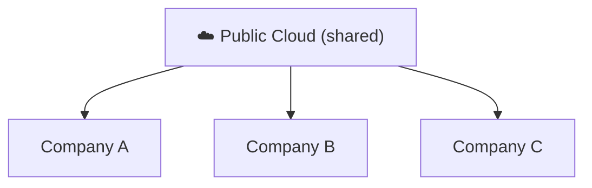
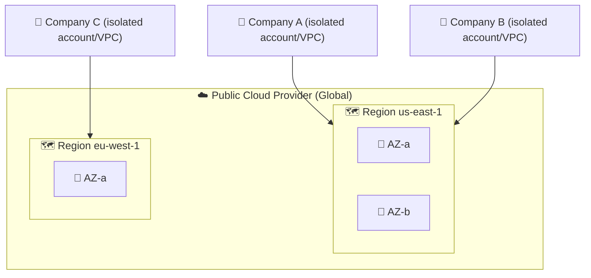

⬅ [Back to Index](../README.md)

# Public Cloud

A **public cloud** is owned and operated by a **third-party provider** that delivers computing resources over the internet. Resources are **shared** among many customers (multi-tenant).

### 🎓 Professional (IT-Standard) Reference

| Concept | Layman View | Professional (IT-Standard) View + Example |
|---------|-------------|-------------------------------------------|
| Multi-tenancy | Everyone shares the cloud | Public cloud serves many customers on shared infrastructure.<br>Each tenant is logically isolated from the others.<br>Isolation uses accounts, Identity and Access Management (IAM), and networking.<br>Customers cannot see each other's data.<br>This maximizes efficiency and lowers cost.<br>*Example: Amazon Web Services (AWS) accounts isolated via IAM and Virtual Private Cloud (VPC).* |
| Elasticity | Scales on demand | Capacity expands and contracts automatically with demand.<br>Global regions and Availability Zones (AZs) provide reach and resilience.<br>You pay only for what you use.<br>Scaling avoids over-provisioning.<br>It supports unpredictable workloads.<br>*Example: scaling an application across multiple Availability Zones (AZs).* |
| Economics | No upfront hardware | Public cloud uses an Operating Expenditure (OpEx) model.<br>There is no Capital Expenditure (CapEx) on hardware.<br>Billing is metered per usage.<br>This lowers the barrier to entry.<br>Costs must be governed to avoid waste.<br>*Example: hourly Elastic Compute Cloud (EC2) billing with no upfront purchase.* |

---

## 🗺️ Visual Overview



**Explanation:** A public cloud is owned by a provider like AWS, Azure, or Google and shared by many customers at once. Each customer is isolated but rents from the same giant pool of hardware — like tenants in one big apartment building.

---

## 🏭 Examples / Providers

- **Amazon Web Services (AWS)** → [details](../05-Cloud-Providers/aws.md)
- **Microsoft Azure** → [details](../05-Cloud-Providers/azure.md)
- **Google Cloud Platform (GCP)** → [details](../05-Cloud-Providers/gcp.md)
- Oracle Cloud, IBM Cloud, Alibaba Cloud

---

## 💡 How It Works

- The provider owns the data centers, hardware, and networking.
- You rent resources on demand and share physical infrastructure with other tenants (securely isolated).
- Access everything via the internet.

---

## ✅ Advantages

| Advantage | Explanation |
|-----------|-------------|
| No hardware cost | Provider owns everything |
| Massive scalability | Near-unlimited resources |
| Pay-as-you-go | Only pay for usage |
| Global reach | Deploy in regions worldwide |
| High reliability | Redundant, managed infrastructure |

## ⚠️ Disadvantages

- Less control over infrastructure.
- Shared environment (though isolated).
- Compliance concerns for sensitive data.

---

## 🎯 Best For

- Startups & scale-ups.
- Web/mobile apps, dev/test environments.
- Variable or unpredictable workloads.

---

## 🖼️ Public Cloud Providers


---

## 🏗️ Architecture: Multi-Tenant Public Cloud



**Explanation:** Thousands of customers share the same global hardware pool, but each is fenced off by its own account, IAM policies, and VPC. You pick a Region close to your users and spread across AZs for resilience.

---

## 🖥️ What It Looks Like — Picking a Region (Mockup)

```text
┌────────────────────────────────────────────────────────┐
│  ☁️  Console        Region: [ US East (N. Virginia) ▾ ] │
├────────────────────────────────────────────────────────┤
│   ○ US East (N. Virginia)   us-east-1   ⚡ lowest price │
│   ○ US West (Oregon)        us-west-2                   │
│   ● Europe (Ireland)        eu-west-1   ✓ GDPR region   │
│   ○ Asia Pacific (Mumbai)   ap-south-1                  │
│                                                        │
│   Availability Zones in region: 3  ▇▇▇                 │
└────────────────────────────────────────────────────────┘
```

---

## 🌐 Real-World Usage Example

**Airbnb** runs almost entirely on **AWS public cloud**. During peak booking seasons it elastically scales thousands of EC2 instances and stores billions of images in S3 — with zero data centers of its own. When traffic drops, capacity (and cost) shrinks automatically. This let a startup serve 150M+ users globally without ever buying a server.

**Other real examples:** Netflix (AWS streaming), Spotify (Google Cloud), Slack (AWS), Pinterest (AWS).

---

## 🔍 Deep Dive — Concepts Often Missed

- **Region selection drivers:** latency (near users), price (varies per region), compliance (data residency), and service availability (new services launch in some regions first).
- **Data egress cost:** moving data *out* of the public cloud is the classic surprise bill.
- **Well-Architected best practice:** always deploy across ≥2 AZs for production high availability.
- **Landing zones:** enterprises use multi-account structures (AWS Organizations / Azure Management Groups) to isolate teams and enforce guardrails.

---

**Related:** [Private Cloud](private-cloud.md) · [Hybrid Cloud](hybrid-cloud.md)

**Navigation:** [Next → Private Cloud](private-cloud.md) | ⬅ [Back to Index](../README.md)
