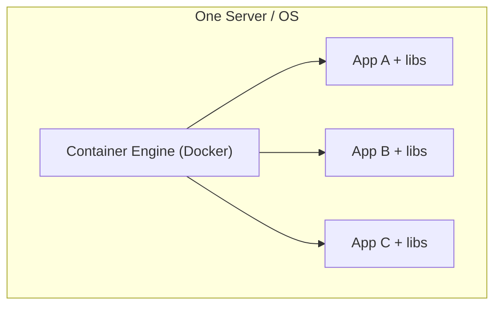
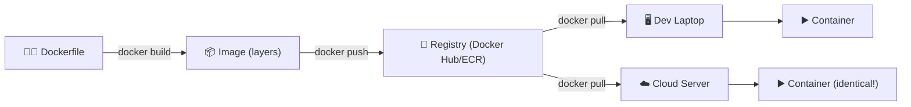

⬅ [Back to Index](../README.md)

# Containers & Docker

A **container** packages an application with all its dependencies (libraries, config) into a single, portable unit that runs consistently across any environment.

> 📦 "It works on my machine" → with containers, it works *everywhere*.

### 🎓 Professional (IT-Standard) Reference

| Concept | Layman View | Professional (IT-Standard) View + Example |
|---------|-------------|-------------------------------------------|
| Container | A portable app box | A container packages an app with its dependencies into one unit.<br>It uses Operating System (OS)-level virtualization sharing the host kernel.<br>Isolation uses Linux namespaces and control groups (cgroups).<br>Containers are lighter and faster than Virtual Machines (VMs).<br>They run consistently across environments.<br>*Example: a Docker container running the Nginx web server.* |
| Image | The app's blueprint | An image is an immutable, layered template for containers.<br>It is built from a set of instructions in a Dockerfile.<br>Each layer is cached to speed up rebuilds.<br>Images are versioned with tags.<br>Containers are running instances of images.<br>*Example: building an image with `docker build -t app:1.0 .`.* |
| Registry | Store for app boxes | A registry stores and distributes container images.<br>It follows the Open Container Initiative (OCI) standard.<br>Images are pushed and pulled by version.<br>Registries can be public or private.<br>They integrate with Continuous Integration/Continuous Delivery (CI/CD).<br>*Example: Docker Hub or Amazon Elastic Container Registry (ECR).* |
| Isolation | Apps don't interfere | Containers isolate processes and resources from each other.<br>Isolation is lighter than a full Virtual Machine (VM).<br>Each container has its own filesystem and network view.<br>Resource limits prevent interference.<br>Many containers run per host efficiently.<br>*Example: many containers on one host with separate namespaces.* |

---

## 🗺️ Visual Overview



**Explanation:** A container packages an app together with everything it needs to run, then shares the host operating system with other containers. This makes containers tiny and fast to start compared to full virtual machines — like lunchboxes stacked on one shared table.

---

## 🆚 Containers vs VMs

```
   Virtual Machines            Containers
 ┌──────┬──────┬──────┐    ┌──────┬──────┬──────┐
 │ App  │ App  │ App  │    │ App  │ App  │ App  │
 │ Bins │ Bins │ Bins │    │ Bins │ Bins │ Bins │
 │ OS   │ OS   │ OS   │    ├──────┴──────┴──────┤
 ├──────┴──────┴──────┤    │ Container Engine   │
 │    Hypervisor      │    │   Host OS          │
 │    Host OS         │    ├────────────────────┤
 │    Hardware        │    │   Hardware         │
 └────────────────────┘    └────────────────────┘
```

Containers **share the host OS kernel** → lightweight, fast, efficient.

---

## 🐳 Docker — The Standard Tool

**Docker** is the most popular containerization platform.

### Key Concepts
- **Image** — a blueprint/template for a container.
- **Container** — a running instance of an image.
- **Dockerfile** — instructions to build an image.
- **Registry** — stores images (Docker Hub, AWS ECR, GCR).

### Example Dockerfile
```dockerfile
FROM node:18-alpine
WORKDIR /app
COPY package.json .
RUN npm install
COPY . .
EXPOSE 3000
CMD ["node", "server.js"]
```

### Common Commands
```bash
docker build -t my-app .        # build image
docker run -p 3000:3000 my-app  # run container
docker ps                       # list running containers
docker push my-app              # push to registry
```

---

## 🏭 Industry Tools

| Purpose | Tools |
|---------|-------|
| Container runtime | **Docker**, Podman, containerd |
| Image registry | Docker Hub, **AWS ECR**, **GCR**, **Azure ACR** |
| Orchestration | **Kubernetes**, Docker Swarm, ECS |
| Security scanning | Trivy, Clair, Snyk |

---

## 💡 Why Containers Matter

- **Portability** — run anywhere (laptop, cloud, on-prem).
- **Consistency** — same environment in dev/test/prod.
- **Efficiency** — lightweight, fast startup.
- **Microservices** — perfect for breaking apps into small services.

➡️ Managing many containers at scale? See [Kubernetes](../06-Tools-and-Practices/kubernetes.md).

---

## 🖼️ Container Ecosystem


---

## 🏗️ Architecture: Build → Ship → Run



**Explanation:** You build an image once, push it to a registry, and pull it anywhere. The same image runs identically on a laptop and in the cloud — killing "works on my machine" bugs.

---

## 🖥️ What It Looks Like — Docker Run (Mockup)

```text
$ docker run -p 3000:3000 my-app:1.0
Unable to find image 'my-app:1.0' locally
1.0: Pulling from library/my-app
7d3e...: Pull complete  ▇▇▇▇▇▇▇ 100%
Status: Downloaded newer image
> Server listening on http://0.0.0.0:3000  ✅ (started in 0.4s)

$ docker ps
CONTAINER ID   IMAGE        STATUS         PORTS
a1b2c3d4e5f6   my-app:1.0   Up 3 seconds   0.0.0.0:3000->3000
```

---

## 🌐 Real-World Usage Example

**Spotify** packages hundreds of microservices as Docker containers so any team can deploy independently. A new feature is built into an image, tested, and shipped to production in minutes — the same container image that ran on a developer's laptop runs across thousands of servers, powering music for 600M+ users.

**Other real examples:** PayPal containerized apps to cut infra costs ~50%; Uber runs its dispatch stack in containers; almost every CI/CD pipeline builds containers.

---

## 🔍 Deep Dive — Concepts Often Missed

- **Namespaces + cgroups** are the Linux kernel features that *make* containers (isolation + resource limits) — Docker is just a friendly wrapper.
- **Layer caching:** order Dockerfile steps from least- to most-frequently-changing to speed rebuilds.
- **Multi-stage builds** shrink images (build in a big image, copy only the artifact into a tiny one).
- **Image bloat & security:** use minimal bases (`alpine`, `distroless`), scan with Trivy, and never bake secrets into images.
- **Containers are ephemeral & stateless:** persist data in volumes or external stores, not inside the container.
- **OCI standard:** images/runtimes are standardized — that's why Podman/containerd interoperate with Docker.

---

**Navigation:** [← Virtualization](virtualization.md) | [Next → Cloud Networking](networking.md) | ⬅ [Back to Index](../README.md)
