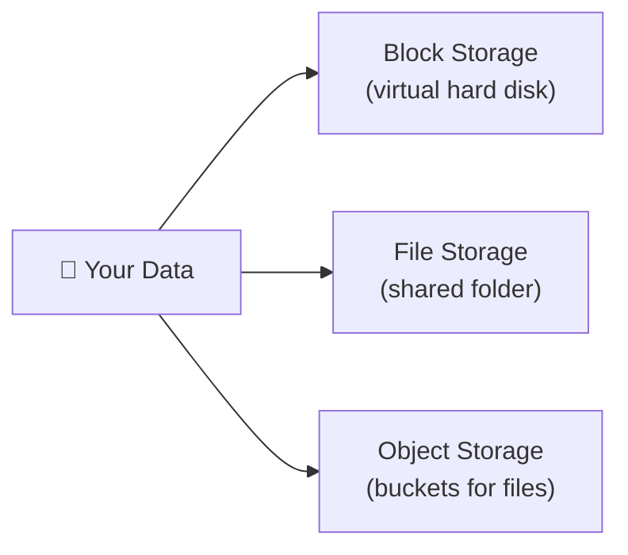
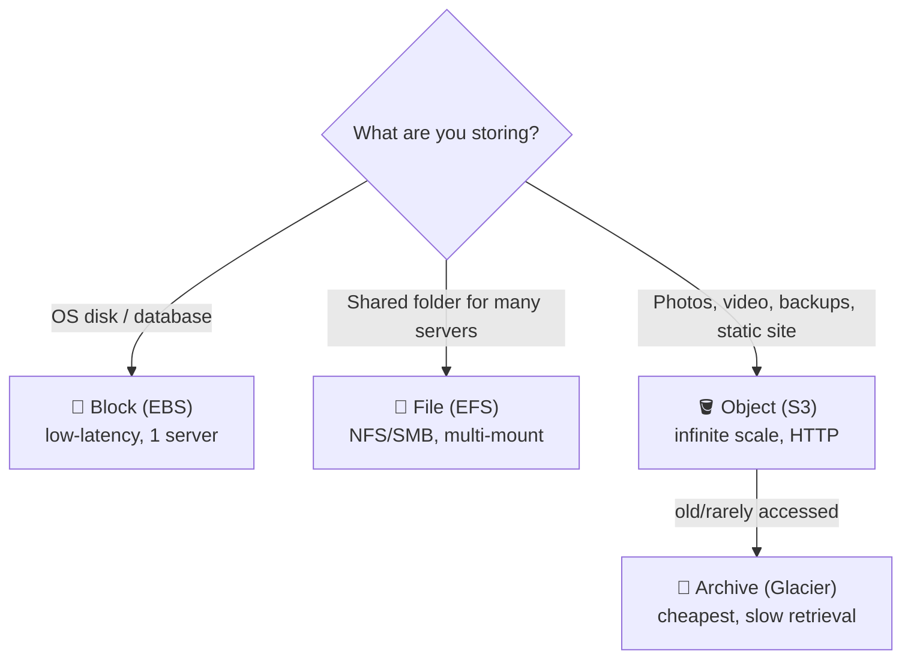

⬅ [Back to Index](../README.md)

# Cloud Storage

Cloud storage lets you store and retrieve data over the internet. There are **three main types**, each for different use cases.

### 🎓 Professional (IT-Standard) Reference

| Concept | Layman View | Professional (IT-Standard) View + Example |
|---------|-------------|-------------------------------------------|
| Object storage | Store files in buckets | Object storage keeps data as objects with metadata in buckets.<br>It is accessed over Hypertext Transfer Protocol (HTTP) using an Application Programming Interface (API).<br>It scales almost infinitely.<br>It offers very high durability (often eleven nines).<br>It suits backups, media, and static assets.<br>*Example: Amazon Simple Storage Service (S3) or Azure Blob Storage.* |
| Block storage | A virtual hard drive | Block storage provides low-latency volumes attached to a server.<br>It behaves like a physical hard disk.<br>It is ideal for databases and operating systems.<br>Volumes can be resized and snapshotted.<br>Each volume attaches to one instance at a time.<br>*Example: Amazon Elastic Block Store (EBS) mounted to an Elastic Compute Cloud (EC2) instance.* |
| File storage | A shared network folder | File storage offers a shared file system over the network.<br>It uses protocols like Network File System (NFS) or Server Message Block (SMB).<br>Many servers can mount it at once.<br>It suits shared application data.<br>It is fully managed by the provider.<br>*Example: Amazon Elastic File System (EFS) or Azure Files.* |
| Tiering & lifecycle | Cheaper storage for old data | Lifecycle policies move data between storage tiers automatically.<br>Data flows from hot to cold to archive over time.<br>This optimizes cost for infrequently used data.<br>Rules trigger based on age or access.<br>It reduces storage bills significantly.<br>*Example: a Simple Storage Service (S3) lifecycle rule moving data to Glacier after 90 days.* |

---

## 🗺️ Visual Overview



**Explanation:** Cloud storage comes in three flavors. Block storage acts like a hard disk for a server, file storage is a shared network folder, and object storage holds huge numbers of files (photos, backups) in buckets accessed over the web.

---

## 🗂️ Three Types of Storage

### 1️⃣ Object Storage
- Stores data as **objects** (file + metadata + unique ID) in a flat structure ("buckets").
- Best for: images, videos, backups, static websites, big data.
- **Highly scalable & cheap.**

| Provider | Service |
|----------|---------|
| AWS | **S3** |
| Azure | **Blob Storage** |
| GCP | **Cloud Storage** |

### 2️⃣ Block Storage
- Stores data in fixed-size **blocks**, like a virtual hard drive attached to a VM.
- Best for: databases, OS disks, high-performance apps.

| Provider | Service |
|----------|---------|
| AWS | **EBS** (Elastic Block Store) |
| Azure | **Managed Disks** |
| GCP | **Persistent Disk** |

### 3️⃣ File Storage
- Shared file system accessed over a network (NFS/SMB).
- Best for: shared files, legacy apps, content management.

| Provider | Service |
|----------|---------|
| AWS | **EFS** (Elastic File System) |
| Azure | **Azure Files** |
| GCP | **Filestore** |

---

## 📊 Comparison

| Feature | Object | Block | File |
|---------|--------|-------|------|
| Structure | Flat (buckets) | Blocks | Hierarchy (folders) |
| Access | HTTP API | Attached to VM | Network mount |
| Scalability | Virtually unlimited | Limited | Moderate |
| Use case | Media, backups | Databases, VMs | Shared drives |

---

## 🧊 Storage Tiers (Cost Optimization)

Cloud providers offer tiers based on access frequency:
- **Hot** — frequent access (higher cost). e.g., S3 Standard.
- **Cool / Infrequent** — occasional access. e.g., S3 Standard-IA.
- **Archive / Cold** — rare access, cheapest. e.g., **AWS S3 Glacier**, Azure Archive.

💡 **Example:** Store active user photos in Hot tier, move 5-year-old backups to Glacier to save 80%+ on cost.

---

## 💡 Example: Upload to AWS S3

```bash
aws s3 cp myfile.jpg s3://my-bucket/photos/
aws s3 ls s3://my-bucket/photos/
```

---

## 🖼️ Cloud Storage Services


---

## 🏗️ Architecture: Choosing the Right Storage



**Explanation:** Match storage to workload: **block** for one server's disk/DB, **file** for shared folders, **object** for massive scalable file dumps — with lifecycle rules auto-moving cold data to cheap archive tiers.

---

## 🖥️ What It Looks Like — S3 Bucket & Lifecycle (Mockup)

```text
┌─────────────────────────────────────────────┐
│  🪣 S3 › my-app-media                                │
├─────────────────────────────────────────────┤
│  📁 photos/    2.1 TB    Standard (Hot)             │
│  📁 backups/   8.7 TB    Glacier (Archive)  💤       │
│                                                     │
│  Lifecycle rule: “archive-old”                       │
│   IF object age > 90 days  →  move to Glacier       │
│   Est. savings: ~82% on archived data               │
│  Durability: 99.999999999% (11 nines)               │
└─────────────────────────────────────────────┘
```

---

## 🌐 Real-World Usage Example

**Dropbox** stores exabytes of user files primarily in object storage (it built "Magic Pocket," its own S3-like system, after starting on AWS S3). Every file you drop is chunked, deduplicated, and stored as objects with 11-nines durability — accessible instantly from any device. Cold/old file versions tier down to cheaper storage automatically.

**Other real examples:** Airbnb stores listing photos in S3; Snapchat uses object storage for media; databases like RDS sit on block storage (EBS).

---

## 🔍 Deep Dive — Concepts Often Missed

- **Durability vs Availability:** durability = won't lose data (11 nines); availability = can access it right now (e.g., 99.99%). Different guarantees!
- **Storage classes drive cost:** S3 Standard → Standard-IA → Glacier → Deep Archive (retrieval gets cheaper but slower).
- **Retrieval fees & latency:** archive tiers are cheap to store but charge (and delay minutes–hours) to read — don't archive hot data.
- **Object versioning & immutability (Object Lock):** protect against accidental deletes and ransomware.
- **Encryption:** at-rest (SSE-KMS) and in-transit (TLS) should be default.
- **Block volumes attach to one instance;** for shared access use file storage (EFS) or object (S3).

---

**Navigation:** [← Cloud Networking](networking.md) | [Next → AWS](../05-Cloud-Providers/aws.md) | ⬅ [Back to Index](../README.md)
