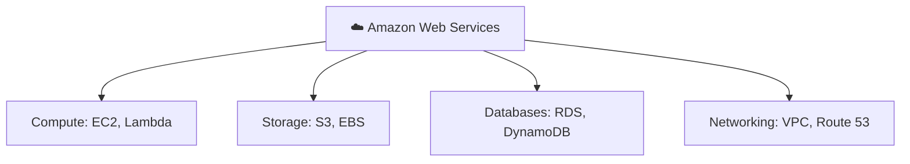
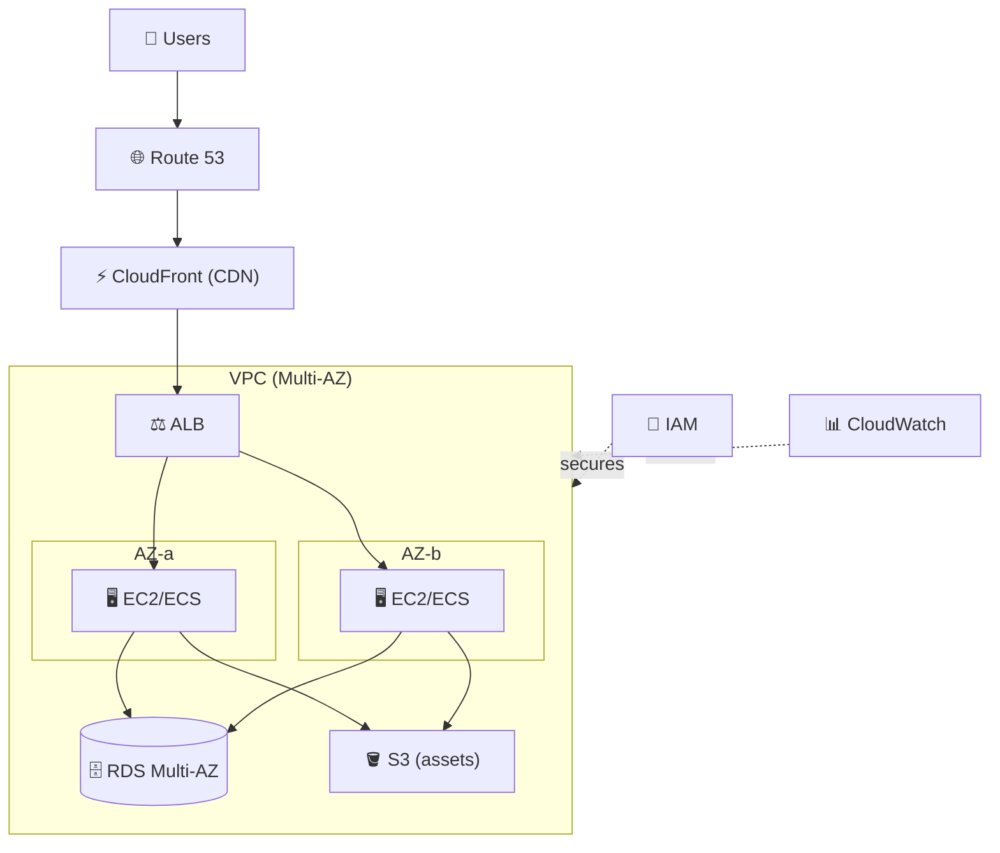

⬅ [Back to Index](../README.md)

# Amazon Web Services (AWS)

**AWS** is the **market leader** in cloud computing (launched 2006), offering 200+ services across compute, storage, databases, AI/ML, and more.

### 🎓 Professional (IT-Standard) Reference

| Service Area | Layman View | Professional (IT-Standard) View + Example |
|--------------|-------------|-------------------------------------------|
| Compute | Rent servers | Amazon Web Services (AWS) offers several compute models.<br>Elastic Compute Cloud (EC2) provides Virtual Machines (VMs).<br>Lambda provides serverless functions.<br>Elastic Container Service (ECS) and Elastic Kubernetes Service (EKS) run containers.<br>Auto Scaling adjusts capacity to demand.<br>*Example: Auto Scaling EC2 instances behind an Application Load Balancer (ALB).* |
| Storage | Store files/data | AWS provides multiple storage types.<br>Simple Storage Service (S3) is object storage.<br>Elastic Block Store (EBS) is block storage for instances.<br>Elastic File System (EFS) is shared file storage.<br>Lifecycle rules optimize cost over time.<br>*Example: hosting static website assets in an S3 bucket.* |
| Database | Managed databases | AWS offers managed relational and NoSQL databases.<br>Relational Database Service (RDS) and Aurora handle Structured Query Language (SQL).<br>DynamoDB is a managed NoSQL database.<br>Backups, patching, and replication are automated.<br>Multi-Availability Zone (AZ) options add resilience.<br>*Example: an Aurora Multi-AZ deployment for High Availability (HA).* |
| Identity & governance | Control access | AWS secures access with Identity and Access Management (IAM).<br>IAM defines users, roles, and least-privilege policies.<br>Organizations manages multiple accounts centrally.<br>CloudTrail records API activity for auditing.<br>These support compliance and governance.<br>*Example: assigning least-privilege IAM roles per service.* |

---

## 🗺️ Visual Overview



**Explanation:** Amazon Web Services (AWS) is the largest cloud provider, offering hundreds of services grouped into families like compute, storage, databases, and networking. You mix and match these building blocks to run almost any application.

---

## 🧱 Core Services by Category

| Category | Service | What It Does |
|----------|---------|--------------|
| **Compute** | EC2 | Virtual servers |
| | Lambda | Serverless functions |
| | ECS / EKS | Container orchestration |
| | Elastic Beanstalk | PaaS |
| **Storage** | S3 | Object storage |
| | EBS | Block storage |
| | EFS | File storage |
| | Glacier | Archival storage |
| **Database** | RDS | Managed relational DB (MySQL, Postgres) |
| | DynamoDB | NoSQL database |
| | Aurora | High-performance relational DB |
| | Redshift | Data warehouse |
| **Networking** | VPC | Virtual private cloud |
| | Route 53 | DNS |
| | CloudFront | CDN |
| | ELB | Load balancer |
| **Security** | IAM | Identity & access |
| | KMS | Key management |
| | Shield / WAF | DDoS & firewall |
| **AI/ML** | SageMaker | ML platform |
| | Rekognition | Image analysis |
| | Bedrock | Generative AI |

---

## 🌍 Global Infrastructure

- **Regions** — geographic areas (e.g., us-east-1, eu-west-1).
- **Availability Zones (AZs)** — isolated data centers within a region.
- **Edge Locations** — for CloudFront CDN.

💡 Deploy across multiple AZs for **high availability**.

---

## 💡 Example: Typical Web App on AWS

```
Route 53 (DNS) → CloudFront (CDN) → ALB (Load Balancer)
   → EC2 / ECS (App servers, multi-AZ)
   → RDS (Database, with read replicas)
   → S3 (Static assets & backups)
```

---

## 💰 Pricing Models

- **On-Demand** — pay per use, no commitment.
- **Reserved Instances** — 1–3 year commitment, big discount.
- **Spot Instances** — unused capacity, up to 90% off (interruptible).
- **Savings Plans** — flexible commitment-based discounts.

---

## 🖼️ Popular AWS Services


---

## 🏗️ Architecture: A Highly-Available Web App on AWS



**Explanation:** The classic AWS reference architecture: DNS → CDN → load balancer → auto-scaling compute across two AZs → Multi-AZ database, with S3 for assets, IAM for access, and CloudWatch for monitoring.

---

## 🖥️ What It Looks Like — AWS Console Home (Mockup)

```text
┌────────────────────────────────────────────┐
│  aws 🔍 Search   N.Virginia ▾   ⚠ 3   🔔   acme-prod ▾ │
├────────────────────────────────────────────┤
│  Recently visited:  EC2 · S3 · Lambda · RDS · IAM     │
│  Cost (MTD):  $ 1,284.55   ▇▇▇▇▇▁▁  vs budget       │
│  EC2: 14 running   Lambda: 2.1M invokes   S3: 4.2 TB │
│  Health: ● All systems operational                   │
└────────────────────────────────────────────┘
```

---

## 🌐 Real-World Usage Example

**Netflix** is the definitive AWS case study: 100% of streaming runs on AWS across thousands of EC2 instances, S3 for its media catalog, DynamoDB for viewing state, and Kinesis for real-time telemetry. It auto-scales for evening peaks (a third of US internet traffic) and uses Chaos Monkey to test resilience across AZs — all with zero data centers of its own.

**Other real examples:** Airbnb, Robinhood, Coinbase, NASA JPL (Mars rover imagery), and the CIA (GovCloud).

---

## 🔍 Deep Dive — Concepts Often Missed

- **Region ≠ AZ:** always design across ≥2 AZs; use multiple Regions for DR/latency.
- **IAM is foundational:** roles > long-lived keys; enforce least privilege and MFA.
- **Well-Architected Framework:** AWS's 6 pillars (see [Well-Architected](../10-Advanced-Concepts/well-architected-framework.md)) guide every design.
- **Free tier & cost traps:** NAT gateways, idle EBS, and data egress silently add up.
- **Managed > self-managed:** prefer RDS/Aurora over DB-on-EC2 unless you truly need control.

---

## 🎓 Certifications
- Cloud Practitioner (beginner)
- Solutions Architect Associate / Professional
- Developer / SysOps / DevOps

➡️ See [Certifications Guide](../09-Resources/certifications.md)

---

**Navigation:** [Next → Azure](azure.md) | ⬅ [Back to Index](../README.md)
