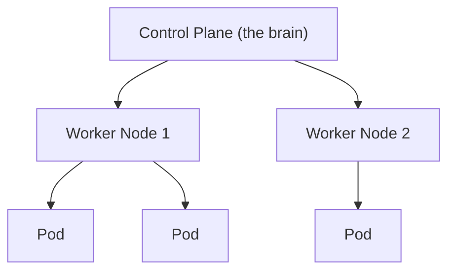
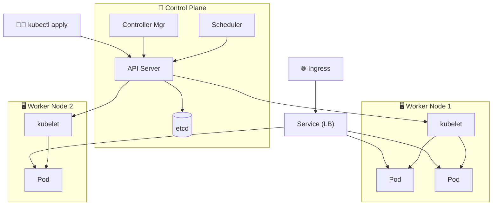

⬅ [Back to Index](../README.md)

# Kubernetes & Container Orchestration

**Kubernetes (K8s)** is the industry-standard open-source system for **automating deployment, scaling, and management** of containerized applications. Created by Google, now maintained by the CNCF.

> 🚢 If [Docker](../04-Core-Technologies/containers.md) builds the ships (containers), Kubernetes is the harbor master orchestrating the whole fleet.

### 🎓 Professional (IT-Standard) Reference

| Concept | Layman View | Professional (IT-Standard) View + Example |
|---------|-------------|-------------------------------------------|
| Pod | Smallest running unit | A Pod is the smallest deployable unit in Kubernetes.<br>It holds one or more tightly coupled containers.<br>Containers in a Pod share network and storage.<br>Pods are ephemeral and can be replaced.<br>They are scheduled onto nodes.<br>*Example: an application container plus a sidecar in one Pod.* |
| Deployment | Manage app copies | A Deployment manages replicas of a Pod declaratively.<br>It handles rolling updates and rollbacks.<br>It self-heals by recreating failed Pods.<br>Desired replica count is maintained automatically.<br>It is the standard way to run stateless apps.<br>*Example: applying a Deployment with `kubectl apply -f deployment.yaml`.* |
| Service | Stable address | A Service gives Pods a stable network identity.<br>It provides a fixed virtual Internet Protocol (IP) and Domain Name System (DNS) name.<br>It load-balances traffic across matching Pods.<br>Pods can change while the Service stays constant.<br>It decouples clients from Pod lifecycles.<br>*Example: a ClusterIP Service fronting three replicas.* |
| Autoscaling | Grow with traffic | The Horizontal Pod Autoscaler (HPA) adjusts Pod count automatically.<br>It scales based on Central Processing Unit (CPU) or custom metrics.<br>It adds Pods under load and removes them when idle.<br>This maintains performance and saves cost.<br>Thresholds are configurable.<br>*Example: an HPA scaling Pods from two to ten at 70% CPU usage.* |

---

## 🗺️ Visual Overview



**Explanation:** Kubernetes automatically runs and manages containers across many machines. A control plane (the brain) decides where containers run, while worker nodes host the actual application Pods — restarting and scaling them as needed.

---

## 🤔 Why Orchestration?

Running one container is easy. Running **hundreds across many servers** — with scaling, self-healing, load balancing, and rolling updates — needs orchestration.

Kubernetes automatically:
- **Schedules** containers onto servers.
- **Scales** up/down based on load.
- **Self-heals** — restarts failed containers.
- **Load balances** traffic.
- **Rolls out** updates with zero downtime.

---

## 🧩 Core Concepts

| Concept | Description |
|---------|-------------|
| **Cluster** | Set of machines (nodes) running K8s |
| **Node** | A worker machine (VM or physical) |
| **Pod** | Smallest unit — one or more containers |
| **Deployment** | Manages replicas & updates of pods |
| **Service** | Stable network endpoint for pods |
| **Ingress** | Manages external HTTP access |
| **ConfigMap / Secret** | Configuration & sensitive data |
| **Namespace** | Virtual cluster for isolation |

### Architecture
```
┌───────────── Control Plane ─────────────┐
│  API Server │ Scheduler │ etcd │ Controller │
└──────────────────┬──────────────────────┘
		┌──────────┼──────────┐
	 Node 1     Node 2     Node 3
	[Pods]     [Pods]     [Pods]
```

---

## 💡 Example: Deployment YAML

```yaml
apiVersion: apps/v1
kind: Deployment
metadata:
  name: web-app
spec:
  replicas: 3
  selector:
	matchLabels:
	  app: web
  template:
	metadata:
	  labels:
		app: web
	spec:
	  containers:
	  - name: web
		image: my-app:1.0
		ports:
		- containerPort: 80
```

Common commands:
```bash
kubectl apply -f deployment.yaml   # deploy
kubectl get pods                   # list pods
kubectl scale deployment web-app --replicas=5
kubectl logs <pod-name>            # view logs
```

---

## 🏭 Managed Kubernetes Services

| Provider | Service |
|----------|---------|
| AWS | **EKS** |
| Azure | **AKS** |
| GCP | **GKE** (best-in-class) |
| Red Hat | **OpenShift** |

---

## 🧰 Kubernetes Ecosystem

| Purpose | Tools |
|---------|-------|
| Package management | **Helm** (charts) |
| Service mesh | **Istio**, Linkerd |
| GitOps | **ArgoCD**, Flux |
| Monitoring | **Prometheus**, **Grafana** ([details](monitoring.md)) |
| Ingress | NGINX Ingress, Traefik |

---

## 🖼️ Kubernetes Ecosystem Tools


---

## 🏗️ Architecture: Inside a Kubernetes Cluster



**Explanation:** The control plane (API server, scheduler, etcd, controllers) is the brain. You send desired state via `kubectl`; kubelets on worker nodes run Pods; a Service load-balances across them and Ingress exposes them externally. K8s constantly reconciles reality to your desired state.

---

## 🖥️ What It Looks Like — kubectl (Mockup)

```text
$ kubectl get pods -o wide
NAME              READY   STATUS    RESTARTS   NODE
web-app-7d9-abc   1/1     Running   0          node-1
web-app-7d9-def   1/1     Running   0          node-1
web-app-7d9-ghi   1/1     Running   0          node-2

$ kubectl scale deploy web-app --replicas=5
deployment.apps/web-app scaled
$ # 2 new pods scheduling...  self-healing + autoscaling ✅
```

---

## 🌐 Real-World Usage Example

**Tinder** migrated to Kubernetes to run ~1,000 services across 15,000+ pods, letting it scale to millions of swipes per second while cutting cloud costs and speeding deploys. Self-healing means crashed pods restart automatically and rolling updates ship features with zero downtime — impossible to manage by hand at that scale.

**Other real examples:** Spotify, Airbnb, The New York Times, Pinterest, and OpenAI all run production on Kubernetes.

---

## 🔍 Deep Dive — Concepts Often Missed

- **Declarative & self-healing:** you declare *desired* state; K8s continuously reconciles — kill a pod, it comes back.
- **Requests vs limits:** requests reserve resources for scheduling; limits cap usage — misconfigure and pods get OOM-killed or throttled.
- **Liveness vs readiness probes:** liveness restarts hung pods; readiness gates traffic until ready.
- **StatefulSets vs Deployments:** stateful apps (databases) need stable identity/storage.
- **Ingress vs Service:** Service = internal L4 endpoint; Ingress = external L7 HTTP routing.
- **Managed K8s (EKS/AKS/GKE)** offloads the control plane — you rarely run it yourself in production.

---

**Navigation:** [← Infrastructure as Code](iac.md) | [Next → Monitoring](monitoring.md) | ⬅ [Back to Index](../README.md)
