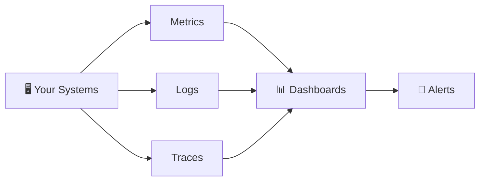
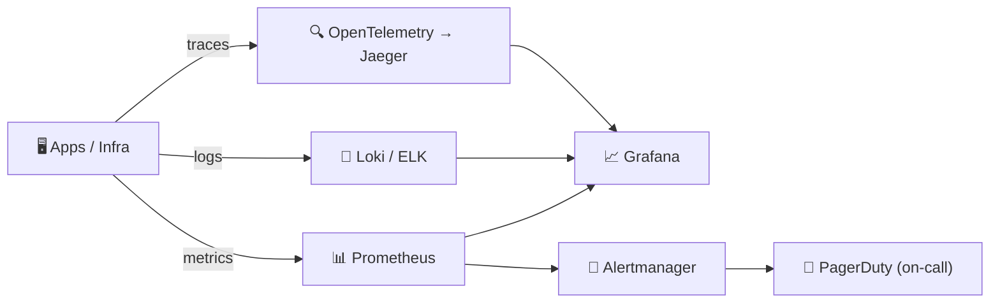

⬅ [Back to Index](../README.md)

# Monitoring & Observability

You can't manage what you can't measure. **Monitoring** tracks system health; **observability** helps you understand *why* something is happening.

### 🎓 Professional (IT-Standard) Reference

| Concept | Layman View | Professional (IT-Standard) View + Example |
|---------|-------------|-------------------------------------------|
| Metrics | Numbers over time | Metrics are numeric measurements collected over time.<br>They are stored as time-series data.<br>They track things like latency and resource usage.<br>They power dashboards and alerts.<br>They are lightweight and efficient.<br>*Example: Prometheus scraping Central Processing Unit (CPU) and latency metrics.* |
| Logs | Event records | Logs are timestamped records of discrete events.<br>They are centralized and made searchable.<br>Structured logs are easier to query.<br>They help diagnose specific failures.<br>They complement metrics and traces.<br>*Example: the Elasticsearch, Logstash, and Kibana (ELK) stack aggregating application logs.* |
| Traces | Request's journey | Distributed tracing follows a request across services.<br>Each step is recorded as a span.<br>It reveals where time is spent.<br>It uses the OpenTelemetry standard.<br>It is vital in microservices.<br>*Example: Jaeger tracing a slow request across services.* |
| Alerting & SLOs | Warn when it breaks | Alerts notify teams when systems misbehave.<br>They are based on Service Level Indicators (SLIs) and Objectives (SLOs).<br>Objectives relate to Service Level Agreements (SLAs).<br>Error budgets guide when to act.<br>Good alerts reduce noise.<br>*Example: Alertmanager paging on a 99.9% Service Level Objective (SLO) breach.* |

---

## 🗺️ Visual Overview



**Explanation:** Monitoring and observability collect three signals from your systems — metrics (numbers), logs (events), and traces (request paths). These feed dashboards and alerts so you can see health at a glance and get paged when something breaks.

---

## 🔭 The Three Pillars of Observability

| Pillar | What It Tracks | Example |
|--------|----------------|---------|
| **Metrics** | Numeric measurements over time | CPU %, request rate, latency |
| **Logs** | Timestamped event records | Error messages, access logs |
| **Traces** | Request flow across services | A request through microservices |

---

## 🏭 Industry Tools

| Category | Tools |
|----------|-------|
| **Metrics** | **Prometheus**, CloudWatch, Datadog |
| **Visualization** | **Grafana**, Kibana |
| **Logging** | **ELK Stack** (Elasticsearch, Logstash, Kibana), Loki, Splunk |
| **Tracing** | Jaeger, Zipkin, AWS X-Ray |
| **All-in-one (SaaS)** | **Datadog**, New Relic, Dynatrace |
| **Cloud-native** | AWS CloudWatch, Azure Monitor, Google Cloud Operations |
| **Alerting** | PagerDuty, Opsgenie, Alertmanager |

---

## 📊 Prometheus + Grafana (Popular Combo)

- **Prometheus** — collects & stores metrics (pull-based, time-series DB).
- **Grafana** — beautiful dashboards to visualize those metrics.

```
App exposes /metrics → Prometheus scrapes → Grafana dashboards → Alerts
```

### Example Prometheus Query (PromQL)
```promql
# Average CPU usage over 5 minutes
rate(container_cpu_usage_seconds_total[5m])
```

---

## 🚨 Key Metrics to Monitor (The "Four Golden Signals")

1. **Latency** — how long requests take.
2. **Traffic** — how much demand (requests/sec).
3. **Errors** — rate of failed requests.
4. **Saturation** — how "full" your system is (CPU, memory, disk).

---

## 💡 Why It Matters

- **Detect issues** before users do.
- **Debug faster** with logs & traces.
- **Optimize costs** by spotting waste.
- **Meet SLAs** (uptime guarantees).

➡️ Related: [Kubernetes](kubernetes.md) · [DevOps & CI/CD](devops-cicd.md)

---

## 🖼️ Observability Toolchain


---

## 🏗️ Architecture: An Observability Pipeline



**Explanation:** The three pillars — metrics, logs, traces — flow into a common visualization layer (Grafana) and an alerting path that pages the on-call engineer when an SLO breaks. This is how teams detect and diagnose issues before users notice.

---

## 🖥️ What It Looks Like — Grafana Dashboard (Mockup)

```text
┌───────────────────────────────────────────────┐
│  📊 Service Health   last 1h   ● LIVE                │
├───────────────────────────────────────────────┤
│  Latency p95   142 ms  ▁▂▃▅▃▂▁▂▃  ✅ < 200ms SLO   │
│  Req rate      8.4k/s  ▆▇█▇▆▅▆▇█                    │
│  Error rate    0.12%   ▁▁▁▂▁▁▁▁▁  ✅               │
│  CPU sat.      63%     ▇▇▇▇▇▁▁                    │
│  🚨 1 alert:  “high-latency-checkout”  FIRING          │
└─────────────────────────────────────────────┘
```

---

## 🌐 Real-World Usage Example

**Uber** built one of the world's largest monitoring systems (M3, on top of Prometheus) ingesting billions of metrics per second across thousands of microservices. When a payment or dispatch service slows, dashboards and traces pinpoint the exact failing service in seconds, and on-call engineers are paged automatically — keeping rides flowing 24/7.

**Other real examples:** Netflix's Atlas, Cloudflare's Grafana dashboards, and virtually every SaaS using Datadog for full-stack observability.

---

## 🔍 Deep Dive — Concepts Often Missed

- **Monitoring vs Observability:** monitoring = known-unknowns (dashboards you built); observability = unknown-unknowns (ask new questions of rich telemetry).
- **SLI / SLO / SLA / error budget:** SLI = measured signal, SLO = target, SLA = contract, error budget = allowed failure before you freeze releases.
- **Cardinality explosion:** too many label combinations blow up metric cost — label carefully.
- **Alert fatigue:** page only on symptoms users feel (golden signals), not every CPU blip.
- **OpenTelemetry** is the vendor-neutral standard unifying metrics/logs/traces.

---

**Navigation:** [← Kubernetes](kubernetes.md) | [Next → Cloud Security](../07-Security/cloud-security.md) | ⬅ [Back to Index](../README.md)
