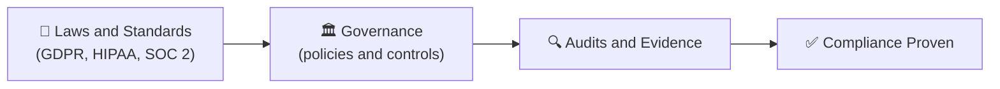
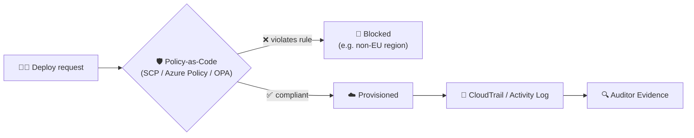

⬅ [Back to Index](../README.md)

# Compliance & Governance

**Compliance** means meeting legal, regulatory, and industry standards. **Governance** is the framework of policies and controls that keep your cloud usage secure, compliant, and cost-effective.

### 🎓 Professional (IT-Standard) Reference

| Concept | Layman View | Professional (IT-Standard) View + Example |
|---------|-------------|-------------------------------------------|
| Standards | The rules to follow | Compliance standards define required security controls.<br>Common frameworks include International Organization for Standardization (ISO) 27001.<br>Others are System and Organization Controls (SOC) 2 and Payment Card Industry Data Security Standard (PCI-DSS).<br>Regulations include the Health Insurance Portability and Accountability Act (HIPAA) and General Data Protection Regulation (GDPR).<br>They vary by industry and region.<br>*Example: PCI-DSS applying to systems that handle card payments.* |
| Governance | Guardrails for teams | Governance sets guardrails for how teams use the cloud.<br>Policy-as-code enforces rules automatically.<br>Organization-wide controls apply centrally.<br>This prevents risky configurations.<br>It keeps usage consistent and compliant.<br>*Example: AWS Organizations Service Control Policies (SCPs) or Azure Policy.* |
| Audit & evidence | Proof you followed rules | Audits require evidence that controls are working.<br>Immutable logs provide that evidence.<br>Trails record who did what and when.<br>Auditors review these for certification.<br>Retention policies preserve records.<br>*Example: CloudTrail logs used for a System and Organization Controls (SOC) 2 audit.* |
| Data residency | Where data lives | Data residency controls where data is stored.<br>Some laws require data to stay in a region.<br>Providers offer region and sovereignty controls.<br>This supports legal and regulatory needs.<br>It is critical for global organizations.<br>*Example: keeping European Union (EU) data in EU regions for General Data Protection Regulation (GDPR) compliance.* |

---

## 🗺️ Visual Overview



**Explanation:** Compliance and governance make sure your cloud use follows laws and standards like GDPR or HIPAA. You put policies and controls in place, then prove they work through audits — turning rules into demonstrable, certified practice.

---

## 📋 Major Compliance Standards

| Standard | Applies To | Focus |
|----------|-----------|-------|
| **GDPR** | EU data | Data privacy & protection |
| **HIPAA** | US healthcare | Patient health data |
| **PCI-DSS** | Payment cards | Credit card data security |
| **SOC 2** | Service providers | Security, availability, confidentiality |
| **ISO 27001** | General | Information security management |
| **FedRAMP** | US government | Federal cloud security |
| **CCPA** | California | Consumer data privacy |

---

## 🏛️ Cloud Governance Pillars

| Pillar | What It Covers | Tools |
|--------|----------------|-------|
| **Cost Management (FinOps)** | Control spending | AWS Budgets, Cost Explorer, CloudHealth |
| **Security & Compliance** | Meet standards | AWS Config, Azure Policy |
| **Resource Organization** | Tags, accounts, structure | AWS Organizations, Azure Management Groups |
| **Policy Enforcement** | Guardrails | Service Control Policies, OPA |
| **Auditing** | Track all activity | AWS CloudTrail, Azure Activity Log |

---

## 💰 FinOps — Cloud Cost Governance

Cloud costs can spiral. **FinOps** brings financial accountability:
- **Tag resources** to track cost by team/project.
- **Set budgets & alerts.**
- **Right-size** underutilized resources.
- Use **Reserved/Spot instances** for savings.
- **Delete unused** resources (orphaned disks, idle VMs).

---

## 🛡️ Governance Tools

| Provider | Governance Tools |
|----------|------------------|
| AWS | Organizations, Config, CloudTrail, Control Tower |
| Azure | Policy, Blueprints, Management Groups, Cost Management |
| GCP | Organization Policy, Cloud Asset Inventory |
| Multi-cloud | **Open Policy Agent (OPA)**, Terraform Sentinel |

---

## 💡 Example: Data Residency

A European company must keep EU citizens' data within the EU (GDPR):
- Deploy resources only in **EU regions** (e.g., eu-west-1).
- Use policies to **block** deployments in other regions.
- Encrypt data and log all access for audits.

---

## ✅ Governance Best Practices

1. Define clear policies **before** scaling.
2. Automate compliance checks (policy as code).
3. Tag everything for cost & ownership tracking.
4. Enable audit logging everywhere.
5. Regular compliance audits & reviews.

---

## 🖼️ Compliance & Governance Tools


---

## 🏗️ Architecture: Policy-as-Code Guardrails



**Explanation:** Governance turns rules into automated guardrails: a deploy that violates policy (wrong region, no encryption) is blocked *before* it happens, while every action is logged immutably to provide audit evidence for certifications.

---

## 🖥️ What It Looks Like — Compliance Report (Mockup)

```text
┌───────────────────────────────────────────────┐
│  🛡️ AWS Config › Conformance: PCI-DSS               │
├──────────────────────────────────────────────┤
│  Compliant rules:  46 / 52   ▇▇▇▇▇▇▁ 88%           │
│  ❌ s3-bucket-ssl-requests-only   (2 buckets)       │
│  ❌ encrypted-volumes             (4 volumes)       │
│  ✅ mfa-enabled-for-root                            │
│  ✅ cloudtrail-enabled                              │
└─────────────────────────────────────────────┘
```

---

## 🌐 Real-World Usage Example

When **Zoom** exploded during the pandemic, it had to rapidly prove **SOC 2, HIPAA, and GDPR** compliance to win enterprise, healthcare, and government customers. It used cloud governance (encryption, audit logging, data-residency controls letting customers pick regions) to pass audits — turning compliance into a sales enabler rather than a blocker.

**Other real examples:** Stripe maintains PCI-DSS Level 1 so merchants don't have to; EU companies enforce GDPR data residency by blocking non-EU region deploys via policy.

---

## 🔍 Deep Dive — Concepts Often Missed

- **Compliance ≠ security:** you can be compliant yet insecure (checkbox trap) — aim for both.
- **Shared responsibility applies here too:** provider is certified for infra; *you* prove your workload's compliance.
- **Policy-as-code (SCP/OPA/Sentinel)** enforces rules automatically vs manual reviews.
- **Immutable audit logs (CloudTrail)** are the evidence auditors demand — protect them from deletion.
- **Data residency & sovereignty:** where data physically lives is legally binding (GDPR, sovereign clouds).
- **Continuous compliance:** tools like AWS Config detect drift in real time, not once a year.

---

**Navigation:** [← IAM](iam.md) | [Next → Hands-on Projects](../08-Hands-on-Projects/projects.md) | ⬅ [Back to Index](../README.md)
