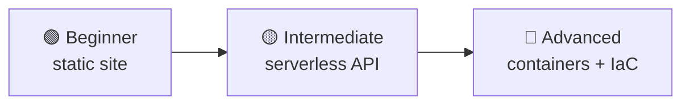

⬅ [Back to Index](../README.md)

# Hands-on Projects (Beginner → Advanced)

Theory is nothing without practice. Build these projects to cement your learning. Most can be done in the **free tier** of AWS/Azure/GCP.

### 🎓 Professional (IT-Standard) Reference

| Project Type | Layman View | Professional (IT-Standard) Skill + Example |
|--------------|-------------|--------------------------------------------|
| Static website hosting | Put a site online | This project teaches static content delivery. You host files in object storage. A Content Delivery Network (CDN) caches them near users. A Domain Name System (DNS) service routes the domain. It demonstrates low-cost, scalable hosting. *Example: Simple Storage Service (S3) plus CloudFront plus Route 53.* |
| Serverless API | A backend without servers | This project builds an Application Programming Interface (API) without managing servers. Functions handle requests on demand. An API gateway exposes the endpoints. A NoSQL database stores the data. It teaches event-driven design. *Example: AWS Lambda plus API Gateway plus DynamoDB.* |
| Containerized app | Package & run an app | This project packages an application into a container. The image is built and pushed to a registry. An orchestrator runs and scales it. A Continuous Integration/Continuous Delivery (CI/CD) pipeline automates deployment. It teaches modern deployment practices. *Example: deploying to Elastic Kubernetes Service (EKS) via GitHub Actions.* |
| IaC deployment | Build infra with code | This project provisions infrastructure using code. Resources are defined in version-controlled files. Deployments become repeatable and auditable. It reduces manual configuration errors. It teaches Infrastructure as Code (IaC). *Example: Terraform provisioning a full Virtual Private Cloud (VPC) and application tier.* |

---

## 🗺️ Visual Overview

**Explanation:** These hands-on projects build your skills step by step. Start simple with a static website, progress to serverless APIs, and finish with full containerized apps deployed via Infrastructure as Code — each project adds real, portfolio-worthy experience.

---

## 🟢 Beginner Projects

### 1. Host a Static Website
- **Goal:** Deploy an HTML/CSS site.
- **Tools:** AWS S3 (static hosting) + CloudFront (CDN).
- **Learn:** [Object storage](../04-Core-Technologies/storage.md), [CDN](../04-Core-Technologies/networking.md).

### 2. Launch Your First Virtual Machine
- **Goal:** Run a Linux server and host a simple app.
- **Tools:** AWS EC2 / Azure VM / GCP Compute Engine.
- **Learn:** [IaaS](../02-Service-Models/iaas.md), SSH, firewalls.

### 3. Serverless "Hello World" API
- **Goal:** Build an API with no servers.
- **Tools:** AWS Lambda + API Gateway.
- **Learn:** [Serverless / FaaS](../02-Service-Models/faas-serverless.md).

---

## 🟡 Intermediate Projects

### 4. Containerize an App with Docker
- **Goal:** Package a web app into a Docker image and run it.
- **Tools:** Docker, Docker Hub.
- **Learn:** [Containers](../04-Core-Technologies/containers.md).

### 5. Deploy a 3-Tier Web App
- **Goal:** Web + App + Database tiers with load balancing.
- **Tools:** EC2 + RDS + Load Balancer in a VPC.
- **Learn:** [Networking](../04-Core-Technologies/networking.md), [databases](../05-Cloud-Providers/aws.md).

### 6. Build a CI/CD Pipeline
- **Goal:** Auto-build, test, and deploy on every git push.
- **Tools:** GitHub Actions / Jenkins.
- **Learn:** [DevOps & CI/CD](../06-Tools-and-Practices/devops-cicd.md).

### 7. Provision Infrastructure with Terraform
- **Goal:** Create a VPC, subnets, and EC2 — all as code.
- **Tools:** Terraform.
- **Learn:** [Infrastructure as Code](../06-Tools-and-Practices/iac.md).

---

## 🔴 Advanced Projects

### 8. Deploy a Microservices App on Kubernetes
- **Goal:** Run multiple containerized services with scaling & self-healing.
- **Tools:** EKS / AKS / GKE, Helm.
- **Learn:** [Kubernetes](../06-Tools-and-Practices/kubernetes.md).

### 9. Build a Monitoring Stack
- **Goal:** Collect metrics and visualize dashboards with alerts.
- **Tools:** Prometheus + Grafana.
- **Learn:** [Monitoring](../06-Tools-and-Practices/monitoring.md).

### 10. Serverless Data Pipeline
- **Goal:** Process uploaded files automatically and store results.
- **Tools:** S3 + Lambda + DynamoDB (or GCP: Cloud Storage + Cloud Functions + BigQuery).
- **Learn:** Event-driven architecture.

### 11. Multi-Region High-Availability App
- **Goal:** Deploy an app across regions with failover.
- **Tools:** Route 53, multi-AZ RDS, auto-scaling.
- **Learn:** [High availability](../05-Cloud-Providers/aws.md), disaster recovery.

### 12. Full GitOps Workflow
- **Goal:** Git-driven Kubernetes deployments.
- **Tools:** ArgoCD + Kubernetes + Terraform.
- **Learn:** [IaC](../06-Tools-and-Practices/iac.md) + [Kubernetes](../06-Tools-and-Practices/kubernetes.md).

---

## 🎯 Tips for Projects

- Always use the **free tier** and **set billing alerts** to avoid surprise charges.
- **Tear down** resources when done (`terraform destroy`, delete instances).
- Document what you build — great for your portfolio/resume.
- Push code to GitHub to showcase your skills.

---

**Navigation:** [Next → Certifications](../09-Resources/certifications.md) | ⬅ [Back to Index](../README.md)
