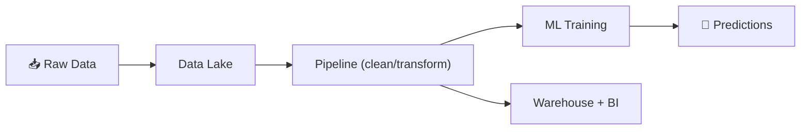

⬅ [Back to Index](../README.md)

# AI/ML & Big Data in the Cloud

The cloud is where most AI/ML and big data workloads run today, thanks to on-demand GPUs, managed services, and massive storage.

### 🎓 Professional (IT-Standard) Reference

| Concept | Layman View | Professional (IT-Standard) View + Example |
|---------|-------------|-------------------------------------------|
| Data lake | One big data pool | A data lake stores vast amounts of raw data centrally.<br>It holds structured and unstructured data together.<br>Data is kept in its native format until needed.<br>It scales cheaply using object storage.<br>It feeds analytics and machine learning.<br>*Example: Amazon Simple Storage Service (S3) with AWS Lake Formation.* |
| Data pipeline | Move & clean data | A data pipeline moves and transforms data at scale.<br>It follows Extract, Transform, Load (ETL) or Extract, Load, Transform (ELT) patterns.<br>It cleans and prepares data for use.<br>It can run in batch or streaming mode.<br>It is orchestrated and automated.<br>*Example: Apache Spark running on Elastic MapReduce (EMR) or Google Dataflow.* |
| ML platform | Train smart models | A machine learning platform manages the model lifecycle.<br>It covers training, tuning, and serving models.<br>It provides managed access to Graphics Processing Units (GPUs).<br>It reduces infrastructure setup effort.<br>It supports production deployment.<br>*Example: Amazon SageMaker or Google Vertex AI.* |
| Warehouse & BI | Analyze & report | A data warehouse supports analytics and Business Intelligence (BI).<br>It uses columnar storage for fast queries.<br>It handles large analytical workloads.<br>It powers dashboards and reports.<br>It is often serverless or managed.<br>*Example: Google BigQuery, Amazon Redshift, or Snowflake.* |

---

## 🗺️ Visual Overview



**Explanation:** In the cloud, raw data flows into a central data lake, gets cleaned by pipelines, then feeds either machine-learning models (predictions) or a warehouse for reports. The cloud provides cheap storage and on-demand GPUs to power all of it.

---

## 🤖 Cloud AI/ML Services

### Pre-Trained AI APIs (no ML expertise needed)
| Capability | AWS | Azure | GCP |
|------------|-----|-------|-----|
| Vision | Rekognition | Computer Vision | Vision AI |
| Speech | Transcribe/Polly | Speech Services | Speech-to-Text |
| Language/NLP | Comprehend | Language Service | Natural Language AI |
| Translation | Translate | Translator | Translation AI |
| Generative AI | **Bedrock** | **Azure OpenAI** | **Vertex AI / Gemini** |

### ML Platforms (build your own models)
| Provider | Platform |
|----------|----------|
| AWS | **SageMaker** |
| Azure | **Azure Machine Learning** |
| GCP | **Vertex AI** |

---

## 📊 Big Data Concepts

| Concept | Description |
|---------|-------------|
| **The 3 Vs** | Volume, Velocity, Variety of data |
| **Data Lake** | Store raw data of any format (S3, ADLS) |
| **Data Warehouse** | Structured data for analytics (Redshift, BigQuery) |
| **ETL / ELT** | Extract, Transform, Load pipelines |
| **Batch vs Stream** | Process in chunks vs real-time |

---

## 🏭 Big Data Tools

| Purpose | Tools |
|---------|-------|
| **Processing** | Apache Spark, Hadoop, AWS EMR, Databricks |
| **Streaming** | Apache Kafka, Kinesis, Flink, Spark Streaming |
| **Data Warehouse** | BigQuery, Redshift, **Snowflake** |
| **Orchestration** | Apache Airflow, AWS Step Functions |
| **Data Lake** | AWS S3 + Lake Formation, Azure Data Lake |
| **Visualization** | Tableau, Power BI, Looker, Grafana |

---

## 💡 Example: End-to-End Data Pipeline

```
Data Sources (apps, IoT, logs)
	  │
   Ingestion (Kafka / Kinesis)
	  │
   Storage (Data Lake - S3)
	  │
   Processing (Spark / Databricks)   ← ETL
	  │
   Warehouse (BigQuery / Snowflake)
	  │
   Analytics & ML (Vertex AI, dashboards)
	  │
   Insights (Tableau / Power BI)
```

---

## 🖥️ GPUs & Specialized Hardware

- **GPUs** — for training deep learning models (NVIDIA on all clouds).
- **TPUs** — Google's Tensor Processing Units for ML.
- **Inferentia/Trainium** — AWS custom ML chips.

💡 Rent a GPU cluster for hours instead of buying $100K hardware.

---

## 🌟 Why Cloud for AI/ML?

- On-demand GPUs/TPUs (pay per hour).
- Managed services remove infrastructure work.
- Scale training across many machines.
- Pre-trained models for instant capabilities.
- Integrated data pipelines.

---

## 🖼️ AI/ML & Big Data Tools


---

## 🖥️ What It Looks Like — SageMaker Training Job (Mockup)

```text
┌───────────────────────────────────────────────┐
│  🤖 SageMaker › Training Job: fraud-model-v7          │
├──────────────────────────────────────────────┤
│  Instance: ml.p3.2xlarge (1x V100 GPU)              │
│  Epoch 18/20   loss 0.041   val_acc 0.982          │
│  Progress ▇▇▇▇▇▇▇▇▇▁ 90%   ETA 4m               │
│  Status: InProgress   Spend: $6.12                  │
└──────────────────────────────────────────────┘
```

---

## 🌐 Real-World Usage Example

**Spotify** uses Google BigQuery and Dataflow to process billions of streaming events daily, powering "Discover Weekly" recommendations for 600M+ users. **OpenAI** trains large language models on massive cloud GPU clusters (Azure). **Capital One** runs fraud detection on Spark/Databricks, scoring transactions in milliseconds — all using rented GPUs/TPUs instead of buying millions in hardware.

---

## 🔍 Deep Dive — Concepts Often Missed

- **Data lake vs warehouse:** lake = raw any-format (cheap S3); warehouse = structured, query-optimized (BigQuery).
- **Lakehouse (Databricks):** combines both — lake storage with warehouse-style ACID/queries.
- **ETL vs ELT:** cloud shifted to ELT — load raw first, transform in the warehouse.
- **Batch vs streaming:** Spark batch for reports; Kafka/Flink streaming for real-time.
- **MLOps:** the discipline of versioning, deploying, and monitoring models (drift detection).
- **GPU vs TPU vs Inferentia:** training needs GPUs/TPUs; cheap inference chips (Inferentia) cut serving costs.
- **Egress costs:** moving big data *out* of the cloud is expensive — process it in place.

---

**Navigation:** [← Edge Computing & CDN](edge-computing-cdn.md) | [Next → Well-Architected Framework](well-architected-framework.md) | ⬅ [Back to Index](../README.md)
