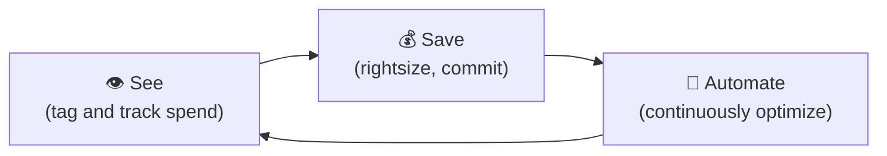

⬅ [Back to Index](../README.md)

# Cloud Cost Optimization (FinOps)

**FinOps** (Financial Operations) is the practice of managing and optimizing cloud spending. Cloud bills can explode without discipline.

### 🎓 Professional (IT-Standard) Reference

| Concept | Layman View | Professional (IT-Standard) View + Example |
|---------|-------------|-------------------------------------------|
| Rightsizing | Don't over-buy | Rightsizing matches resource size to actual usage.<br>Oversized resources waste money.<br>Utilization metrics guide the correct size.<br>It applies to compute, storage, and databases.<br>It is a core Financial Operations (FinOps) practice.<br>*Example: downsizing an idle m5.xlarge instance to a smaller type.* |
| Commitments | Prepay to save | Commitments trade flexibility for lower prices.<br>You commit to usage over one or three years.<br>Options include Reserved Instances and Savings Plans.<br>Google calls these Committed Use Discounts (CUDs).<br>They suit steady, predictable workloads.<br>*Example: a one-year Savings Plan for a steady baseline load.* |
| Tagging & allocation | Know who spends | Tagging labels resources for cost tracking.<br>Cost allocation tags enable chargeback and showback.<br>They attribute spend to teams or projects.<br>They improve accountability and visibility.<br>They are essential for governance.<br>*Example: tags like `env=prod` and `team=payments`.* |
| Spot/preemptible | Cheap spare capacity | Spot and preemptible instances use spare capacity cheaply.<br>They offer deep discounts over on-demand pricing.<br>They can be reclaimed with little notice.<br>They suit fault-tolerant, interruptible work.<br>Workloads must handle interruptions.<br>*Example: using Spot Instances for batch processing jobs.* |

---

## 🗺️ Visual Overview



**Explanation:** Financial Operations (FinOps) is a continuous loop for controlling cloud cost. First you gain visibility by tagging and tracking spend, then you save by rightsizing and committing to discounts, then you automate the optimization — and repeat.

---

## 💸 Why Costs Spiral

- Idle/forgotten resources (running VMs, unattached disks).
- Over-provisioning (bigger instances than needed).
- No auto-scaling (paying for peak 24/7).
- Data transfer/egress fees.
- Lack of visibility (no tagging).

---

## 🎯 Cost Optimization Strategies

| Strategy | How | Savings |
|----------|-----|---------|
| **Right-sizing** | Match instance size to actual usage | High |
| **Reserved Instances / Savings Plans** | Commit 1–3 yrs for discount | Up to 72% |
| **Spot Instances** | Use spare capacity for interruptible work | Up to 90% |
| **Auto-scaling** | Scale down during low demand | High |
| **Storage tiering** | Move cold data to cheaper tiers | Medium |
| **Delete unused** | Remove orphaned disks/IPs/snapshots | Medium |
| **Scheduling** | Turn off dev/test at night & weekends | ~65% on dev |
| **Serverless** | Pay only when running | Variable |

---

## 💰 Pricing Models Explained

| Model | Best For | Discount |
|-------|----------|----------|
| **On-Demand** | Unpredictable, short-term | None |
| **Reserved / Savings Plans** | Steady, predictable workloads | 40–72% |
| **Spot / Preemptible** | Fault-tolerant, batch jobs | 70–90% |

💡 **Common mix:** Reserved for baseline + On-Demand for variability + Spot for batch.

---

## 🏭 FinOps Tools

| Tool | Purpose |
|------|---------|
| **AWS Cost Explorer / Budgets** | Analyze & alert on spend |
| **Azure Cost Management** | Azure cost tracking |
| **GCP Cost Management** | GCP billing insights |
| **CloudHealth (VMware)** | Multi-cloud cost management |
| **Kubecost** | Kubernetes cost visibility |
| **Infracost** | Cost estimates in Terraform PRs |

---

## 🏷️ Tagging Strategy (Critical!)

Tag every resource to track cost by team/project/environment:
```
Environment = production
Team        = payments
Project      = checkout-revamp
CostCenter   = CC-1234
```
Then filter costs by tag to find who spends what.

---

## 💡 Example: Cutting a Bill in Half

1. **Audit** — Cost Explorer shows 40% spend on idle dev servers.
2. **Schedule** — auto-shutdown dev VMs nights/weekends → save 65% on dev.
3. **Right-size** — downsize over-provisioned prod instances → save 20%.
4. **Reserve** — buy Savings Plans for steady baseline → save 50% on that portion.
5. **Cleanup** — delete 200 orphaned disks and old snapshots.

---

## 📊 The FinOps Cycle

```
Inform (visibility) → Optimize (act) → Operate (govern) → repeat
```

---

## 🖼️ FinOps Tools


---

## 🖥️ What It Looks Like — Cost Explorer (Mockup)

```text
┌───────────────────────────────────────────────┐
│  💰 Cost Explorer › This Month                      │
├──────────────────────────────────────────────┤
│  Forecast: $48,200  (▲ 12% vs last month) ⚠️          │
│  EC2      ▇▇▇▇▇▇▇▇ $21,400   🔴 5 idle instances    │
│  RDS      ▇▇▇▇▁     $9,800                          │
│  S3       ▇▇▁        $4,100                          │
│  Egress   ▇▇▁        $3,900   ⚠️ review transfers    │
│  💡 Recommendations: rightsize (-$6.1k), RIs (-$8k)  │
└──────────────────────────────────────────────┘
```

---

## 🌐 Real-World Usage Example

**Airbnb, Spotify, and Atlassian** run dedicated FinOps teams. A classic real win: companies routinely cut 30–50% of their bill by scheduling non-prod environments to shut down nights/weekends and buying Savings Plans for steady baselines. **Pinterest** publicly discussed saving tens of millions by rightsizing and moving batch jobs to Spot instances (up to 90% cheaper).

---

## 🔍 Deep Dive — Concepts Often Missed

- **Egress is the silent killer:** data *leaving* the cloud/region is expensive — architect to minimize it.
- **Unit economics:** track cost per customer/request, not just total — that's what scales.
- **Showback vs chargeback:** showback informs teams; chargeback bills them — both need tagging.
- **Commitment risk:** over-committing RIs/Savings Plans on shrinking usage wastes money — commit to baseline only.
- **Shift-left cost (Infracost):** estimate cost in the pull request *before* deploying.
- **Idle ≠ free:** provisioned-but-unused resources (disks, IPs, load balancers) still bill.

---

**Navigation:** [← Disaster Recovery & HA](disaster-recovery-ha.md) | [Next → Edge Computing & CDN](edge-computing-cdn.md) | ⬅ [Back to Index](../README.md)
