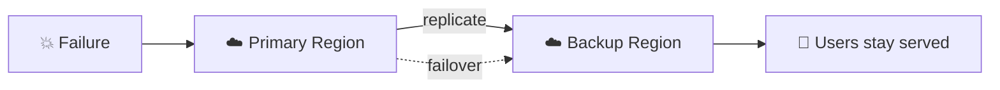

⬅ [Back to Index](../README.md)

# Disaster Recovery & High Availability

**High Availability (HA)** keeps systems running with minimal downtime. **Disaster Recovery (DR)** restores systems after a major failure (region outage, data loss).

### 🎓 Professional (IT-Standard) Reference

| Concept | Layman View | Professional (IT-Standard) View + Example |
|---------|-------------|-------------------------------------------|
| RTO | How fast you recover | The Recovery Time Objective (RTO) is the maximum acceptable downtime.<br>It defines how quickly systems must be restored.<br>It drives disaster-recovery design choices.<br>Lower RTO usually costs more.<br>It is agreed with the business.<br>*Example: an RTO of one hour after a major failure.* |
| RPO | How much data you can lose | The Recovery Point Objective (RPO) is the maximum acceptable data loss.<br>It defines how far back recovery can go.<br>It is set by backup and replication frequency.<br>Lower RPO needs more frequent backups.<br>It balances cost and risk.<br>*Example: an RPO of five minutes using continuous backup.* |
| HA design | Avoid single failures | High Availability (HA) design removes single points of failure.<br>It uses redundancy across Availability Zones (AZs).<br>Load balancing and health checks reroute traffic.<br>Failures are handled automatically.<br>It keeps services running.<br>*Example: an active-active deployment across multiple AZs.* |
| DR strategy | Plan for disaster | A Disaster Recovery (DR) strategy defines how to recover from major outages.<br>Options range from backup-and-restore to multi-site.<br>Intermediate patterns are pilot light and warm standby.<br>Cost rises with faster recovery.<br>The choice matches RTO and RPO.<br>*Example: a cross-region warm standby environment.* |

---

## 🗺️ Visual Overview



**Explanation:** High Availability (HA) and Disaster Recovery (DR) keep services running through failures. Data is replicated to a backup region, and if the primary region fails, traffic fails over so users barely notice — guided by targets for recovery time (RTO) and data loss (RPO).

---

## 📏 Key Metrics

| Metric | Meaning |
|--------|---------|
| **RTO (Recovery Time Objective)** | How long to recover (max acceptable downtime) |
| **RPO (Recovery Point Objective)** | How much data loss is acceptable (time between backups) |
| **SLA** | Guaranteed uptime (e.g., 99.99% = ~52 min/year downtime) |
| **MTTR** | Mean Time To Recovery |

### Uptime Cheat Sheet
| SLA | Downtime/Year |
|-----|---------------|
| 99% | ~3.65 days |
| 99.9% ("three nines") | ~8.76 hours |
| 99.99% ("four nines") | ~52 minutes |
| 99.999% ("five nines") | ~5 minutes |

---

## 🏗️ High Availability Techniques

| Technique | Description |
|-----------|-------------|
| **Redundancy** | Multiple copies of everything |
| **Multi-AZ** | Deploy across Availability Zones |
| **Load Balancing** | Distribute + health checks |
| **Auto-scaling** | Replace failed instances |
| **Database replication** | Standby replicas with failover |
| **Health checks** | Detect & remove unhealthy nodes |

---

## 🔥 Disaster Recovery Strategies (cheapest → priciest)

| Strategy | RTO/RPO | Description | Cost |
|----------|---------|-------------|------|
| **Backup & Restore** | Hours | Restore from backups | 💲 |
| **Pilot Light** | 10s of min | Minimal core always running | 💲💲 |
| **Warm Standby** | Minutes | Scaled-down copy always running | 💲💲💲 |
| **Multi-Site Active/Active** | ~0 | Full duplicate running live | 💲💲💲💲 |

```
Backup/Restore ──▶ Pilot Light ──▶ Warm Standby ──▶ Active/Active
   cheaper, slower recovery   ◀────────────▶   pricier, instant
```

---

## 💡 Example: Multi-Region HA Architecture

```
		Route 53 (DNS failover / geo-routing)
		┌──────────────┴──────────────┐
   Region A (Primary)            Region B (Standby)
   Load Balancer                 Load Balancer
   Auto-scaling group (multi-AZ) Auto-scaling group
   Primary Database ──replication──▶ Replica Database
```

If Region A fails, Route 53 redirects traffic to Region B.

---

## ✅ Best Practices

1. **Automate backups** and test restores regularly.
2. **Deploy across multiple AZs** at minimum.
3. **Test your DR plan** — untested DR = no DR.
4. **Use IaC** to rebuild infrastructure fast ([Terraform](../06-Tools-and-Practices/iac.md)).
5. **Monitor & alert** ([observability](../06-Tools-and-Practices/monitoring.md)).
6. Define **RTO/RPO** based on business needs.

---

## 🖼️ DR & HA Tools


---

## 🖥️ What It Looks Like — Failover Event (Mockup)

```text
┌───────────────────────────────────────────────┐
│  🚨 Route 53 › Health Check: us-east-1 FAILED       │
├──────────────────────────────────────────────┤
│  14:02:10  Primary (us-east-1) unhealthy ✗           │
│  14:02:12  DNS failover → us-west-2 (standby)        │
│  14:02:40  Traffic serving from us-west-2 ✅         │
│  RTO actual: 30s   RPO actual: 12s   Users: served  │
└──────────────────────────────────────────────┘
```

---

## 🌐 Real-World Usage Example

**Netflix** built **Chaos Monkey** (its Simian Army) to randomly kill production instances — forcing engineers to design for failure so real outages barely register. When an entire AWS region degrades, Netflix evacuates traffic to other regions in minutes. **Banks** run active/active across regions for near-zero RTO because downtime = lost transactions and regulatory penalties.

---

## 🔍 Deep Dive — Concepts Often Missed

- **Untested DR = no DR:** run game days / DR drills regularly; backups you never restore may be corrupt.
- **RTO vs RPO drive cost:** near-zero targets require expensive active/active; match them to business impact.
- **Multi-AZ ≠ Multi-Region:** AZ protects a datacenter failure; region protects a whole-region outage.
- **Backups need to be immutable/off-site** to survive ransomware and accidental deletion.
- **Failback matters too:** plan how to return to primary once it recovers.
- **Data replication lag = your real RPO:** async replication can lose in-flight writes.

---

**Navigation:** [← Messaging](messaging-event-driven.md) | [Next → Cost Optimization (FinOps)](cost-optimization-finops.md) | ⬅ [Back to Index](../README.md)
