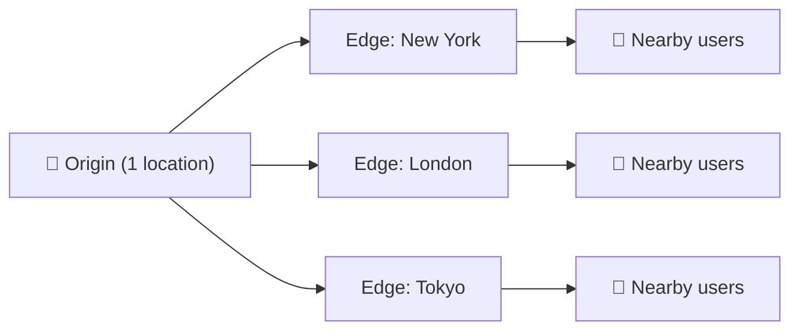

⬅ [Back to Index](../README.md)

# Edge Computing & CDN

**Edge computing** processes data closer to where it's generated (near users/devices) instead of a distant central data center — reducing latency.

### 🎓 Professional (IT-Standard) Reference

| Concept | Layman View | Professional (IT-Standard) View + Example |
|---------|-------------|-------------------------------------------|
| CDN | Cache near users | A Content Delivery Network (CDN) caches content close to users.<br>It uses globally distributed edge locations.<br>It reduces latency and origin load.<br>It speeds up static and media delivery.<br>It improves user experience worldwide.<br>*Example: Amazon CloudFront, Cloudflare, or Akamai.* |
| Edge compute | Run code near users | Edge compute runs lightweight functions near the user.<br>Code executes at Points of Presence (PoPs).<br>It cuts round trips to central regions.<br>It lowers latency for real-time needs.<br>It offloads work from the origin.<br>*Example: Lambda@Edge or Cloudflare Workers.* |
| Latency reduction | Faster responses | Latency reduction serves responses from the nearest location.<br>It shortens the Round-Trip Time (RTT).<br>It improves speed for global users.<br>It relies on edge and regional placement.<br>It enhances the user experience.<br>*Example: cutting Round-Trip Time (RTT) for worldwide visitors.* |
| IoT edge | Smart devices process locally | Internet of Things (IoT) edge lets devices process data locally.<br>It reduces bandwidth to the cloud.<br>It enables faster local decisions.<br>It works even with poor connectivity.<br>It syncs with the cloud when possible.<br>*Example: AWS IoT Greengrass on a factory gateway.* |

---

## 🗺️ Visual Overview



**Explanation:** A Content Delivery Network (CDN) and edge computing push content and code close to users worldwide. Instead of everyone reaching one distant server, they hit the nearest edge location — cutting delay and speeding up responses.

---

## 🌍 The Core Idea

```
Traditional:  User ────────────▶ Distant Data Center (high latency)
Edge:         User ──▶ Nearby Edge Node (low latency) ──▶ Cloud (if needed)
```

---

## 🧩 Key Concepts

| Concept | Description |
|---------|-------------|
| **Edge Location** | Small data center near users |
| **CDN** | Caches static content at the edge |
| **Edge Functions** | Run code at the edge (e.g., Cloudflare Workers) |
| **IoT Edge** | Process sensor data locally |
| **Latency** | Delay — edge minimizes it |

---

## 📦 CDN (Content Delivery Network)

CDNs cache content (images, videos, JS/CSS) at edge locations worldwide.

```
Origin Server (1 location)
	  │  content cached to ↓
Edge nodes: New York · London · Tokyo · Sydney · São Paulo ...
	  │
Users get content from the NEAREST node → fast!
```

### CDN Providers/Tools
| Provider | Service |
|----------|---------|
| AWS | **CloudFront** |
| Azure | **Azure CDN / Front Door** |
| GCP | **Cloud CDN** |
| Independent | **Cloudflare**, Akamai, Fastly |

---

## ⚡ Edge Compute Tools

| Tool | What It Does |
|------|--------------|
| **Cloudflare Workers** | Run JS at 300+ edge locations |
| **AWS Lambda@Edge** | Run Lambda at CloudFront edge |
| **AWS Greengrass** | IoT edge computing |
| **Azure IoT Edge** | Edge for IoT devices |
| **Akamai EdgeWorkers** | Edge functions |

---

## 💡 Real-World Examples

- **Netflix/YouTube** — video cached at edge for smooth streaming.
- **Gaming** — edge servers reduce lag.
- **Self-driving cars** — process sensor data locally (can't wait for cloud).
- **Smart factories** — analyze machine data on-site in real time.
- **E-commerce** — personalize pages at the edge for speed.

---

## ✅ Benefits

- **Ultra-low latency** — critical for real-time apps.
- **Reduced bandwidth** — less data sent to central cloud.
- **Better reliability** — works even with intermittent connectivity.
- **Improved UX** — faster page loads.

---

## 🖼️ Edge & CDN Tools


---

## 🏗️ Architecture: Cache Hit vs Miss at the Edge


**Explanation:** On a cache hit, the nearby edge serves content in a few milliseconds. On a miss, it fetches once from the distant origin, caches it, and every later user in that region gets the fast path.

---

## 🖥️ What It Looks Like — CDN Analytics (Mockup)

```text
┌───────────────────────────────────────────────┐
│  🌐 Cloudflare › Analytics (24h)                     │
├──────────────────────────────────────────────┤
│  Requests   1.2B     Cache hit-rate  94.3%  🟢       │
│  Bandwidth saved (origin offload)  38 TB             │
│  p50 latency  9ms    Threats blocked  4.1M          │
└──────────────────────────────────────────────┘
```

---

## 🌐 Real-World Usage Example

**Disney+** and **Netflix** push video to thousands of edge caches (Netflix runs its own Open Connect appliances inside ISPs) so a show streams from a server miles away, not across an ocean. **Cloudflare Workers** run code at 300+ locations — companies do A/B testing, auth, and personalization at the edge, shaving hundreds of milliseconds off every request.

---

## 🔍 Deep Dive — Concepts Often Missed

- **Cache-Control & TTLs** decide what edges cache and for how long — misconfigured headers = stale or uncached content.
- **Cache invalidation/purge:** pushing a new deploy means invalidating edge caches.
- **Edge functions have limits:** small CPU/memory budgets, short execution — not for heavy compute.
- **CDN ≠ edge compute:** CDN caches content; edge compute *runs code* near users.
- **Origin shield** adds a mid-tier cache to further reduce origin hits.
- **Latency is physics:** even at light speed, distance adds delay — edge is the only fix.

---

**Navigation:** [← Cost Optimization](cost-optimization-finops.md) | [Next → AI/ML & Big Data in Cloud](ai-ml-bigdata.md) | ⬅ [Back to Index](../README.md)
