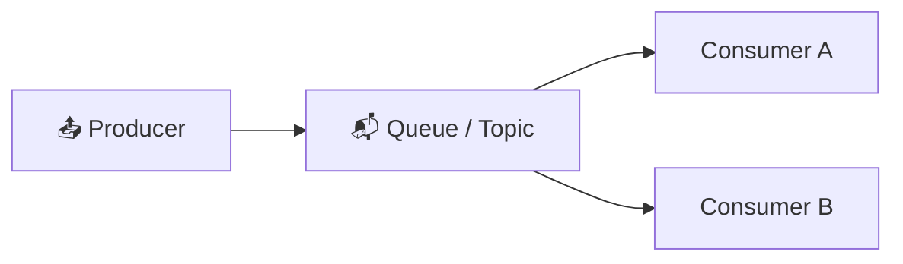

⬅ [Back to Index](../README.md)

# Messaging & Event-Driven Architecture

**Event-driven architecture** lets services communicate asynchronously through **messages/events** instead of direct calls — improving scalability and decoupling.

> 📨 Service A doesn't wait for Service B. It drops a message and moves on.

### 🎓 Professional (IT-Standard) Reference

| Concept | Layman View | Professional (IT-Standard) View + Example |
|---------|-------------|-------------------------------------------|
| Message queue | A to-do inbox | A message queue decouples producers from consumers.<br>Messages wait in line until processed.<br>It smooths out traffic spikes.<br>It enables asynchronous processing.<br>It improves reliability and scaling.<br>*Example: Amazon Simple Queue Service (SQS) or RabbitMQ.* |
| Pub/Sub | Broadcast news | Publish/Subscribe (Pub/Sub) sends events to many subscribers.<br>Publishers do not know the receivers.<br>Subscribers get copies of each event.<br>It fans out messages efficiently.<br>It supports loose coupling.<br>*Example: Amazon Simple Notification Service (SNS), Google Pub/Sub, or Kafka topics.* |
| Event streaming | A flowing log of events | Event streaming handles continuous, ordered event flows.<br>It retains events for replay.<br>It supports high-throughput pipelines.<br>Consumers read at their own pace.<br>It powers real-time analytics.<br>*Example: Apache Kafka or Amazon Kinesis.* |
| Idempotency | Handle duplicates safely | Idempotency ensures repeated actions have the same effect.<br>It uses deduplication keys to detect repeats.<br>It prevents double-processing on retries.<br>It makes systems safe to retry.<br>It improves data correctness.<br>*Example: an idempotent consumer keyed on message Identifiers (IDs).* |

---

## 🗺️ Visual Overview



**Explanation:** Messaging and event-driven systems let services talk without waiting on each other. A producer drops messages into a queue or topic, and consumers process them at their own pace — decoupling components so they scale and fail independently.

---

## 🔄 Synchronous vs Asynchronous

```
SYNCHRONOUS (request/response)      ASYNCHRONOUS (messaging)
A ──request──▶ B                    A ──▶ [Queue/Topic] ──▶ B
A ◀─response── B                    A continues immediately
(A waits, coupled)                  (decoupled, resilient)
```

---

## 🧩 Core Patterns

| Pattern | Description |
|---------|-------------|
| **Message Queue** | Point-to-point; one consumer processes each message |
| **Pub/Sub** | One event → many subscribers |
| **Event Streaming** | Continuous stream of events, replayable |
| **Dead Letter Queue** | Holds failed messages for retry/inspection |

---

## 🏭 Industry Messaging Tools

| Tool | Type | Notes |
|------|------|-------|
| **Apache Kafka** | Event streaming | High-throughput, replayable, industry standard |
| **RabbitMQ** | Message broker | Flexible routing, mature |
| **AWS SQS** | Managed queue | Simple, scalable |
| **AWS SNS** | Managed pub/sub | Fan-out notifications |
| **AWS EventBridge** | Event bus | Serverless event routing |
| **Azure Service Bus** | Message broker | Enterprise messaging |
| **Google Pub/Sub** | Managed pub/sub | Global scale |
| **NATS** | Lightweight messaging | Fast, cloud-native |

---

## 💡 Example: Order Processing (Event-Driven)

```
Order Service ──"OrderPlaced" event──▶ [Kafka Topic]
										  │
		┌─────────────────────────────────┼──────────────────┐
		▼                                 ▼                    ▼
  Payment Service              Inventory Service        Email Service
  (charge card)                (reduce stock)           (send confirmation)
```

Each service reacts independently to the same event. If Email Service is down, orders still process.

---

## 🌊 Kafka Core Concepts

| Term | Meaning |
|------|---------|
| **Producer** | Sends messages |
| **Consumer** | Reads messages |
| **Topic** | A named stream of messages |
| **Partition** | Topic split for parallelism |
| **Broker** | A Kafka server |
| **Consumer Group** | Consumers sharing the work |
| **Offset** | Position in the stream |

---

## ✅ Benefits

- **Decoupling** — services don't depend on each other directly.
- **Scalability** — add consumers to handle load.
- **Resilience** — messages persist if a consumer is down.
- **Flexibility** — add new consumers without changing producers.

---

## 🖼️ Messaging & Streaming Tools


---

## 🖥️ What It Looks Like — Kafka Consumer Lag (Mockup)

```text
┌───────────────────────────────────────────────┐
│  🌊 Kafka › Topic: orders  (6 partitions)           │
├──────────────────────────────────────────────┤
│  Group: payment-svc    lag: 12     🟢 healthy       │
│  Group: inventory-svc  lag: 4,208  🟡 catching up   │
│  Group: email-svc      lag: 0      🟢 healthy       │
│  Throughput: 84k msg/s   Retention: 7d              │
└──────────────────────────────────────────────┘
```

---

## 🌐 Real-World Usage Example

**Uber** runs one of the largest Kafka deployments on earth — trillions of messages/day powering trip events, surge pricing, and fraud detection. **LinkedIn** *invented* Kafka to handle its activity stream. **Robinhood** and banks use event streaming so a single "OrderPlaced" event fans out to payment, ledger, and notification services independently — if one is down, the event replays later.

---

## 🔍 Deep Dive — Concepts Often Missed

- **Queue vs stream:** SQS/RabbitMQ delete a message once consumed; Kafka *retains* it for replay by many consumers.
- **At-least-once delivery** is the norm → consumers **must be idempotent** to handle duplicates.
- **Dead Letter Queues (DLQ)** capture poison messages so one bad message doesn't block the queue.
- **Ordering** is only guaranteed within a Kafka partition — choose partition keys carefully.
- **Backpressure & consumer lag** are the key health metrics — rising lag = consumers can't keep up.
- **Outbox pattern** reliably publishes events from a DB transaction without dual-write bugs.

---

**Navigation:** [← Databases](databases-in-cloud.md) | [Next → Disaster Recovery & HA](disaster-recovery-ha.md) | ⬅ [Back to Index](../README.md)
