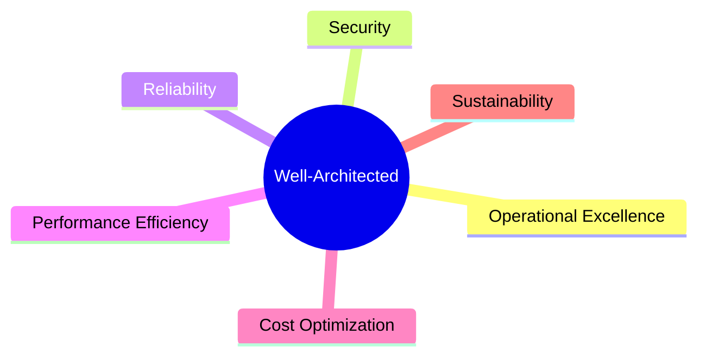

⬅ [Back to Index](../README.md)

# The Well-Architected Framework

Cloud providers publish **Well-Architected Frameworks** — best-practice pillars for building reliable, secure, efficient systems. AWS pioneered it; Azure & GCP have equivalents.

### 🎓 Professional (IT-Standard) Reference

| Pillar | Layman View | Professional (IT-Standard) View + Example |
|--------|-------------|-------------------------------------------|
| Operational Excellence | Run things smoothly | Operational excellence focuses on running and improving workloads. It emphasizes automation and monitoring. It uses runbooks and repeatable processes. It learns from failures and reviews. It keeps operations efficient. *Example: Infrastructure as Code (IaC) plus runbooks and observability.* |
| Security | Keep it safe | The security pillar protects data and systems. It applies least-privilege access. It encrypts data and audits activity. It uses Identity and Access Management (IAM) controls. It enforces defense in depth. *Example: IAM plus Key Management Service (KMS) plus CloudTrail.* |
| Reliability | Stay up | The reliability pillar keeps workloads available. It designs for failure and recovery. It spreads resources across Availability Zones (AZs). It automates healing and scaling. It meets availability targets. *Example: a Multi-Availability Zone (AZ) deployment with auto-healing.* |
| Performance & Cost | Fast and efficient | Performance efficiency and cost optimization balance speed and spend. They select the right resource types. They scale to match demand. They remove waste continuously. They align cost with value. *Example: rightsizing instances and using Savings Plans.* |

---

## 🗺️ Visual Overview

**Explanation:** The Well-Architected Framework is a checklist of pillars for building good cloud systems. Balancing all of them — running well, staying secure and reliable, performing efficiently, and controlling cost — leads to a healthy, production-ready workload.

---

## 🏛️ The Six Pillars (AWS)

| Pillar | Focus | Key Questions |
|--------|-------|---------------|
| **1. Operational Excellence** | Run & monitor systems | Can we deploy & recover fast? Is everything automated? |
| **2. Security** | Protect data & systems | Least privilege? Encryption? Auditing? |
| **3. Reliability** | Recover from failure | Multi-AZ? Auto-scaling? Backups? |
| **4. Performance Efficiency** | Use resources efficiently | Right instance types? Caching? |
| **5. Cost Optimization** | Avoid unnecessary spend | Right-sizing? Reserved instances? |
| **6. Sustainability** | Minimize environmental impact | Efficient resource use? Right regions? |

---

## 🧭 Design Principles

### Operational Excellence
- Perform operations **as code** (IaC).
- Make frequent, small, reversible changes.
- Anticipate failure; learn from it.

### Security
- Implement a strong **identity foundation** ([IAM](../07-Security/iam.md)).
- Apply security at **all layers**.
- **Encrypt** in transit and at rest.
- Automate security best practices.

### Reliability
- **Automatically recover** from failure.
- **Test recovery** procedures.
- **Scale horizontally** for availability.
- Stop guessing capacity → auto-scale.

### Performance Efficiency
- Use **serverless** where possible.
- Experiment often.
- Use the right technology for the job.

### Cost Optimization
- Adopt a **consumption model** (pay for use).
- Measure efficiency.
- Stop spending on undifferentiated heavy lifting.

### Sustainability
- Choose efficient regions & hardware.
- Right-size and delete idle resources.

---

## 💡 How It's Used in Industry

- Architects run **Well-Architected Reviews** before major launches.
- Providers offer tools: **AWS Well-Architected Tool**, Azure Advisor, GCP Architecture Framework.
- Interviewers **love** asking about these pillars — see the [Test lesson](../14-Final-Test/interview-questions.md).

---

## 📋 Quick Checklist Before Going Live

- [ ] Multi-AZ deployment? (Reliability)
- [ ] Least-privilege IAM & encryption? (Security)
- [ ] Auto-scaling configured? (Performance/Cost)
- [ ] Monitoring & alerts set up? (Operational Excellence)
- [ ] Backups & tested DR plan? (Reliability)
- [ ] Cost budgets & tagging? (Cost Optimization)
- [ ] Infrastructure as Code? (Operational Excellence)

---

## 🌐 Real-World Usage Example

Before major launches (e.g., a new banking app on AWS), architects run a formal **Well-Architected Review** using the AWS Well-Architected Tool — answering dozens of questions per pillar and getting a prioritized list of risks. **Startups** applying for AWS/Azure credits are often required to pass a Well-Architected Review. It's also a hiring signal: interviewers ask candidates to reason through the pillars for a design.

---

## 🔍 Deep Dive — Concepts Often Missed

- **The pillars trade off:** more reliability/performance often costs more — the framework is about *conscious* trade-offs.
- **Sustainability (6th pillar)** is newer — pick efficient regions/hardware and delete waste to cut carbon.
- **It's provider-agnostic thinking:** Azure (Well-Architected Framework) and GCP (Architecture Framework) mirror the same ideas.
- **Reviews are continuous:** re-run as the workload evolves, not just once at launch.
- **"Operational excellence" = automation:** manual ops don't scale — IaC + runbooks + observability.
- **Design for failure** is the reliability core — assume components will die and auto-heal.

---

**Navigation:** [← AI/ML & Big Data](ai-ml-bigdata.md) | [Next → Terraform Deep Dive](../11-Tool-Deep-Dives/terraform-deep-dive.md) | ⬅ [Back to Index](../README.md)
