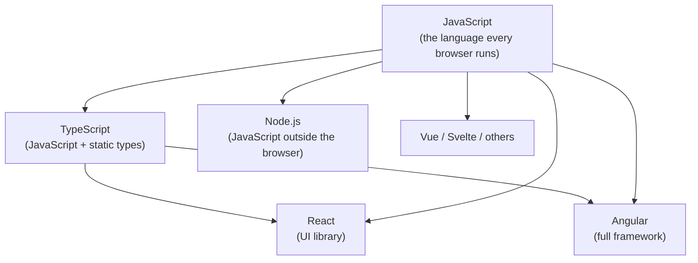

# 👋 Start Here — Frontend Development in Plain English

> 💼 **Industry Perspective:** In professional frontend teams, **Start Here — Frontend Development in Plain English** is applied to build reliable, scalable, and maintainable production software. Engineers are expected to understand its trade-offs, best practices, and how it fits into modern architecture, code reviews, and day-to-day team workflows.

> **Read this first.** No jargon, no assumptions. This page explains the *whole* of frontend development — the languages (HTML, CSS, JavaScript, TypeScript), the frameworks (React, Angular, Vue), and the browser platform — using everyday analogies, then shows how each idea is used in real projects. Once this "clicks," the rest of the track will make sense easily.

⬅ [Back to Index](../README.md)

---

## 🧠 The One Big Idea (if you remember nothing else)

> **JavaScript is the language that makes web pages *do things*. Everything else — TypeScript, React, Angular, Node — is a tool built *on top of* JavaScript to make it safer, faster, or easier to organize.**

That's it. Everything else is a detail on top of that one sentence.

---

## 🟨 The JavaScript Ecosystem — Venn Diagram

Here is the single most important picture in this whole track. **Everything shares the same core: plain JavaScript.** TypeScript adds types on top, and frameworks like React and Angular are *libraries/tools written in* JavaScript (or TypeScript).

<svg width="560" height="440" viewBox="0 0 560 440" xmlns="http://www.w3.org/2000/svg" role="img" aria-label="Venn diagram of the JavaScript ecosystem">
  <!-- JavaScript: the big base circle -->
  <circle cx="280" cy="230" r="200" fill="#f7df1e" fill-opacity="0.30" stroke="#e6c200" stroke-width="2"/>
  <!-- TypeScript: superset overlapping JS -->
  <circle cx="280" cy="200" r="130" fill="#3178c6" fill-opacity="0.30" stroke="#3178c6" stroke-width="2"/>
  <!-- React -->
  <circle cx="205" cy="235" r="80" fill="#61dafb" fill-opacity="0.30" stroke="#2ba3c9" stroke-width="2"/>
  <!-- Angular -->
  <circle cx="355" cy="235" r="80" fill="#dd0031" fill-opacity="0.25" stroke="#dd0031" stroke-width="2"/>

  <!-- Labels -->
  <text x="280" y="410" text-anchor="middle" font-family="sans-serif" font-size="18" font-weight="bold" fill="#8a7400">JavaScript (the core language)</text>
  <text x="280" y="120" text-anchor="middle" font-family="sans-serif" font-size="16" font-weight="bold" fill="#1f4f8f">TypeScript (JS + types)</text>
  <text x="175" y="235" text-anchor="middle" font-family="sans-serif" font-size="14" font-weight="bold" fill="#0d6f8c">React</text>
  <text x="385" y="235" text-anchor="middle" font-family="sans-serif" font-size="14" font-weight="bold" fill="#a80025">Angular</text>
  <text x="280" y="270" text-anchor="middle" font-family="sans-serif" font-size="13" fill="#333">Vue · Node · Svelte…</text>
</svg>

**How to read it:**

- 🟨 The **big yellow circle is JavaScript** — the language every browser understands. It is the foundation.
- 🟦 **TypeScript** sits *inside* JavaScript's world: it is a **superset** — all JavaScript is valid TypeScript, plus type-checking on top.
- 🟦 **React** and 🟥 **Angular** are **frameworks/libraries written in JS/TS**. They overlap heavily with TypeScript because most modern React and Angular apps are written in TypeScript.
- 🟩 **Vue, Node, Svelte** and "many more" all live in the same circle — they can't exist without JavaScript underneath.

> **Takeaway:** Learn JavaScript well and every other box on this diagram becomes *much* easier — because they are all just JavaScript wearing different hats.

---

## 🔗 How the pieces relate (flow view)

**Explanation:** Notice every arrow *starts* at JavaScript. TypeScript compiles down to JavaScript. React and Angular are shipped as JavaScript. Node runs JavaScript on servers. **JavaScript is the hub; the rest are spokes.**

---

## 🏢 The Master Analogy: JavaScript = Electricity

Keep this one analogy in your head for the whole track:

| Everyday Situation | JavaScript Equivalent | What it means |
|--------------------|-----------------------|---------------|
| ⚡ **Electricity in the wires** | JavaScript | The raw power that makes everything run. |
| 🔌 **A labeled plug/adapter** | TypeScript | Same electricity, but with a shape that prevents you plugging things in wrong. |
| 🧰 **Pre-built appliances** | React / Angular / Vue | Ready-made machines you build with, powered by the same electricity. |
| 🏭 **A power station outside the house** | Node.js | The same electricity, generated somewhere other than the browser. |

The wires (JavaScript) power everything — **that's the heart of the whole ecosystem.**

---

## 🗺️ What this track covers

| Chapter | You'll learn |
|---------|--------------|
| 01 · JavaScript | Variables & types, functions & scope, async/await, and how the ecosystem fits together. |
| 02 · TypeScript | Basics, interfaces & types, functions & generics, classes & OOP, advanced types, config & modules. |
| 03 · React | 100% of React as sub-lessons: JSX, components & composition, state/events/forms, effects, all hooks, context/refs/performance, routing & state libraries, styling & form libraries, TypeScript & testing, and advanced/ecosystem (Concurrent, Server Components, Next.js). |
| 04 · Angular | 100% of Angular as sub-lessons: setup, components, binding, directives, pipes, services & DI, modules & standalone, lifecycle, communication, routing, forms, HttpClient & RxJS, change detection & signals, NgRx, testing, and ecosystem. |
| 05 · Vue | Vue 3 SFCs, reactivity, directives, composables, and the ecosystem (Pinia, Nuxt). |
| 06 · HTML & CSS | Semantic HTML, CSS core, layout (Flexbox/Grid/responsive), and modern CSS & styling systems. |
| 07 · Browser & Web Platform | DOM & Web APIs, Web Components, and PWA/offline. |
| 08 · Quality & Performance | Accessibility, web performance, and frontend security. |
| 09 · Data, Tooling & Architecture | Data & APIs, tooling & build, and architecture & testing. |
| 10 · Cheat Sheets & Final Test | Quick references for JS/TS/React/Angular and interview-style questions. |

> **Tip:** Each chapter groups its topics as sub-lessons in the sidebar. Read the sections in order the first time. After that, jump around freely.

---

⬅ [Back to Index](../README.md)
