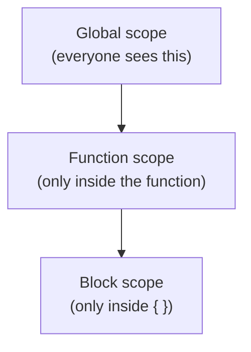

# 🧩 Functions & Scope

> 💼 **Industry Perspective:** In professional frontend teams, **Functions & Scope** is applied to build reliable, scalable, and maintainable production software. Engineers are expected to understand its trade-offs, best practices, and how it fits into modern architecture, code reviews, and day-to-day team workflows.

⬅ [Back to Index](../README.md)

> **Big idea:** A function is a **reusable recipe**. Scope is the set of rules for **which variables a piece of code can see**.

---

## 🍳 Declaring functions

```js
// Function declaration (hoisted — usable before its line)
function add(a, b) {
	return a + b;
}

// Function expression
const sub = function (a, b) {
	return a - b;
};

// Arrow function (short, no own `this`)
const mul = (a, b) => a * b;
```

| Style | Hoisted? | Own `this`? | Best for |
|-------|----------|-------------|----------|
| Declaration | ✅ Yes | ✅ Yes | Top-level named helpers |
| Expression | ❌ No | ✅ Yes | Assigning to variables |
| Arrow | ❌ No | ❌ No (inherits) | Callbacks, short functions |

---

## 🎯 Parameters, defaults & rest

```js
function greet(name = "friend", ...others) {
	console.log(`Hi ${name}`);
	console.log(`Others: ${others.join(", ")}`);
}
greet();                       // Hi friend
greet("Ada", "Bob", "Cara");   // Hi Ada / Others: Bob, Cara
```

---

## 🔭 Scope — who can see what



```js
const g = "global";

function outer() {
	const o = "outer";
	if (true) {
		const b = "block";
		console.log(g, o, b); // ✅ all visible here
	}
	// console.log(b); ❌ b not visible outside the block
}
```

Inner scopes can see outer variables, **but not the other way around.**

---

## 🔒 Closures (the superpower)

A **closure** is a function that "remembers" variables from where it was created, even after that outer function has finished.

```js
function makeCounter() {
	let count = 0;              // private, remembered
	return () => ++count;
}

const next = makeCounter();
next(); // 1
next(); // 2  ← count survived between calls
```

> **Why it matters:** Closures power private data, event handlers, and much of React's design.

---

⬅ [Back to Index](../README.md)
