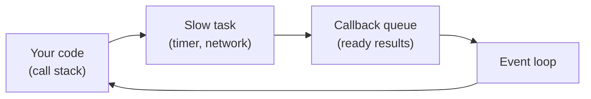

# ⏳ Async JavaScript

> 💼 **Industry Perspective:** In professional frontend teams, **Async JavaScript** is applied to build reliable, scalable, and maintainable production software. Engineers are expected to understand its trade-offs, best practices, and how it fits into modern architecture, code reviews, and day-to-day team workflows.

⬅ [Back to Index](../README.md)

> **Big idea:** JavaScript does **one thing at a time**, but it can *start* a slow job (like a network request) and keep working, then react when the job finishes. That's "async."

---

## 🍽️ The restaurant analogy

A waiter (JavaScript) takes your order and sends it to the kitchen (a slow task). Instead of standing still, the waiter serves other tables and comes back **when the food is ready**. That's the **event loop** in one sentence.



---

## 1️⃣ Callbacks (the old way)

```js
setTimeout(() => {
	console.log("Runs after 1 second");
}, 1000);
```

Nesting many callbacks creates "callback hell" — hard to read. Promises fixed this.

---

## 2️⃣ Promises

A **promise** is an IOU: "I promise a value *later* — either success (`resolve`) or failure (`reject`)."

```js
fetch("https://api.example.com/user")
	.then((res) => res.json())
	.then((data) => console.log(data))
	.catch((err) => console.error(err));
```

| State | Meaning |
|-------|---------|
| pending | Still working |
| fulfilled | Succeeded (has a value) |
| rejected | Failed (has an error) |

---

## 3️⃣ async / await (the modern way)

Syntactic sugar over promises that reads like normal top-to-bottom code.

```js
async function loadUser() {
	try {
		const res = await fetch("https://api.example.com/user");
		const data = await res.json();
		console.log(data);
	} catch (err) {
		console.error(err);
	}
}
```

> **Rule:** `await` can only be used inside an `async` function. Every `async` function returns a promise.

---

## 🏃 Running things in parallel

```js
// Waits for BOTH at the same time (faster)
const [a, b] = await Promise.all([fetchA(), fetchB()]);
```

Use `Promise.all` when tasks don't depend on each other — it's much faster than awaiting them one by one.

---

⬅ [Back to Index](../README.md)
