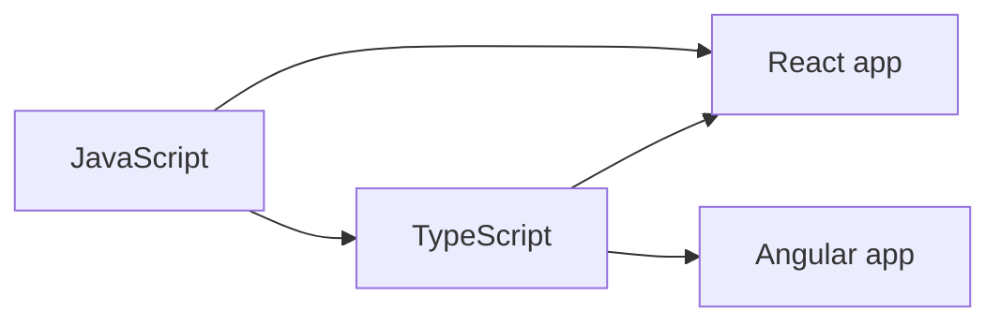

# 🌐 The Ecosystem: JavaScript, TypeScript, React & Angular

> 💼 **Industry Perspective:** In professional frontend teams, **The Ecosystem: JavaScript, TypeScript, React & Angular** is applied to build reliable, scalable, and maintainable production software. Engineers are expected to understand its trade-offs, best practices, and how it fits into modern architecture, code reviews, and day-to-day team workflows.

⬅ [Back to Index](../README.md)

> **Big idea:** TypeScript, React, Angular, Vue and Node are **not competitors to JavaScript** — they are all *built on* it. This page shows exactly how they relate.

---

## 🟨 The Venn diagram (recap)

<div align="center">
<svg width="560" height="440" viewBox="0 0 560 440" xmlns="http://www.w3.org/2000/svg" role="img" aria-label="Venn diagram of the JavaScript ecosystem">
  <circle cx="280" cy="230" r="200" fill="#f7df1e" fill-opacity="0.30" stroke="#e6c200" stroke-width="2"/>
  <circle cx="280" cy="200" r="130" fill="#3178c6" fill-opacity="0.30" stroke="#3178c6" stroke-width="2"/>
  <circle cx="205" cy="235" r="80" fill="#61dafb" fill-opacity="0.30" stroke="#2ba3c9" stroke-width="2"/>
  <circle cx="355" cy="235" r="80" fill="#dd0031" fill-opacity="0.25" stroke="#dd0031" stroke-width="2"/>
  <text x="280" y="410" text-anchor="middle" font-family="sans-serif" font-size="18" font-weight="bold" fill="#8a7400">JavaScript (the core language)</text>
  <text x="280" y="120" text-anchor="middle" font-family="sans-serif" font-size="16" font-weight="bold" fill="#1f4f8f">TypeScript (JS + types)</text>
  <text x="175" y="235" text-anchor="middle" font-family="sans-serif" font-size="14" font-weight="bold" fill="#0d6f8c">React</text>
  <text x="385" y="235" text-anchor="middle" font-family="sans-serif" font-size="14" font-weight="bold" fill="#a80025">Angular</text>
  <text x="280" y="270" text-anchor="middle" font-family="sans-serif" font-size="13" fill="#333">Vue · Node · Svelte…</text>
</svg>
</div>

**Every circle lives inside JavaScript's world.** Learn the core, and each of these becomes a smaller step.

---

## 📊 Quick comparison

| Tool | What it is | Relationship to JavaScript |
|------|------------|----------------------------|
| **JavaScript** | The language browsers run | The foundation — the core circle |
| **TypeScript** | JavaScript **+ static types** | A *superset*; compiles down to JavaScript |
| **React** | A UI **library** | Written in JS/TS; you use it *with* JavaScript |
| **Angular** | A full **framework** | Built with TypeScript; ships as JavaScript |
| **Vue / Svelte** | UI frameworks | Also just JavaScript underneath |
| **Node.js** | A JavaScript **runtime** | Runs JavaScript on servers, not browsers |

---

## 🔷 TypeScript — JavaScript with a seatbelt

```ts
// JavaScript — no error until it crashes at runtime
function double(x) { return x * 2; }
double("hello"); // NaN 😱

// TypeScript — caught before you run it
function doubleTs(x: number): number { return x * 2; }
doubleTs("hello"); // ❌ compile error: string is not a number
```

> **All valid JavaScript is valid TypeScript.** You can adopt it gradually, file by file.

---

## ⚛️ React vs 🅰️ Angular in one glance

| | React | Angular |
|--|-------|---------|
| Type | Library (UI only) | Full framework (batteries included) |
| Language | JS or TS (TS common) | TypeScript (built-in) |
| Learning curve | Gentler start | Steeper, more structure |
| Best when | You want flexibility | You want a complete, opinionated setup |



---

## ✅ What to learn first

1. **JavaScript** (this track) — the non-negotiable foundation.
2. **TypeScript** — adds safety; easy once you know JS.
3. **One framework** (React *or* Angular) — pick based on the job.

> **Remember the electricity analogy:** master the wiring (JavaScript) and every appliance (framework) plugs in easily.

---

⬅ [Back to Index](../README.md)
