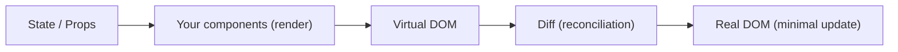

# ⚛️ React Introduction & Setup

> 💼 **Industry Perspective:** In professional frontend teams, **React Introduction & Setup** is applied to build reliable, scalable, and maintainable production software. Engineers are expected to understand its trade-offs, best practices, and how it fits into modern architecture, code reviews, and day-to-day team workflows.

⬅ [Back to Index](../README.md)

> **Big idea:** React is a **JavaScript library for building user interfaces** out of small, reusable **components**. You describe *what* the UI should look like for a given state, and React efficiently updates the DOM to match.

---

## 🧠 Why React?

- **Component-based** — build UIs from small, reusable pieces.
- **Declarative** — describe the end state; React figures out the DOM changes.
- **Virtual DOM** — React keeps a lightweight copy of the DOM, diffs it on each update, and applies only the minimal real changes (fast).
- **Huge ecosystem** — routing, state management, data fetching, and frameworks.



---

## 🚀 Creating a project (Vite — recommended)

```bash
npm create vite@latest my-app -- --template react-ts
cd my-app
npm install
npm run dev
```

> Create React App (`npx create-react-app`) is the older tool; **Vite** is faster and now preferred for new apps.

---

## 🏗️ Your first component

```tsx
// App.tsx
function App() {
	return <h1>Hello, React!</h1>;
}

export default App;
```

## 🔌 Mounting to the page

```tsx
// main.tsx
import { createRoot } from "react-dom/client";
import App from "./App";

createRoot(document.getElementById("root")!).render(<App />);
```

```html
<!-- index.html -->
<div id="root"></div>
```

---

## 🧩 The mental model

1. **Components** return UI (JSX).
2. **Props** pass data *into* a component (read-only).
3. **State** is data a component *owns* and can change.
4. When state/props change, React **re-renders** that component and updates the DOM.

> **Key rule:** UI = f(state). Given the same state, you get the same UI.

---

⬅ [Back to Index](../README.md)
